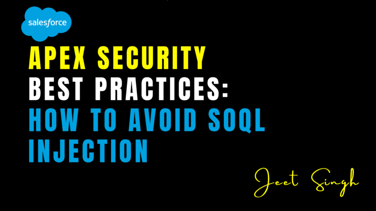

<figure>

<figcaption>

Apex Security Best Practices: How to Avoid SOQL Injection

</figcaption>

</figure>

In Salesforce development, security is a top priority. One of the most critical vulnerabilities to watch out for is **SOQL Injection**, a type of attack that can compromise your data and expose sensitive information. By following best practices, you can protect your Apex code from SOQL injection and ensure your Salesforce org remains secure.

In this blog, we’ll explain what SOQL injection is, how it works, and provide actionable best practices to prevent it in your Apex code—all without diving into technical code examples.

### What Is SOQL Injection?

SOQL (Salesforce Object Query Language) injection is a security vulnerability that occurs when an attacker manipulates a SOQL query by injecting malicious input. This can allow unauthorized access to data, modification of records, or even deletion of critical information.

#### How Does It Happen?

SOQL injection typically occurs when user input is directly included in a SOQL query without proper validation or sanitization. For example:

- A search field that dynamically builds a SOQL query.
    
- A filter or condition that uses unvalidated user input.
    

#### Why Is Preventing SOQL Injection Important?

Preventing SOQL injection is critical because:

- **Data Security**: Protects sensitive data from unauthorized access.
    
- **Compliance**: Ensures compliance with data protection regulations like GDPR and CCPA.
    
- **Reputation**: Safeguards your organization’s reputation by preventing data breaches.
    
- **System Integrity**: Prevents attackers from modifying or deleting critical data.
    

### Best Practices to Avoid SOQL Injection

Here are the top best practices to prevent SOQL injection in your Apex code:.

#### 1\. Use Bind Variables

Instead of directly including user input in SOQL queries, use bind variables. Bind variables automatically escape special characters, making it much harder for attackers to inject malicious code.

#### 2\. Validate and Sanitize User Input

Always validate user input to ensure it meets expected formats (e.g., alphanumeric characters) and sanitize it to remove potentially harmful characters. This reduces the risk of malicious input being included in queries.

#### 3\. Avoid Dynamic SOQL Queries

Dynamic SOQL queries, which are built at runtime, are more prone to injection attacks. If you must use them, always escape user input using built-in Apex methods to neutralize harmful characters.

#### 4\. Enforce Field and Object-Level Security

Use the `WITH SECURITY_ENFORCED` clause in your SOQL queries to ensure that field- and object-level permissions are respected. This adds an extra layer of security by restricting access to sensitive data.

#### 5\. Limit Access to Sensitive Data

Use Salesforce’s built-in security features like **profiles**, **permission sets**, and **sharing rules** to restrict access to sensitive data. This minimizes the impact of a potential injection attack.

#### 6\. Use Apex Managed Sharing

For custom objects, use Apex managed sharing to control access programmatically. This ensures that only authorized users can view or modify records.

#### 7\. Test for Vulnerabilities

Regularly test your Apex code for vulnerabilities using tools like **Salesforce Security Scanner** or **Checkmarx**. This helps identify and fix potential injection risks before they become a problem.

#### 8\. Educate Your Team

Ensure your development team is aware of SOQL injection risks and follows secure coding practices. Conduct regular training sessions and code reviews to reinforce these principles.

### Real-World Example: Preventing SOQL Injection

Imagine you’re building a search feature that allows users to find accounts by name. Instead of directly using user input in the query, you can:

1. Validate the input to ensure it contains only safe characters.
    
2. Use bind variables to safely include the input in the query.
    
3. Enforce security settings to restrict access to sensitive data.
    

This approach ensures that even if an attacker tries to inject malicious code, the system will reject it.

### Conclusion

SOQL injection is a serious security vulnerability that can compromise your Salesforce data and expose your organization to risks. By following best practices like using bind variables, validating user input, and leveraging Salesforce’s security features, you can protect your Apex code from injection attacks.

Remember: **Security is not a one-time task—it’s an ongoing process.** Regularly review your code, test for vulnerabilities, and stay updated on the latest security practices to keep your Salesforce org safe.

                                                                                                                                                                       **\-Jeet Singh**
