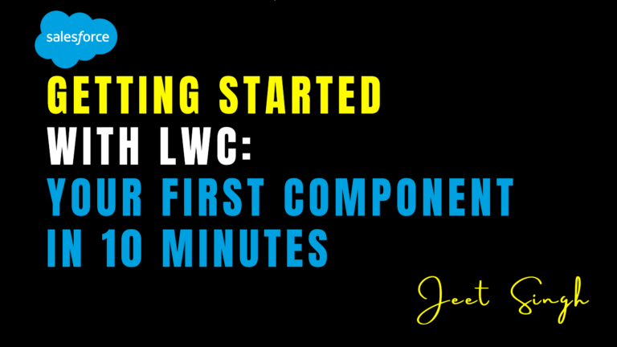

<figure>

<figcaption>

Getting Started with LWC: Your First Component in 10 Minutes

</figcaption>

</figure>

Lightning Web Components (LWC) is a modern framework for building fast, scalable, and reusable components in Salesforce. Whether you’re a beginner or an experienced developer, LWC makes it easy to create dynamic and responsive user interfaces. In this blog, we’ll walk you through the basics of LWC and show you how to build your first component in just 10 minutes—no prior experience required!

### What Are Lightning Web Components (LWC)?

Lightning Web Components (LWC) is a framework built on standard web technologies like HTML, JavaScript, and CSS. It’s designed to help developers create lightweight, high-performance components for Salesforce applications. LWC is the future of Salesforce development, offering better performance, easier debugging, and a more modern development experience compared to older frameworks like Aura. With LWC, you can build components that are not only fast but also reusable and easy to maintain.

### Why Use LWC?

LWC offers several advantages for Salesforce developers. First, it’s lightweight and fast, making it ideal for building responsive user interfaces. Second, it uses standard web technologies, so you can leverage your existing HTML, JavaScript, and CSS skills. Third, components are modular and reusable, saving you time and effort. Finally, LWC provides a modern development experience with features like two-way data binding and a rich set of pre-built components. Whether you’re building a simple button or a complex dashboard, LWC has you covered.

### How to Build Your First LWC Component

Building your first LWC component is quick and easy. Start by setting up your development environment. You’ll need the Salesforce CLI, Visual Studio Code (VS Code), and the Salesforce Extension Pack. Once your environment is ready, create a new LWC component using the Salesforce CLI. This will generate the necessary files, including an HTML template, a JavaScript file, and a CSS file.

Next, design your component using the HTML template. You can use standard HTML tags and LWC-specific tags to create the layout. For example, you might add a heading, a button, or a form. After designing the structure, add interactivity with JavaScript. Define functions to handle user interactions, such as button clicks or form submissions. LWC uses a reactive programming model, so changes in your data automatically update the UI.

Finally, style your component using the CSS file. Use standard CSS to customize the appearance of your component, such as colors, fonts, and spacing. LWC also supports scoped styles, so your styles won’t affect other components. Once your component is ready, deploy it to your Salesforce org using the Salesforce CLI. After deployment, add the component to a Lightning page and test it in the Salesforce interface.

### Tips for Building Great LWC Components

When building LWC components, start small and focused. Create simple components first and gradually add complexity as you gain experience. Use pre-built components from Salesforce’s library to save time and effort. Follow best practices, such as using descriptive names and writing clean code. Finally, test your components thoroughly in different scenarios to ensure they work as expected. By following these tips, you can build high-quality components that are both functional and user-friendly.

### Conclusion

Lightning Web Components (LWC) is a powerful and modern framework for building Salesforce applications. With its focus on performance, reusability, and ease of use, LWC is the ideal choice for developers looking to create dynamic and responsive user interfaces. By following the steps in this blog, you can build your first LWC component in just 10 minutes and start exploring the possibilities of this exciting framework.

Remember: **LWC is not just a tool—it’s a new way of thinking about Salesforce development.** Start small, experiment, and have fun building your first component!

                                                                                                                                                                    **\-Jeet Singh**
