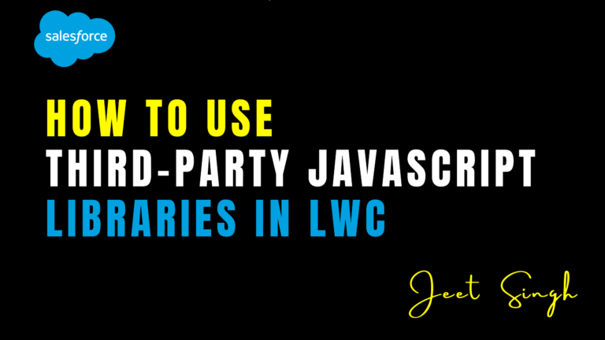

<figure>

<figcaption>

How to Use Third-Party JavaScript Libraries in LWC

</figcaption>

</figure>

Lightning Web Components (LWC) is a powerful framework for building modern, responsive applications in Salesforce. While LWC provides a rich set of features out of the box, there are times when you may need to use third-party JavaScript libraries to add advanced functionality, such as charting, date pickers, or data visualization. Integrating these libraries into LWC can enhance your application’s capabilities, but it requires careful handling to ensure compatibility and performance. In this blog, we’ll explore how to use third-party JavaScript libraries in LWC, with step-by-step guidance and code examples.

### Why Use Third-Party JavaScript Libraries?

Third-party JavaScript libraries can save you time and effort by providing pre-built solutions for common tasks. For example, you might use a library like **Chart.js** for creating interactive charts, **Moment.js** for date manipulation, or **Lodash** for utility functions. These libraries are often well-tested, widely used, and come with extensive documentation, making them a valuable resource for developers.

However, integrating third-party libraries into LWC requires careful consideration. LWC uses a secure, sandboxed environment that restricts access to the global `window` object and other browser APIs. This means you can’t simply include a library via a `<script>` tag in your HTML. Instead, you need to follow specific steps to ensure the library works correctly within the LWC framework.

## Steps to Use Third-Party JavaScript Libraries in LWC

Here’s how you can integrate third-party JavaScript libraries into your LWC components:

### 1\. Install the Library as a Static Resource

Salesforce allows you to upload third-party libraries as **static resources**, which can then be referenced in your LWC components. To do this, download the library’s JavaScript file (usually a `.js` file) and upload it to Salesforce as a static resource.

1. Go to **Setup** → **Static Resources**.
    
2. Click **New** and upload the JavaScript file.
    
3. Give the static resource a meaningful name (e.g., `chartJS`).
    

### 2\. Load the Library in Your Component

Once the library is uploaded as a static resource, you can load it in your LWC component using the `loadScript` function from the `lightning/platformResourceLoader` module. This function ensures the library is loaded asynchronously and only once, even if multiple components reference it.

##### Example:

Javascript

import { LightningElement } from 'lwc';  
import { loadScript } from 'lightning/platformResourceLoader';  
import CHARTJS from '@salesforce/resourceUrl/chartJS'; // Replace with your static resource name

export default class ChartComponent extends LightningElement {  
chart;  
chartjsInitialized = false;

renderedCallback() {  
if (this.chartjsInitialized) return;  
this.chartjsInitialized = true;

loadScript(this, CHARTJS)  
.then(() => {  
console.log('Chart.js loaded successfully');  
this.initializeChart();  
})  
.catch(error => {  
console.error('Error loading Chart.js', error);  
});  
}

initializeChart() {  
const ctx = this.template.querySelector('canvas').getContext('2d');  
this.chart = new window.Chart(ctx, {  
type: 'bar',  
data: {  
labels: \['Red', 'Blue', 'Yellow', 'Green', 'Purple', 'Orange'\],  
datasets: \[{  
label: '# of Votes',  
data: \[12, 19, 3, 5, 2, 3\],  
backgroundColor: \[  
'rgba(255, 99, 132, 0.2)',  
'rgba(54, 162, 235, 0.2)',  
'rgba(255, 206, 86, 0.2)',  
'rgba(75, 192, 192, 0.2)',  
'rgba(153, 102, 255, 0.2)',  
'rgba(255, 159, 64, 0.2)'  
\],  
borderColor: \[  
'rgba(255, 99, 132, 1)',  
'rgba(54, 162, 235, 1)',  
'rgba(255, 206, 86, 1)',  
'rgba(75, 192, 192, 1)',  
'rgba(153, 102, 255, 1)',  
'rgba(255, 159, 64, 1)'  
\],  
borderWidth: 1  
}\]  
},  
options: {  
scales: {  
y: {  
beginAtZero: true  
}  
}  
}  
});  
}  
}

In this example, we load **Chart.js** as a static resource and use it to create a bar chart in the component.

### 3\. Use the Library in Your Component

Once the library is loaded, you can use its functions and classes in your component. In the example above, we use the `window.Chart` class to create a chart. Note that the library’s functions and classes are accessed through the `window` object, as LWC restricts direct access to global variables.

## Best Practices for Using Third-Party Libraries

When using third-party JavaScript libraries in LWC, follow these best practices to ensure compatibility and performance. First, only use libraries that are lightweight and well-maintained. Heavy libraries can slow down your component and increase load times.

Second, load libraries asynchronously using `loadScript` to avoid blocking the rendering of your component. Third, test your components thoroughly to ensure the library works as expected in the LWC environment. Finally, consider the security implications of using third-party libraries, as they may introduce vulnerabilities if not properly vetted.

## Real-World Example: Using Moment.js for Date Formatting

Imagine you’re building a component that displays formatted dates. You can use **Moment.js** to handle date formatting and manipulation. First, upload Moment.js as a static resource. Then, load it in your component and use it to format date.

##### Example:

Javascript

import { LightningElement } from 'lwc';  
import { loadScript } from 'lightning/platformResourceLoader';  
import MOMENTJS from '@salesforce/resourceUrl/momentJS'; // Replace with your static resource name

export default class DateComponent extends LightningElement {  
formattedDate;

renderedCallback() {  
loadScript(this, MOMENTJS)  
.then(() => {  
console.log('Moment.js loaded successfully');  
this.formattedDate = window.moment().format('MMMM Do YYYY, h:mm:ss a');  
})  
.catch(error => {  
console.error('Error loading Moment.js', error);  
});  
}  
}

In this example, we use Moment.js to format the current date and display it in the component.

### Conclusion

Third-party JavaScript libraries can add powerful functionality to your LWC components, but they require careful integration to work within Salesforce’s secure environment. By uploading libraries as static resources and loading them using `loadScript`, you can leverage these tools while maintaining performance and compatibility. Whether you’re creating charts, formatting dates, or adding utility functions, third-party libraries can help you build better applications.

Remember: **Choose libraries wisely and follow best practices to ensure a seamless integration.** Start using third-party libraries in your LWC projects today and unlock new possibilities!

                                                                                                                                                                     **-Jeet Singh**
