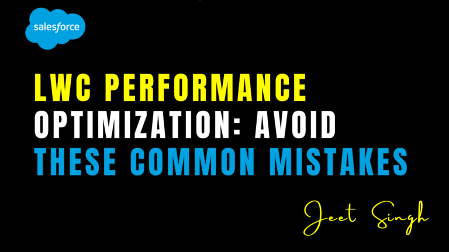

<figure>

<figcaption>

LWC Performance Optimization: Avoid These Common Mistakes

</figcaption>

</figure>

In Lightning Web Components (LWC), performance is a critical factor that directly impacts user experience. Slow-loading components or inefficient code can frustrate users and reduce engagement. To build fast and responsive applications, it’s important to avoid common mistakes that can degrade performance. In this blog, we’ll explore some of the most common performance pitfalls in LWC and provide tips on how to avoid them, ensuring your components run smoothly and efficiently.

### Why Is Performance Optimization Important?

Performance optimization is essential for creating a positive user experience. In Salesforce, users often work with large datasets and complex business processes, so even small inefficiencies can add up and slow down your application. Poor performance can lead to longer load times, unresponsive interfaces, and frustrated users. By optimizing your LWC components, you can ensure they load quickly, respond promptly to user interactions, and provide a seamless experience.

## Common Performance Mistakes in LWC

Here are some of the most common performance mistakes in LWC and how to avoid them:

#### 1\. Overusing the renderedCallback Hook

The `renderedCallback` hook is called every time the component renders or re-renders. While it’s useful for DOM manipulations, overusing it can lead to performance issues. For example, if you perform heavy operations or make unnecessary DOM updates in this hook, it can slow down your component.

To avoid this, only use the `renderedCallback` hook when absolutely necessary. If you need to perform DOM manipulations, ensure they are lightweight and efficient. Avoid making frequent or unnecessary changes to the DOM, as this can trigger additional re-renders and degrade performance.

#### 2\. Not Using Lightning Data Service (LDS)

Lightning Data Service (LDS) is a powerful tool for fetching and managing records in LWC. It provides built-in caching, which reduces the number of server calls and improves performance. However, some developers still rely on Apex for simple CRUD operations, which can be slower and less efficient.

To optimize performance, use LDS for simple CRUD operations whenever possible. It’s faster, more efficient, and easier to use than Apex for these tasks. Reserve Apex for complex scenarios where LDS isn’t sufficient.

#### 3\. Inefficient Use of Apex Calls

Apex calls are essential for complex business logic, but they can be a performance bottleneck if not used efficiently. For example, making multiple Apex calls in a loop or fetching unnecessary data can slow down your component.

To avoid this, optimize your Apex methods to reduce processing time and avoid hitting governor limits. Use selective queries with indexed fields, and retrieve only the data you need. If you’re working with large datasets, consider using pagination or the `LIMIT` clause to process data in smaller chunks.

#### 4\. Ignoring Caching

Caching is a powerful way to reduce server calls and improve performance. However, some developers overlook caching and make repeated calls for the same data, which can slow down their components.

To optimize performance, leverage caching wherever possible. LDS provides built-in caching, but you can also implement your own caching strategy for Apex calls. For example, store frequently used data in a JavaScript variable or use browser storage (like `localStorage`) to cache data temporarily. Just be mindful of data freshness and refresh the cache when necessary.

#### 5\. Not Handling Errors Gracefully

Error handling is an important part of performance optimization. Unhandled errors can cause your component to crash or behave unpredictably, leading to a poor user experience.

To avoid this, always handle errors gracefully. Use try-catch blocks for imperative calls and error handling in the Wire Service to catch and display errors. Provide clear and helpful error messages to users, so they understand what went wrong and how to fix it.

#### 6\. Overloading Components with Logic

Overloading a single component with too much logic can make it difficult to maintain and debug. It can also lead to performance issues, as the component becomes more complex and resource-intensive.

To avoid this, break down your application into smaller, reusable components. Each component should have a single responsibility, such as displaying a list, handling user input, or rendering a specific UI element. This makes your code easier to understand, test, and optimize.

### Best Practices for Optimizing LWC Performance

Here are some general best practices for optimizing LWC performance. First, keep your components small and focused. Each component should have a single responsibility, making it easier to maintain and debug. Second, use LDS for simple CRUD operations to reduce server calls and improve performance. Third, optimize your Apex methods to reduce processing time and avoid hitting governor limits.

Fourth, leverage caching to reduce server calls and improve the user experience. Fifth, handle errors gracefully to ensure your components behave predictably and provide a good user experience. Finally, test your components thoroughly with real-world data to identify and fix performance issues.

### Real-World Example: Optimizing a Data Table Component

Imagine you’re building a data table component that displays a list of records. To optimize performance, you can use LDS to fetch the data, implement pagination to process large datasets in smaller chunks, and use caching to reduce server calls. By following these best practices, you can create a fast and responsive data table that provides a great user experience.

## Conclusion

Performance optimization is a critical part of building LWC components that are fast, responsive, and user-friendly. By avoiding common mistakes like overusing the `renderedCallback` hook, ignoring caching, and overloading components with logic, you can create components that perform well under any conditions. Whether you’re fetching data, handling user input, or rendering complex UIs, these best practices will help you build better applications.

Remember: **Performance isn’t just a technical detail—it’s a critical part of the user experience.** Start optimizing your LWC components today and see the difference it makes!

                                                                                                                                                                    **\-Jeet Singh**
