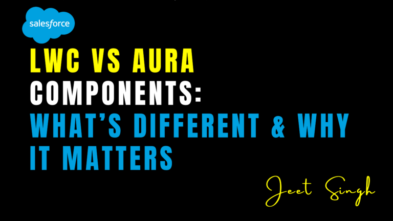

<figure>

<figcaption>

LWC vs Aura Components: What’s Different & Why It Matters

</figcaption>

</figure>

When building user interfaces in Salesforce, you have two main options: **Lightning Web Components (LWC)** and **Aura Components**. Both frameworks allow you to create dynamic and interactive components, but they differ significantly in terms of performance, development experience, and future-proofing. In this blog, we’ll explore the key differences between LWC and Aura Components, why these differences matter, and how to choose the right framework for your project.

### What Are LWC and Aura Components?

Lightning Web Components (LWC) is a modern framework built on standard web technologies like HTML, JavaScript, and CSS. It’s lightweight, fast, and designed to work seamlessly with the latest web standards. Aura Components, on the other hand, is the older framework that powers the original Lightning Component framework. While Aura has been widely used for years, Salesforce is now encouraging developers to adopt LWC for new projects due to its superior performance and modern development experience

### Why Does the Choice Between LWC and Aura Matter?

The choice between LWC and Aura Components matters because it impacts the performance, scalability, and maintainability of your Salesforce applications. LWC is faster, more efficient, and easier to debug, making it the preferred choice for new projects. Aura Components, while still supported, are considered legacy technology and may not receive the same level of innovation and support in the future. By choosing LWC, you’re future-proofing your application and ensuring it can take advantage of the latest Salesforce features.

### Key Differences Between LWC and Aura Components

LWC and Aura Components differ in several key areas. First, LWC is built on standard web technologies, making it easier for developers with web development experience to get started. Aura, on the other hand, uses a proprietary framework that can be more challenging to learn. Second, LWC is faster and more lightweight, resulting in better performance for end users. Aura Components, while functional, can be slower and more resource-intensive.

Another major difference is the development experience. LWC provides a modern, intuitive development environment with features like two-way data binding and a rich set of pre-built components. Aura Components, while powerful, can feel outdated in comparison. Finally, LWC is designed to work seamlessly with other modern web technologies, making it easier to integrate with third-party tools and libraries. Aura Components, while capable, may require additional effort to achieve the same level of integration.

### When to Use LWC vs Aura Components

For new projects, LWC is the clear choice. It’s faster, more efficient, and easier to maintain, making it ideal for building modern, high-performance applications. If you’re working on an existing project that uses Aura Components, you don’t need to rewrite everything immediately. Aura is still supported and will continue to work for the foreseeable future. However, consider gradually migrating to LWC for new features or components to take advantage of its benefits.

If you’re building complex components that require advanced features like custom events or complex data binding, Aura Components may still have an edge in some cases. However, Salesforce is rapidly adding new features to LWC, so this gap is closing quickly. In most cases, LWC is the better choice for both new and existing projects.

### Why LWC Is the Future of Salesforce Development

Salesforce is heavily investing in LWC, making it the future of Salesforce development. LWC is faster, more efficient, and easier to debug, making it the preferred choice for new projects. It also aligns with modern web standards, making it easier to integrate with other technologies and tools. By adopting LWC, you’re future-proofing your application and ensuring it can take advantage of the latest Salesforce features and innovations.

## Conclusion

The choice between LWC and Aura Components is an important one that impacts the performance, scalability, and maintainability of your Salesforce applications. While Aura Components have been a reliable choice for years, LWC is the future of Salesforce development. It’s faster, more efficient, and easier to maintain, making it the preferred choice for new projects. If you’re still using Aura Components, consider gradually migrating to LWC to take advantage of its benefits and future-proof your application.

Remember: **The right framework can make all the difference in building a successful Salesforce application.** Choose LWC for new projects and start exploring its potential today!    

                                                                                                                                                                 **-Jeet Singh**
