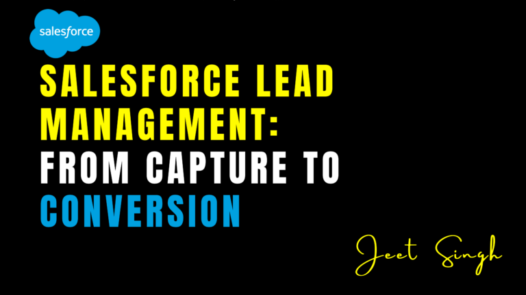

<figure>

<figcaption>

Salesforce Lead Management: From Capture to Conversion

</figcaption>

</figure>

In the world of sales, leads are the lifeblood of your business. They represent potential customers who have shown interest in your products or services. However, managing leads effectively can be a challenge, especially as your business grows. Salesforce Lead Management provides a comprehensive solution for capturing, tracking, and converting leads into customers. In this blog, we’ll explore the lead management process in Salesforce, from capturing leads to converting them into opportunities, and share best practices to help you maximize your sales potential.

### What Is Salesforce Lead Management?

Salesforce Lead Management is a set of tools and processes designed to help businesses capture, track, and nurture leads through the sales pipeline. It allows sales teams to manage leads from the moment they enter the system until they are converted into customers. With Salesforce Lead Management, you can automate repetitive tasks, track lead interactions, and analyze lead performance to improve your sales process.

For example, if a potential customer fills out a form on your website, Salesforce can automatically create a lead record and notify the appropriate sales rep. The rep can then track the lead’s progress, nurture the relationship, and convert the lead into an opportunity when the time is right.

### The Lead Management Process in Salesforce

The lead management process in Salesforce can be broken down into several key stages: **capture**, **qualification**, **nurturing**, and **conversion**. Let’s explore each stage in detail.

#### 1\. Lead Capture

The first step in the lead management process is capturing leads. Leads can come from various sources, such as website forms, email campaigns, social media, or events. Salesforce provides tools for capturing leads automatically and storing them in a centralized system.

For example, you can use Salesforce’s web-to-lead feature to capture leads from your website. When a visitor fills out a form, Salesforce automatically creates a lead record and assigns it to the appropriate sales rep.

#### 2\. Lead Qualification

Not all leads are created equal. Some are ready to buy, while others need more time and nurturing. Lead qualification is the process of evaluating leads to determine their potential value and readiness to purchase. Salesforce provides tools for scoring and grading leads based on criteria like demographics, behavior, and engagement.

For example, you can use Salesforce’s lead scoring feature to assign points to leads based on their actions, such as visiting your website or opening an email. Leads with higher scores are more likely to convert and should be prioritized by your sales team.

#### 3\. Lead Nurturing

Lead nurturing is the process of building relationships with leads over time. Not all leads are ready to buy immediately, so it’s important to stay in touch and provide value until they are ready to make a decision. Salesforce provides tools for automating lead nurturing, such as email campaigns, task reminders, and follow-up workflows.

For example, you can set up a workflow to automatically send a series of educational emails to leads who have shown interest but aren’t ready to buy. This keeps your brand top-of-mind and moves leads closer to conversion.

#### 4\. Lead Conversion

The final stage of the lead management process is converting leads into opportunities. A lead is considered converted when they are ready to make a purchase or move forward in the sales process. Salesforce provides tools for converting leads into opportunities, contacts, and accounts, ensuring that all relevant information is transferred seamlessly.

For example, when a lead expresses interest in your product, you can convert them into an opportunity and assign it to a sales rep. The rep can then track the opportunity through the sales pipeline and close the deal.

## Best Practices for Salesforce Lead Management

Here are some best practices to help you get the most out of Salesforce Lead Management:

### 1. **Define Your Lead Qualification Criteria**

Clearly define the criteria for qualifying leads, such as budget, authority, need, and timeline (BANT). This ensures that your sales team focuses on the most promising leads.

* * *

### 2. **Automate Lead Capture and Assignment**

Use Salesforce’s automation tools to capture leads from multiple sources and assign them to the appropriate sales reps. This saves time and ensures that no leads fall through the cracks.

* * *

### 3. **Nurture Leads with Personalized Content**

Use email campaigns, social media, and other channels to nurture leads with personalized content. Provide value at every stage of the buyer’s journey to build trust and move leads closer to conversion.

* * *

### 4. **Track Lead Interactions**

Use Salesforce to track all interactions with leads, such as emails, calls, and meetings. This provides a complete view of the lead’s journey and helps your sales team make informed decisions.

* * *

### 5. **Analyze Lead Performance**

Use Salesforce’s reporting and analytics tools to track lead performance and identify areas for improvement. For example, you can analyze conversion rates, lead sources, and sales cycle length to optimize your lead management process.

## Real-World Example: Transforming Lead Management

Imagine you’re a small business owner looking to improve your lead management process. By implementing Salesforce Lead Management, you can capture leads from your website, qualify them based on their potential value, and nurture them with personalized content. You can also track lead interactions and analyze lead performance to identify trends and optimize your sales process. Over time, you’ll be able to convert more leads into customers and grow your business.

## Conclusion

Salesforce Lead Management is a powerful tool for capturing, tracking, and converting leads into customers. By following the lead management process—capture, qualification, nurturing, and conversion—you can maximize your sales potential and build stronger customer relationships. Whether you’re a small business owner or a sales professional, Salesforce Lead Management can help you streamline your sales process and achieve your goals.

Remember: **Effective lead management isn’t just about closing deals—it’s about building relationships and delivering value.** Start using Salesforce Lead Management today and take your sales process to the next level!            

                                                                                                                                                            **-Jeet Singh**
