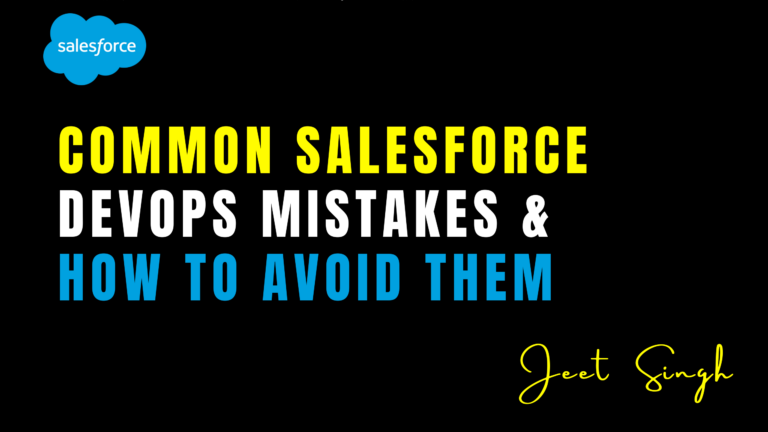

<figure>

<figcaption>

Common Salesforce DevOps Mistakes & How to Avoid Them

</figcaption>

</figure>

Salesforce DevOps has transformed how organizations **develop, test, and deploy changes** to their environments. By integrating **CI/CD pipelines, version control, and automated testing**, teams can achieve faster and more reliable releases. However, despite the benefits, many teams make **avoidable mistakes** that slow down development, introduce risks, and cause deployment failures.

In this blog, we’ll discuss the **most common Salesforce DevOps mistakes** and how to **prevent them** to ensure a smooth development workflow.

## 1\. Ignoring Version Control

One of the biggest mistakes in Salesforce DevOps is **not using version control properly** or **skipping it altogether**. Many teams still rely on **change sets**, which lack traceability and collaboration features. Without version control, developers **risk overwriting each other’s changes, losing important updates, and facing deployment conflicts**.

### **How to Avoid It:**

- Implement **Git-based version control** with tools like **GitHub, Bitbucket, or Azure DevOps**.
- Use **branching strategies** (e.g., feature branches, main branch, and hotfix branches) to manage changes efficiently.
- Automate syncing between sandboxes and production to prevent conflicts.

## 2\. Poor CI/CD Implementation

Many teams either **do not use CI/CD** or **set it up incorrectly**. Some organizations **manually test and deploy changes**, leading to **inconsistent releases, human errors, and slower time to market**. Others may set up **CI/CD pipelines but fail to optimize them**, causing **deployment failures and performance issues**.

### **How to Avoid It:**

- Use **DevOps tools like Copado, Gearset, or AutoRABIT** to automate CI/CD pipelines.
- Run **automated tests (unit, UI, API tests)** as part of every CI/CD process.
- Ensure deployments go through **staging or UAT environments before reaching production**.

## 3\. Skipping Automated Testing

Salesforce teams often neglect **automated testing**, relying only on **manual testing or basic unit tests**. This increases the risk of **bugs in production**, making it harder to **identify and fix issues before deployment**.

### **How to Avoid It:**

- Implement **Apex unit tests** with proper **test data factories** to ensure high test coverage.
- Use **Selenium, Provar, or Tosca** for automated UI testing.
- Automate **API testing with Postman or REST/SOAP UI** to validate integrations.

## 4\. Deploying Directly to Production

Some teams still **deploy changes directly to production**, skipping testing environments like **developer sandboxes, integration sandboxes, or UAT**. This practice **increases the risk of breaking critical business processes** and **causes downtime for users**.

### **How to Avoid It:**

- Always deploy changes to a **sandbox environment first**.
- Use **staging environments** to test real-world scenarios before production.
- Implement **approval workflows** in CI/CD to ensure proper review before deployments.

## 5\. Not Managing Metadata Properly

Salesforce metadata management can be challenging, especially with **custom objects, fields, flows, and Lightning components**. Many teams **fail to track metadata dependencies**, leading to **failed deployments and missing components** in production.

### **How to Avoid It:**

- Use **metadata comparison tools** like **Gearset or Flosum** to track changes.
- Document dependencies **before deploying complex configurations**.
- Automate metadata validation in CI/CD pipelines to catch errors early.

## 6\. Ignoring Security & Compliance

Salesforce environments handle **sensitive customer data**, making **security and compliance critical**. Some teams **do not enforce access controls, audit logs, or encryption**, increasing the risk of **data breaches and compliance violations**.

### **How to Avoid It:**

- Use **Salesforce Shield for data security** and enable **event monitoring**.
- Implement **role-based access controls (RBAC)** to restrict sensitive deployments.
- Enforce **audit trails and logging** for tracking changes in production.

## 7\. Not Backing Up Data & Metadata

Many teams assume that **Salesforce automatically backs up all data and metadata**, but **native recovery options are limited**. Without backups, accidental **deletions, failed deployments, or corruption** can lead to **permanent data loss**.

### **How to Avoid It:**

- Use backup solutions like **Gearset, AutoRABIT, or OwnBackup**.
- Schedule **regular automated backups** for both **data and metadata**.
- Ensure rollback capabilities are included in CI/CD workflows.

## 8\. Lack of Collaboration Between Developers & Admins

Salesforce development involves both **developers (who write Apex, LWC, and integrations)** and **admins (who configure workflows, process builders, and declarative tools)**. Poor collaboration between these roles can cause **misaligned deployments, conflicts, and inefficiencies**.

### **How to Avoid It:**

- Use **DevOps platforms like Copado or Flosum** that support both **developers and admins**.
- Maintain **shared documentation and communication channels (Slack, Microsoft Teams, or Jira)**.
- Conduct **regular sync meetings** to align development efforts.

## 9\. Failing to Monitor & Optimize Performance

After deployments, teams often **fail to monitor Salesforce performance**, leading to **slow page loads, Apex CPU timeouts, and governor limit issues**. Poor optimization can degrade the **user experience** and affect business operations.

### **How to Avoid It:**

- Use **Salesforce Optimizer & Event Monitoring** to analyze system performance.
- Implement **APEX profiling** and query optimization to reduce execution times.
- Monitor **error logs, integration failures, and system limits regularly**.

## Conclusion

Salesforce DevOps is a game-changer, but **common mistakes can slow down progress and create risks**. By **implementing version control, automating CI/CD, enforcing testing, managing metadata, and ensuring security**, teams can **streamline development and reduce deployment failures**.

Investing in **the right DevOps tools and best practices** will help Salesforce teams **achieve faster, more reliable, and error-free deployments**, ultimately enhancing productivity and customer experience.

                                                                                                                                                         **-Jeet Singh**
