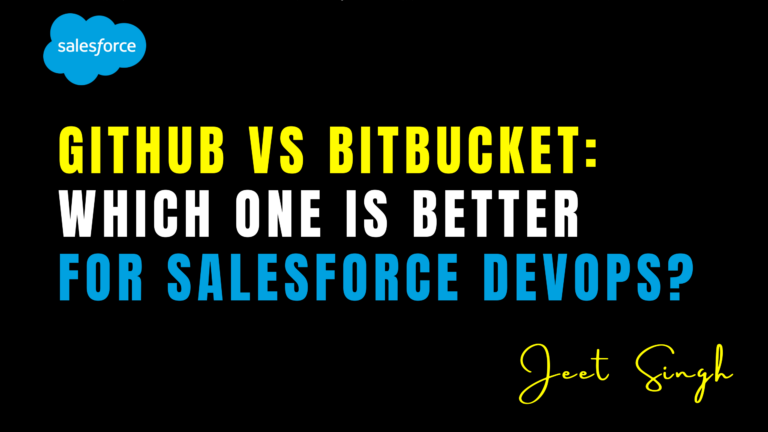

<figure>

<figcaption>

GitHub vs Bitbucket: Which One is Better for Salesforce DevOps?

</figcaption>

</figure>

When it comes to **Salesforce DevOps**, version control plays a crucial role in ensuring smooth collaboration, efficient development, and streamlined deployments. Two of the most popular Git-based repositories for managing Salesforce projects are **GitHub and Bitbucket**. Both platforms offer robust version control, collaboration features, and integration with CI/CD tools, but they cater to different types of teams and workflows.

If you’re a Salesforce developer or DevOps engineer trying to decide between **GitHub and Bitbucket**, it’s important to understand their **differences, strengths, and limitations** to determine which one best fits your needs.

## Overview of GitHub and Bitbucket

#### GitHub

GitHub is the world’s most widely used **Git-based repository hosting service**. It is known for its **user-friendly interface, strong open-source community, and extensive integration options**. Many Salesforce teams use GitHub to manage their metadata, code, and DevOps workflows efficiently.

#### Bitbucket

Bitbucket, developed by Atlassian, is another powerful **Git repository management tool** that is widely adopted, especially by teams that use Jira, Confluence, and other Atlassian products. It is known for **its seamless integration with Jira**, making it a preferred choice for teams following **agile and DevOps methodologies**.

## Key Factors to Consider

#### 1\. Collaboration and User Experience

GitHub is often praised for its **clean and intuitive interface**. It provides **pull requests, issue tracking, and discussions**, making it easy for teams to collaborate on Salesforce development. Since GitHub is home to a vast open-source community, it encourages knowledge sharing and innovation.

Bitbucket, on the other hand, **offers a more enterprise-focused approach** with deep integration into Jira and Confluence. If your Salesforce team heavily relies on **Atlassian tools for project management**, Bitbucket provides a more **connected and structured workflow**.

#### 2\. Integration with Salesforce DevOps Tools

Both GitHub and Bitbucket integrate well with Salesforce DevOps tools like **Copado, Gearset, Jenkins, and Azure DevOps**. However, GitHub has a broader ecosystem, supporting **more third-party integrations**, including GitHub Actions, which allows for automated deployments and testing directly within the platform.

Bitbucket, being part of the Atlassian ecosystem, works seamlessly with **Bamboo, Jira, and Bitbucket Pipelines**, providing a more **centralized approach for development, tracking, and deployment**. If your team already uses Jira, Bitbucket may be the **better choice** due to its native integration.

#### 3\. Security and Access Control

Security is a top priority for Salesforce DevOps, especially when handling metadata and customer data.

GitHub offers **branch protection rules, encrypted secrets, and fine-grained access control** to ensure that sensitive Salesforce configurations are protected. GitHub Enterprise also provides **self-hosted options** for organizations with strict security requirements.

Bitbucket takes security a step further with **built-in IP whitelisting, enforced two-factor authentication, and integration with Atlassian Access**. Bitbucket’s repository-level permissions allow **more granular access control**, making it ideal for enterprises with strict governance policies.

#### 4\. Pricing and Scalability

GitHub offers **a free plan for individuals and small teams**, with premium plans for enterprises that need **advanced security and CI/CD features**.

Bitbucket provides **free private repositories** for small teams (up to 5 users), which is a major advantage over GitHub’s free plan, which only allows public repositories. Bitbucket’s **pricing structure is more attractive for enterprises**, as it allows unlimited private repositories at a lower cost compared to GitHub’s premium plans.

#### 5\. Performance and Repository Management

GitHub handles large repositories well, but Bitbucket offers **more control over monorepos** and **better repository organization** for enterprise-level Salesforce development. Bitbucket also has built-in **LFS (Large File Storage)**, which can be useful for Salesforce teams dealing with large metadata sets.

## Which One is Better for Salesforce DevOps?

The choice between GitHub and Bitbucket largely depends on **your team’s workflow, tools, and priorities**.

- **Choose GitHub if** you want a **developer-friendly UI, a large open-source community, and extensive third-party integrations**. It is ideal for **smaller teams, open-source projects, and those using GitHub Actions for CI/CD**.
- **Choose Bitbucket if** your team already uses **Atlassian products like Jira and Confluence** and you need **stronger security controls, repository organization, and built-in CI/CD (Bitbucket Pipelines)**. It is a great option for **enterprise teams following a strict governance model**.

## Conclusion

Both GitHub and Bitbucket are excellent choices for **Salesforce DevOps**, and the best option depends on your team’s **requirements and ecosystem**. If your team values **community, simplicity, and flexibility**, GitHub is a solid choice. However, if your organization relies on **Jira, needs enhanced security, and prefers an enterprise-friendly environment**, Bitbucket may be the **better fit**.

Ultimately, **the success of Salesforce DevOps depends not just on the repository platform but also on implementing the right workflows, CI/CD automation, and security best practices**. Whether you choose GitHub or Bitbucket, integrating it into a well-structured **Salesforce DevOps strategy** will ensure **faster deployments, improved collaboration, and better overall efficiency**.

                                                                                                                                                                      **\-Jeet Singh**
