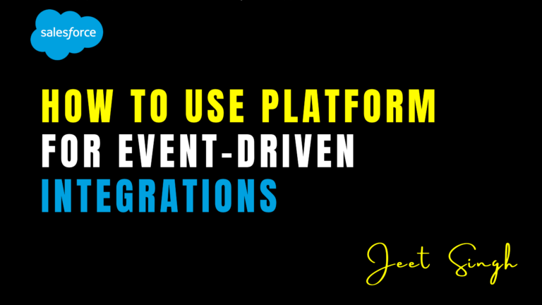

<figure>

<figcaption>

How to Use Platform Events for Event-Driven Integrations

</figcaption>

</figure>

As businesses rely more on real-time data and automation, traditional request-response integrations often fall short in delivering **instant, scalable, and flexible** solutions. This is where **Platform Events in Salesforce** come in. Platform Events enable **event-driven integrations**, allowing different systems to communicate asynchronously in real time.

Instead of relying on scheduled jobs or frequent API polling, Platform Events push relevant data to external systems as soon as a specific event occurs. This ensures **faster processing, better system efficiency, and improved scalability**. In this blog, we’ll explore **what Platform Events are, how they work, their benefits, and how to implement them effectively in Salesforce**.

## What Are Platform Events in Salesforce?

Platform Events are a **publish-subscribe (pub/sub) model of communication**, allowing Salesforce and external systems to interact asynchronously. They work similarly to message queues, where one system **publishes an event**, and multiple subscribers (internal or external) can **listen and respond to it**.

Each Platform Event represents a **real-world business event**, such as:

- A new **lead** being created.
- A **payment** being processed.
- A **case update** being sent to a customer support system.
- A **shipment status** being updated in an external logistics system.

Instead of continuously checking for changes (polling), external systems simply **subscribe** to these events and act on them when they occur. This approach is highly **scalable and efficient**, reducing unnecessary API calls and improving system performance.

## Why Use Platform Events for Event-Driven Integrations?

#### 1\. Real-Time Data Processing

Platform Events enable instant data synchronization between Salesforce and external applications, ensuring that critical updates reach the right system **without delay**.

#### 2\. Asynchronous Communication

Unlike synchronous APIs, Platform Events allow systems to work **independently**, preventing bottlenecks and improving performance.

#### 3\. Scalability & Flexibility

Since multiple systems can subscribe to the same event, businesses can build **highly scalable architectures** that support various integration needs.

#### 4\. Reduced API Usage & Costs

Because data is **pushed** only when an event occurs, Platform Events help minimize unnecessary API calls, reducing API limits and integration costs.

#### 5\. Fault Tolerance & Reliability

Platform Events ensure reliable message delivery. Even if an external system is temporarily down, it can **retrieve and process missed events** once it's back online.

## How Platform Events Work in Salesforce

Platform Events follow a **publish-subscribe model**, where:

1. **Salesforce (or an external system) publishes an event** when a specific action occurs (e.g., an opportunity is won).
2. **Subscribers listen for the event and process it** (e.g., updating a billing system or sending a notification).
3. **Events are stored in Salesforce’s event bus** for a short period, allowing subscribers to consume them when they are ready.

Salesforce provides **multiple ways** to publish and subscribe to Platform Events, including **Apex, Flow, External APIs, and Salesforce Connect**.

## Steps to Implement Platform Events in Salesforce

#### Step 1: Define a Platform Event

To create a Platform Event in Salesforce:

1. Navigate to **Setup** → Search for **Platform Events**.
2. Click **New Platform Event** and define:
    - **Event Name** (e.g., Order\_Status\_Updated).
    - **Fields** to store relevant event data (e.g., Order ID, Status, Timestamp).
3. Save and click **Edit Layout** to add custom fields if needed.

#### Step 2: Publish Platform Events

Platform Events can be **published** in multiple ways:

- **Using Apex**  
    Developers can publish events through **Apex code**, triggering events based on Salesforce record changes.
- **Using Flows or Process Builder**  
    Admins can automate event publishing **without code**, enabling user-friendly event-driven workflows.
- **Using API Calls**  
    External systems can publish Platform Events using Salesforce’s REST or SOAP API.

#### Step 3: Subscribe to Platform Events

Subscribers can consume Platform Events in different ways:

- **Apex Triggers**  
    Salesforce can process events in real-time using Apex triggers, executing business logic immediately.
- **External Systems (via CometD or Streaming API)**  
    External applications can listen for events using the **Streaming API** to receive real-time updates.
- **Flows and Process Builder**  
    Admins can configure Salesforce Flows to **listen for Platform Events** and take automated actions.

#### Step 4: Monitor & Manage Events

Salesforce provides event monitoring tools to track published and subscribed events, ensuring smooth **event processing and debugging**.

## Use Cases for Platform Events in Salesforce

- **Real-Time Order Updates:** When an order is shipped in an external ERP, a Platform Event updates Salesforce automatically.
- **Automated Lead Assignments:** A lead capture system publishes a Platform Event, triggering an assignment workflow in Salesforce.
- **Customer Support Notifications:** A new **case update** in Salesforce triggers a notification to an external support system like **Zendesk**.
- **IoT Device Integration:** Connected devices publish events to Salesforce when anomalies are detected, triggering service requests.
- **Payment Processing:** When a payment is received, an event notifies Salesforce to update the **invoice status**.

## Conclusion

Platform Events in Salesforce enable **real-time, scalable, and efficient** event-driven integrations. By using a **publish-subscribe model**, businesses can automate workflows, enhance customer experiences, and optimize system performance without relying on **traditional request-response mechanisms**.

With **seamless event publishing and flexible subscription options**, Platform Events empower organizations to integrate Salesforce with external systems in a **reliable, cost-effective, and scalable manner**. Whether it’s syncing data across platforms, automating business processes, or enabling real-time analytics, Platform Events provide the foundation for **modern, event-driven architectures** that keep businesses agile and efficient.

                                                                                                                                                             **- Jeet Singh**
