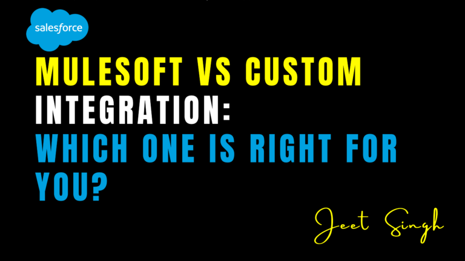

<figure>

<figcaption>

MuleSoft vs Custom Integration: Which One is Right for You?

</figcaption>

</figure>

In today’s fast-paced digital world, businesses rely heavily on data exchange between applications, cloud services, and on-premise systems. As companies grow, they often need **integration solutions** that can connect different systems, ensuring smooth data flow, automation, and operational efficiency.

However, choosing the right integration approach is crucial. While **MuleSoft** is a well-known **integration platform as a service (iPaaS)** that simplifies connectivity, some businesses prefer **custom integration** to create tailor-made solutions. But which one is right for you? Let’s explore the **pros, cons, and key differences** between MuleSoft and custom-built integrations to help you make an informed decision.

## What is MuleSoft?

MuleSoft is a **leading integration platform** that helps businesses connect various applications, data, and devices using an **API-led approach**. Its **Anypoint Platform** provides **pre-built connectors, APIs, security features, and analytics**, making integration faster and more scalable.

With MuleSoft, businesses can integrate systems **without needing extensive custom coding**, making it a popular choice for enterprises looking for **efficiency, automation, and flexibility** in their IT infrastructure.

### **Key Features of MuleSoft**

- **Pre-built Connectors:** Simplifies integration with applications like Salesforce, SAP, AWS, and databases.
- **API Management:** Enables businesses to create, manage, and secure APIs efficiently.
- **Cloud & On-Premise Compatibility:** Works across hybrid environments, supporting cloud and legacy systems.
- **Security & Compliance:** Comes with built-in authentication, encryption, and governance tools.
- **Scalability & Performance Monitoring:** Offers real-time insights into integrations and system health.

### **Pros of MuleSoft Integration**

1. **Faster Deployment:** Pre-built APIs and templates reduce development time.
2. **Enhanced Scalability:** Easily integrates new applications as business needs grow.
3. **Security & Compliance:** Built-in security features help protect sensitive data.
4. **Lower Maintenance Effort:** Regular updates and technical support reduce IT burden.
5. **User-Friendly:** Drag-and-drop interface simplifies integration for non-developers.

### **Cons of MuleSoft Integration**

1. **High Licensing Costs:** MuleSoft’s pricing can be expensive for startups and small businesses.
2. **Learning Curve:** Requires expertise to configure and manage complex integrations.
3. **Vendor Lock-in:** Businesses become dependent on MuleSoft’s ecosystem.
4. **Limited Customization:** Some businesses may require unique integrations not supported by MuleSoft.

## What is Custom Integration?

Custom integration refers to **building software-based solutions from scratch** to connect different applications and systems. This approach allows businesses to have **full control over integrations, data flow, security, and customization**.

Unlike MuleSoft, which provides a **ready-made platform**, custom integration requires **manual development using programming languages, middleware, or APIs** tailored to specific business needs.

### **Key Features of Custom Integration**

- **Built for Specific Business Needs:** Fully customizable to meet unique requirements.
- **No Licensing Fees:** Unlike MuleSoft, businesses avoid subscription costs.
- **Flexible Infrastructure:** Can integrate on-premise, cloud, or hybrid environments.
- **Direct Database & API Access:** Allows deeper customization and optimization.

### **Pros of Custom Integration**

1. **Full Customization:** Businesses have total control over integration logic.
2. **Cost Control:** No ongoing licensing or subscription fees.
3. **No Vendor Lock-in:** Companies retain ownership of their integration infrastructure.
4. **Optimized Performance:** Custom-built solutions can be lightweight and efficient.
5. **Advanced Security:** Businesses can implement custom security protocols.

### **Cons of Custom Integration**

1. **Longer Development Time:** Requires extensive coding, testing, and troubleshooting.
2. **Higher Maintenance Effort:** IT teams must handle updates, monitoring, and bug fixes.
3. **Scalability Challenges:** Adding new integrations may require additional development.
4. **Security Risks:** Custom solutions may require extra effort to ensure data protection.

## MuleSoft vs. Custom Integration: A Detailed Comparison

| **Factor** | **MuleSoft** | **Custom Integration** |
| --- | --- | --- |
| **Deployment Speed** | Faster due to pre-built APIs | Slower, requires coding from scratch |
| **Scalability** | Highly scalable | Scalability depends on architecture |
| **Customization** | Limited to MuleSoft’s framework | Fully customizable |
| **Security** | Built-in security features | Requires custom security implementations |
| **Cost** | High licensing fees | No recurring fees, but high initial costs |
| **Maintenance** | Low, handled by MuleSoft updates | High, requires in-house management |
| **Flexibility** | Restricted to MuleSoft’s ecosystem | Fully flexible for any integration need |
| **Vendor Lock-in** | Yes, reliant on MuleSoft | No, full control remains with the business |

## Which One is Right for Your Business?

The best integration approach depends on **your business size, budget, complexity of integration needs, and technical expertise**.

- **Choose MuleSoft if:**
    
    - You need a **ready-made**, **scalable**, and **secure** solution.
    - Your business **relies on multiple third-party applications** like Salesforce, AWS, or SAP.
    - You want **low maintenance** with vendor support.
    - Your team lacks the resources to build custom solutions from scratch.
- **Choose Custom Integration if:**
    
    - Your business requires **highly specialized** integrations.
    - You prefer **avoiding vendor lock-in** and **owning** your integration infrastructure.
    - You have an **in-house development team** capable of maintaining the integrations.
    - You are looking for **cost-efficient solutions** without ongoing licensing fees.

## Conclusion

Choosing between **MuleSoft and custom integration** is a strategic decision that impacts your **business efficiency, cost, security, and scalability**. MuleSoft is ideal for companies that need **rapid integration, strong security, and scalability** with minimal development effort. On the other hand, custom integration provides **complete control, flexibility, and cost efficiency**, but requires higher initial investment in development and maintenance.

Ultimately, the right choice depends on your business’s **long-term vision, budget, and IT capabilities**. Whether you go with **MuleSoft’s ready-made platform or a custom-built integration**, the key is to ensure **seamless data connectivity** that supports your growth and digital transformation goals.                                                                                                                                                                                                      **-Jeet Singh**
