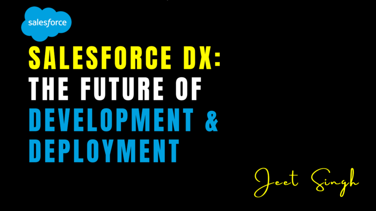

<figure>

<figcaption>

Salesforce DX: The Future of Development & Deployment

</figcaption>

</figure>

Salesforce development has evolved significantly over the years, and Salesforce DX (Developer Experience) is at the forefront of this transformation. Traditional development methods, which relied on **change sets, sandboxes, and manual deployments**, often led to inefficiencies, version conflicts, and limited collaboration. With Salesforce DX, developers now have access to a modern, **source-driven development approach** that enhances agility, automation, and scalability.

## What is Salesforce DX?

Salesforce DX is a **set of tools and best practices** designed to improve the way developers build, test, and deploy applications on the Salesforce platform. It shifts the focus from **org-based development to source-driven development**, allowing teams to store configurations and metadata in a **version control system (VCS)** such as Git. This change provides greater flexibility, making it easier to track changes, collaborate on projects, and roll back updates when needed.

One of the biggest challenges in traditional Salesforce development was the reliance on sandboxes and developer orgs, which often led to **inconsistent environments** and **deployment issues**. Salesforce DX introduces **scratch orgs**, which are temporary, fully configurable environments that allow developers to quickly create, test, and discard environments as needed. This speeds up development cycles and ensures that every new feature is tested in an isolated and controlled space before being pushed to production.

## Why is Salesforce DX Important?

Salesforce DX solves many of the pain points that developers and admins have faced for years. It improves **collaboration**, as multiple developers can work on the same project simultaneously without the risk of overwriting each other’s changes. With everything stored in a version control system, teams can efficiently **merge updates, resolve conflicts, and track progress** with complete transparency.

Another critical advantage is **faster and more reliable deployments**. Traditional change sets were manual and prone to human errors, often resulting in failed deployments. With Salesforce DX, deployments can be automated and **integrated into CI/CD pipelines**, ensuring that every update is tested and validated before going live. This significantly reduces downtime and enhances the overall stability of the system.

Furthermore, Salesforce DX promotes **modular development** through **unlocked packages**, which enable teams to break down large projects into smaller, manageable components. This modular approach makes it easier to deploy updates without affecting the entire system, providing **greater flexibility and reusability** across different Salesforce environments.

## How Salesforce DX is Transforming Development & Deployment

#### 1\. Source-Driven Development

Salesforce DX encourages teams to adopt **source-driven workflows**, meaning that all configurations and metadata are maintained in a central repository. This ensures consistency across environments and eliminates the risks associated with making direct changes in an org.

#### 2\. Scratch Orgs for Agile Development

Scratch orgs allow developers to work in isolated environments, where they can quickly test new features without affecting production. These lightweight, disposable environments help streamline testing and development, making it easier to experiment with new functionalities.

#### 3\. Automated Deployments with CI/CD

With Salesforce DX, teams can integrate their development workflow with **continuous integration and continuous deployment (CI/CD) pipelines**. This automation ensures that new updates are **automatically tested and deployed**, reducing the chances of human error and making deployments more efficient.

#### 4\. Modular Development with Unlocked Packages

Unlocked packages allow businesses to organize their Salesforce customizations into smaller components, making it easier to **manage dependencies, update individual features, and scale applications** without disrupting the entire system.

#### 5\. Improved Collaboration & Version Control

By leveraging Git and other version control systems, Salesforce DX makes it simple for teams to **collaborate in real time, track changes, and ensure code quality** before updates reach production. This eliminates the common issue of overwritten changes and conflicting updates.

## The Future of Salesforce Development with DX

Salesforce DX is more than just a toolset—it represents a **shift toward modern development practices** that prioritize **efficiency, automation, and teamwork**. As businesses continue to demand faster innovation and more reliable deployments, adopting Salesforce DX is no longer an option but a necessity for staying competitive in the Salesforce ecosystem.

By implementing **source-driven development, scratch orgs, automated deployments, and modular packaging**, organizations can **reduce development time, improve deployment success rates, and maintain a more scalable Salesforce architecture**. Whether you are a developer, admin, or IT leader, embracing Salesforce DX will help you unlock new levels of productivity and ensure seamless application delivery in the future.

## Conclusion

Salesforce DX is revolutionizing the way developers and businesses approach Salesforce development and deployment. With its source-driven methodology, seamless integration with DevOps practices, and automation-driven workflows, it empowers teams to **deliver high-quality applications faster and with fewer errors**. The ability to **collaborate efficiently, track every change, and deploy with confidence** makes it an essential tool for any organization looking to scale its Salesforce operations.

As the Salesforce ecosystem continues to grow, businesses that embrace **Salesforce DX will stay ahead of the competition**, ensuring their development processes remain **agile, reliable, and future-proof**. By adopting this modern approach, companies can **increase productivity, reduce deployment risks, and create a more innovative Salesforce experience**. Now is the time to leverage Salesforce DX and unlock the full potential of streamlined Salesforce development.

                                                                                                                                                           **-Jeet Singh**
