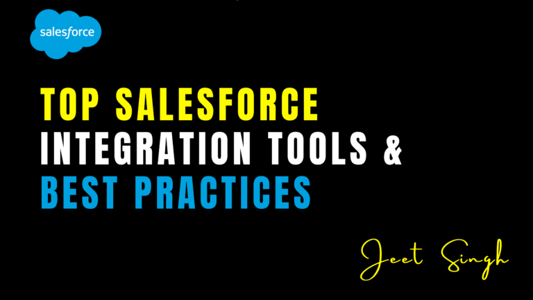

<figure>

<figcaption>

Top Salesforce Integration Tools & Best Practices

</figcaption>

</figure>

Salesforce’s capabilities extend beyond its CRM functions when integrated with other systems like **marketing platforms, ERP systems, e-commerce platforms, and analytics tools**. A well-executed Salesforce integration ensures **seamless data flow, automation, and better decision-making**. However, choosing the right integration tool can be challenging, as different solutions offer varying levels of functionality, scalability, and ease of use. In this blog, we will explore some of the top Salesforce integration tools and best practices to ensure smooth and secure integrations.

## Top Salesforce Integration Tools

MuleSoft Anypoint Platform is one of the most powerful integration tools, offering an API-led connectivity approach to link Salesforce with **cloud-based and on-premise applications**. With its extensive **pre-built connectors** and support for **real-time and batch processing**, it is a top choice for enterprises requiring complex, large-scale integrations. Salesforce Connect, on the other hand, allows businesses to access **external data in real-time without storing it in Salesforce**. By using the **OData protocol**, organizations can connect their Salesforce instance to **external databases like SQL Server, SAP, and SharePoint**, making it ideal for those who need **live data access without duplication**.

For businesses looking for a no-code approach, **Zapier** provides a simple solution that connects Salesforce with thousands of apps, including Gmail, Slack, and HubSpot. Its drag-and-drop workflow automation makes it accessible to non-developers. Similarly, **Workato** is an AI-driven integration platform that enables **multi-step automation workflows** and seamless Salesforce integrations with other enterprise applications like **NetSuite, Marketo, and ServiceNow**. Its built-in security compliance features make it a reliable choice for organizations concerned with data privacy.

Jitterbit is another low-code integration platform that helps Salesforce users sync data quickly across different systems. It is well-suited for **data migration, ETL (Extract, Transform, Load) processes, and AI-powered automation**. Dell Boomi offers similar functionality with a **cloud-native, drag-and-drop interface**, allowing businesses to connect Salesforce to HR, ERP, and financial systems efficiently. These platforms help enterprises streamline their integrations with minimal technical expertise.

For organizations that prefer **native Salesforce solutions**, Apex Callouts, Platform Events, and External Services provide effective alternatives. Apex Callouts allow developers to make REST and SOAP API requests to external systems, while **Platform Events enable real-time, event-driven integrations** for updating data across systems. **External Services allow Salesforce admins to call APIs without writing any code** by using schema-based API definitions, making it a user-friendly option for those who want declarative integration capabilities.

## Best Practices for Salesforce Integration

Before selecting an integration tool, businesses must clearly define their **integration goals**. This includes identifying which systems need to be connected, what data should be shared, and how frequently the integration should occur—whether in **real-time, batch processing, or scheduled syncs**. A well-planned integration strategy ensures efficiency and minimizes system overload.

Security should always be a priority in any integration. Using **OAuth 2.0 for API authentication**, implementing **named credentials** in Salesforce, and enabling **multi-factor authentication (MFA)** are crucial steps in ensuring that data remains secure and compliant with regulations. Additionally, businesses integrating multiple systems should consider using **middleware solutions like MuleSoft, Workato, or Dell Boomi** to simplify complex integrations while maintaining stability and security.

One of the common challenges in Salesforce integrations is exceeding API limits. To avoid this, businesses should optimize API calls by **using batch processing instead of multiple single requests, implementing event-driven architecture with Platform Events, and caching frequently accessed data**. These practices help in **reducing unnecessary API consumption**, ensuring that integrations run smoothly without hitting Salesforce’s API restrictions.

Monitoring and logging are essential for maintaining integration reliability. Salesforce **Debug Logs** and third-party monitoring tools like **MuleSoft Anypoint Monitoring or Workato Insights** can help track errors, detect failures, and provide valuable insights into system performance. Setting up automated alerts ensures that **integration issues can be resolved proactively** before they impact business operations.

Ensuring **data consistency** across integrated systems is also critical. Mismatched field mappings, differing data formats, and improper validation rules can lead to incorrect records and synchronization issues. Establishing proper **data transformation techniques** and validation processes helps prevent these inconsistencies. Additionally, regular testing and maintenance of integrations should not be overlooked. Businesses must validate **API changes from third-party providers**, check for **data synchronization accuracy**, and optimize workflows to improve performance over time.

## Conclusion

Salesforce integration is a game-changer for businesses, but selecting the right tool and following best practices are key to ensuring a **successful and scalable** integration strategy. Tools like **MuleSoft, Zapier, Workato, Jitterbit, and Salesforce Connect** cater to different business needs, from **simple no-code automation to complex enterprise-level integrations**. By prioritizing **security, API optimization, data consistency, and proactive monitoring**, organizations can ensure **seamless data flow, improved efficiency, and enhanced customer experience**. Whether integrating real-time order updates, marketing automation, or financial systems, a **well-executed Salesforce integration** can drive business growth and operational efficiency.

                                                                                                                                                               **-Jeet Singh**
