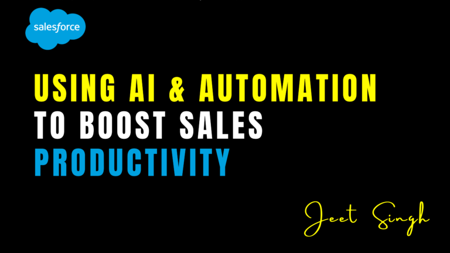

<figure>

<figcaption>

Using AI & Automation to Boost Sales Productivity

</figcaption>

</figure>

In today’s fast-paced business environment, sales teams are constantly under pressure to meet targets, close deals, and drive revenue. However, manual processes and repetitive tasks can slow them down, leading to inefficiencies and missed opportunities. This is where artificial intelligence (AI) and automation come into play. By leveraging AI and automation tools, businesses can streamline their sales processes, enhance productivity, and empower their teams to focus on what they do best—building relationships and closing deals. In this blog, we’ll explore how AI and automation can transform your sales strategy and help you achieve better results.

### The Role of AI and Automation in Sales

Artificial intelligence and automation are no longer just buzzwords—they are essential tools for modern sales teams. AI refers to the use of advanced algorithms and machine learning to analyze data, predict outcomes, and provide actionable insights. Automation, on the other hand, involves using technology to perform repetitive tasks without human intervention. Together, these technologies can revolutionize the way sales teams operate by eliminating manual work, improving accuracy, and enabling smarter decision-making.

For example, AI can analyze customer data to identify patterns and predict which leads are most likely to convert. Automation can then take over tasks like sending follow-up emails, updating CRM records, or scheduling meetings. By combining AI and automation, businesses can create a seamless sales process that maximizes efficiency and drives results.

### How AI Enhances Sales Productivity

AI has the power to transform every stage of the sales process, from lead generation to closing deals. One of the most significant ways AI boosts productivity is through predictive analytics. By analyzing historical data, AI can predict which leads are most likely to convert, allowing sales teams to prioritize their efforts and focus on high-value opportunities. This not only saves time but also increases the chances of closing deals.

Another way AI enhances productivity is through personalized recommendations. AI-powered tools can analyze customer behavior and preferences to suggest the most relevant products or services. This level of personalization helps sales reps tailor their pitches and build stronger relationships with prospects. Additionally, AI can provide real-time insights during sales calls or meetings, offering suggestions on what to say or how to address objections. This empowers sales reps to be more confident and effective in their interactions.

### How Automation Streamlines Sales Processes

Automation is a game-changer for sales teams, as it eliminates the need for manual, repetitive tasks. One of the most common uses of automation is in lead management. Automated tools can capture leads from various sources, such as websites or social media, and assign them to the appropriate sales reps based on predefined criteria. This ensures that no lead falls through the cracks and that follow-ups happen in a timely manner.

Another area where automation shines is in communication. Automated email campaigns can nurture leads by sending personalized messages at the right time, keeping prospects engaged throughout the sales cycle. Automation can also handle tasks like updating CRM records, creating tasks for follow-ups, and generating reports. By taking care of these routine tasks, automation frees up sales reps to focus on building relationships and closing deals.

### Real-World Applications of AI and Automation in Sales

Many businesses are already reaping the benefits of AI and automation in their sales processes. For instance, AI-powered chatbots can engage with website visitors, answer common questions, and even schedule appointments with sales reps. This not only improves the customer experience but also ensures that leads are captured and followed up on promptly.

Another example is the use of AI-driven sales forecasting tools. These tools analyze historical data, market trends, and other factors to predict future sales performance. This helps businesses make informed decisions about resource allocation, goal setting, and strategy development. Automation tools like Salesforce’s Process Builder and Flows can also be used to automate complex workflows, such as lead scoring, opportunity management, and task creation.

### Best Practices for Implementing AI and Automation

To successfully implement AI and automation in your sales process, it’s important to follow best practices. Start by identifying the areas where these technologies can have the most impact. For example, if your team spends too much time on manual data entry, consider automating CRM updates. If lead prioritization is a challenge, explore AI-powered lead scoring tools.

Next, choose the right tools for your needs. There are many AI and automation solutions available, so take the time to evaluate your options and select the ones that align with your goals. It’s also important to involve your sales team in the process. Get their input on pain points and ensure they understand how to use the new tools effectively.

Finally, monitor and optimize your AI and automation strategies over time. Track key metrics like lead conversion rates, sales cycle length, and team productivity to measure the impact of these technologies. Use this data to make adjustments and continuously improve your sales process.

### Conclusion

AI and automation are powerful tools that can transform your sales process and boost productivity. By leveraging these technologies, businesses can eliminate manual tasks, improve accuracy, and empower their sales teams to focus on what they do best. Whether you’re using AI to predict which leads are most likely to convert or automating routine tasks like email follow-ups, these tools can help you achieve better results and stay ahead of the competition.

Ready to take your sales productivity to the next level? Start exploring AI and automation tools today and unlock the full potential of your sales team.

                                                                                                                                                                 **\-Jeet Singh**
