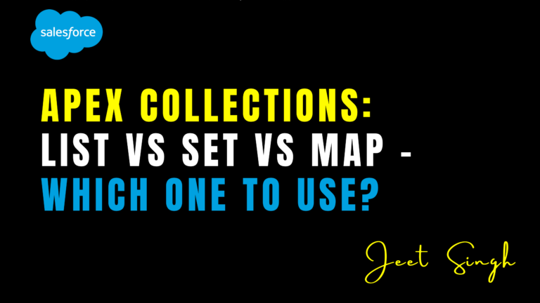

<figure>



<figcaption>

Apex Collections: List vs Set vs Map – Which One to Use?

</figcaption>

</figure>

In Salesforce Apex, **collections** are essential for storing and manipulating groups of data. The three most commonly used collections are **List**, **Set**, and **Map**. Each has its unique characteristics, advantages, and use cases. Choosing the right collection type can significantly impact the performance and readability of your code.

In this blog, we’ll explore the differences between List, Set, and Map, and provide guidance on when to use each one in your Apex development.

### What Are Apex Collections?

Apex collections are data structures that allow you to store multiple values in a single variable. They are particularly useful for:

- Storing and retrieving data.
    
- Iterating through records.
    
- Performing bulk operations.
    

The three primary collection types in Apex are:

1. **List**: An ordered collection of elements that allows duplicates.
    
2. **Set**: An unordered collection of unique elements.
    
3. **Map**: A collection of key-value pairs, where each key is unique.
    

## List: When to Use It

### What Is a List?

A **List** is an ordered collection of elements that allows duplicates. It is the most commonly used collection in Apex.

### Key Features:

- Maintains insertion order.
    
- Allows duplicate values.
    
- Can be accessed by index.
    

### Use Cases:

- Storing records retrieved from a SOQL query.
    
- Maintaining a sequence of items (e.g., order items in a shopping cart).
    
- Performing bulk DML operations.
    

##### Example:

```
List colors = new List{'Red', 'Green', 'Blue'};
colors.add('Yellow'); // Adds 'Yellow' to the list
System.debug(colors[0]); // Outputs 'Red'.
```

## Set: When to Use It

### What Is a Set?

A **Set** is an unordered collection of unique elements. It does not allow duplicates.

### Key Features:

- Does not maintain insertion order.
    
- Ensures all elements are unique.
    
- Cannot be accessed by index.
    

### Use Cases:

- Removing duplicates from a list of values.
    
- Checking for the existence of an element.
    
- Storing unique IDs or keys.
    

##### Example:

```
Set colors = new Set{'Red', 'Green', 'Blue'};
colors.add('Red'); // Does not add 'Red' again
System.debug(colors.contains('Green')); // Outputs 'true'
```

## Map: When to Use It

### What Is a Map?

A **Map** is a collection of key-value pairs, where each key is unique. It is ideal for storing and retrieving data based on a unique identifier.

### Key Features:

- Stores data as key-value pairs.
    
- Keys are unique, but values can be duplicated.
    
- Provides fast lookups by key.
    

### Use Cases:

- Storing records with a unique identifier (e.g., Account ID).
    
- Grouping related data (e.g., Contacts by Account ID).
    
- Performing quick lookups or searches.
    

##### Example:

```
Map accountMap = new Map();
Account acc = new Account(Name = 'Test Account');
accountMap.put(acc.Id, acc); // Adds the account to the map
System.debug(accountMap.get(acc.Id)); // Outputs the account details 
```

## List vs Set vs Map: Key Differences

| **Feature** | **List** | **Set** | **Map** |
| --- | --- | --- | --- |
| **Order** | Maintains insertion order | Unordered | Unordered |
| **Duplicates** | Allows duplicates | No duplicates | Unique keys, duplicate values |
| **Access** | By index | Not by index | By key |
| **Use Case** | Ordered data, bulk operations | Unique values, deduplication | Key-value pairs, fast lookups |

## How to Choose the Right Collection

Here’s a quick guide to help you decide which collection to use:

#### Use a List When:

- You need to maintain the order of elements.
    
- You want to allow duplicate values.
    
- You’re working with records from a SOQL query.
    

#### Use a Set When:

- You need to ensure all elements are unique.
    
- You want to check for the existence of an element.
    
- You’re working with unique IDs or keys.
    

#### Use a Map When:

- You need to store data as key-value pairs.
    
- You want fast lookups by a unique identifier.
    
- You’re grouping related data (e.g., Contacts by Account ID).
    

### Real-World Example: Using Collections Together

Imagine you’re building a feature to group Contacts by their Account ID. Here’s how you can use all three collections together:

1. Use a **List** to store Contacts retrieved from a SOQL query.
    
2. Use a **Set** to store unique Account IDs.
    
3. Use a **Map** to group Contacts by their Account ID.
    

##### Example:

```
List contacts = [SELECT Id, Name, AccountId FROM Contact];
Set accountIds = new Set();
Map> accountContactMap = new Map>();
for (Contact con : contacts) {
accountIds.add(con.AccountId);
if (!accountContactMap.containsKey(con.AccountId)) {
accountContactMap.put(con.AccountId, new List());
}
accountContactMap.get(con.AccountId).add(con);
}
```

### Conclusion

Choosing the right collection type—**List**, **Set**, or **Map**—is crucial for writing efficient and maintainable Apex code. By understanding the strengths and use cases of each collection, you can optimize your code for performance and readability.

Remember: **The right collection can make your code simpler, faster, and more scalable.** Use Lists for ordered data, Sets for unique values, and Maps for key-value pairs to unlock the full potential of Apex collections.

                                                                                                                                                                    **-Jeet Singh**
