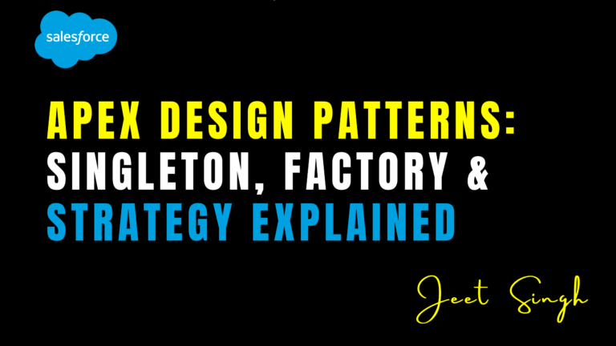

<figure>



<figcaption>

Apex Design Patterns: Singleton, Factory & Strategy Explained

</figcaption>

</figure>

In Salesforce development, writing clean, maintainable, and scalable code is essential. One way to achieve this is by using **design patterns**—proven solutions to common software design problems. Design patterns help you structure your code in a way that promotes reusability, flexibility, and readability.

In this blog, we’ll explore three popular design patterns in Apex: **Singleton**, **Factory**, and **Strategy**. We’ll explain what they are, why they’re useful, and how to implement them in your Salesforce projects.

### What Are Design Patterns?

Design patterns are reusable templates for solving common software design problems. They provide a structured approach to writing code, making it easier to maintain, extend, and scale. In Apex, design patterns are particularly useful for:

- Reducing code duplication.
    
- Improving code readability.
    
- Enhancing flexibility and scalability
    

### Singleton Pattern

#### What Is the Singleton Pattern?

The **Singleton pattern** ensures that a class has only one instance and provides a global point of access to it. This is useful when you need a single, shared resource, such as a configuration manager or a connection pool.

##### Why Use It?

- **Single Instance**: Ensures only one instance of a class exists.
    
- **Global Access**: Provides a global access point to that instance.
    
- **Resource Management**: Reduces resource usage by reusing the same instance.
    

### How to Implement It in Apex

Here’s an example of implementing the Singleton pattern in Apex:

```
public class ConfigurationManager {
private static ConfigurationManager instance;
private ConfigurationManager() {
// Private constructor to prevent instantiation
}
public static ConfigurationManager getInstance() {
if (instance == null) {
instance = new ConfigurationManager();
}
return instance;
}
public String getConfigValue(String key) {
// Logic to retrieve configuration value
return 'Value for ' + key;
}
}
```

##### Usage:

```
ConfigurationManager config = ConfigurationManager.getInstance();
String value = config.getConfigValue('API_KEY');
```

### Factory Pattern

##### What Is the Factory Pattern?

The **Factory pattern** is a creational design pattern that provides an interface for creating objects in a superclass but allows subclasses to alter the type of objects that will be created. It’s useful when you need to create objects without specifying their exact class.

##### Why Use It?

- **Flexibility**: Decouples object creation from the rest of the code.
    
- **Extensibility**: Makes it easy to add new object types.
    
- **Code Reusability**: Centralizes object creation logic.
    

### How to Implement It in Apex

Here’s an example of implementing the Factory pattern in Apex:

```
public interface Notification {
void send(String message);
}
public class EmailNotification implements Notification {
public void send(String message) {
System.debug('Sending email: ' + message);
}
}
public class SMSNotification implements Notification {
public void send(String message) {
System.debug('Sending SMS: ' + message);
}
}
public class NotificationFactory {
public static Notification getNotification(String type) {
if (type == 'Email') {
return new EmailNotification();
} else if (type == 'SMS') {
return new SMSNotification();
}
return null;
}
}
```

#### Usage:

```
Notification notification = NotificationFactory.getNotification('Email');
notification.send('Hello, World!'); 
```

## Strategy Pattern

### What Is the Strategy Pattern?

The **Strategy pattern** is a behavioral design pattern that enables you to define a family of algorithms, encapsulate each one, and make them interchangeable. It allows the algorithm to vary independently from the clients that use it.

### Why Use It?

- **Flexibility**: Allows you to switch algorithms at runtime.
    
- **Separation of Concerns**: Decouples algorithm logic from the main class.
    
- **Testability**: Makes it easier to test individual algorithms.
    

### How to Implement It in Apex

Here’s an example of implementing the Strategy pattern in Apex:

```
public interface DiscountStrategy {
Decimal applyDiscount(Decimal amount);
}
public class NoDiscount implements DiscountStrategy {
public Decimal applyDiscount(Decimal amount) {
return amount;
}
}
public class PercentageDiscount implements DiscountStrategy {
private Decimal percentage;
public PercentageDiscount(Decimal percentage) {
this.percentage = percentage;
}
public Decimal applyDiscount(Decimal amount) {
return amount * (1 - percentage / 100);
}
}
public class Order {
private DiscountStrategy discountStrategy;
public void setDiscountStrategy(DiscountStrategy strategy) {
this.discountStrategy = strategy;
}
public Decimal calculateTotal(Decimal amount) {
return discountStrategy.applyDiscount(amount);
}
}
```

##### Usage:

```
Order order = new Order();
order.setDiscountStrategy(new PercentageDiscount(10));
Decimal total = order.calculateTotal(100); // Outputs 90
```

## Conclusion

Design patterns like **Singleton**, **Factory**, and **Strategy** are powerful tools for writing clean, maintainable, and scalable Apex code. By using these patterns, you can reduce code duplication, improve readability, and enhance flexibility in your Salesforce projects.

Remember: **Design patterns are not one-size-fits-all solutions.** Choose the right pattern for your specific use case, and always aim for simplicity and clarity in your code.

                                                                                                                                                                   **-Jeet Singh**
