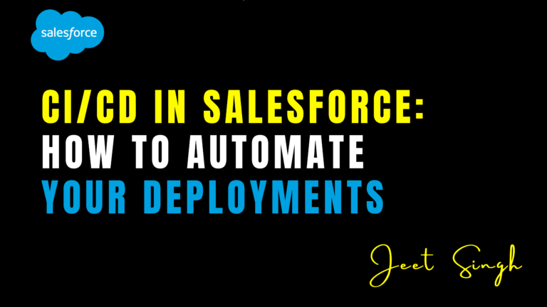

<figure>



<figcaption>

CI/CD in Salesforce: How to Automate Your Deployments

</figcaption>

</figure>


Continuous Integration and Continuous Deployment (CI/CD) in Salesforce is a **modern approach to automating the development, testing, and deployment processes**. Traditional Salesforce deployments, often relying on **Change Sets and manual migrations**, can be slow, error-prone, and difficult to scale. With CI/CD, businesses can **streamline their release cycles, improve collaboration, and ensure high-quality deployments with minimal risks**.

In this guide, we’ll explore **what CI/CD is, why it’s essential for Salesforce, how to implement an automated deployment pipeline, and some key coding examples**.

## Understanding CI/CD in Salesforce

CI/CD consists of two main practices: **Continuous Integration (CI) and Continuous Deployment (CD)**.

- **Continuous Integration (CI)** involves **automating code integration, version control, and testing** whenever developers make changes. It ensures that all code updates are merged efficiently and validated before deployment.
- **Continuous Deployment (CD)** automates **the release process**, ensuring that approved changes are deployed to **testing, staging, and production environments** without manual intervention.

In Salesforce, CI/CD helps teams manage **metadata, configuration changes, Apex code, and Lightning components** efficiently. By leveraging version control systems, automated testing, and deployment tools, businesses can **achieve faster and more reliable releases**.

## Why is CI/CD Important in Salesforce?

Salesforce is a **multi-tenant platform**, meaning that developers work within a shared environment. Without CI/CD, manual deployments can lead to **version conflicts, overwritten changes, and deployment errors**. CI/CD eliminates these risks by ensuring that every change is **properly tracked, tested, and deployed** in an automated and structured manner.

One of the biggest advantages of CI/CD is **faster release cycles**. Instead of relying on lengthy manual deployments, teams can **automate testing and deployment**, allowing for **frequent and incremental updates**. This reduces downtime and enhances **agility in responding to business needs**.

CI/CD also improves **collaboration among developers, admins, and testers**. By using a **centralized version control system (VCS) like Git**, teams can track changes, merge updates, and resolve conflicts before they impact production. Additionally, automated testing ensures that code is **stable, secure, and functional before deployment**, reducing post-release issues.

## Key Components of a Salesforce CI/CD Pipeline

#### 1\. Version Control System (Git, GitHub, Bitbucket, GitLab)

A **Version Control System (VCS)** is essential for tracking code changes, managing metadata, and collaborating efficiently. In a CI/CD pipeline, developers commit changes to a **repository**, where they are reviewed, tested, and merged before deployment.

##### Example Git Commands for Salesforce CI/CD:

```
# Clone the repository
git clone https://github.com/your-org/salesforce-repo.git
# Create a new feature branch
git checkout -b feature-new-api
# Add changes and commit
git add .
git commit -m "Added new API integration"
# Push the changes to the repository
git push origin feature-new-api
```

#### 2\. Continuous Integration (Jenkins, Azure DevOps, CircleCI)

Continuous Integration tools **automate the process of merging code, running unit tests, and validating metadata changes**. Whenever a developer commits new code, the CI system automatically tests and integrates it to prevent errors from reaching production.

##### Jenkinsfile Example for Salesforce CI/CD:

```
{
agent any
stages {
stage('Checkout') {
steps {
git branch: 'main', url: 'https://github.com/your-org/salesforce-repo.git'
}
}
stage('Run Apex Tests') {
steps {
sh 'sfdx force:apex:test:run --resultformat junit --outputdir test-results'
}
}
stage('Deploy to Sandbox') {
steps {
sh 'sfdx force:source:deploy -u sandbox-org -p force-app'
}
}
}
}
```

#### 3\. Automated Testing (Selenium, Provar, Apex Test Classes)

Automated testing ensures that code changes do not break existing functionality. Apex test classes validate backend logic, while tools like Selenium and Provar test **UI and integration workflows**.

##### Example Apex Test Class for CI/CD:

```
@isTest
public class AccountHandlerTest {
@isTest
static void testCreateAccount() {
Test.startTest();
Account acc = new Account(Name='Test Account');
insert acc;
Account insertedAcc = [SELECT Id, Name FROM Account WHERE Id = :acc.Id];
System.assertEquals('Test Account', insertedAcc.Name);
Test.stopTest();
}
}
```

#### 4\. Deployment Automation (Copado, Gearset, Flosum, SFDX CLI)

Deployment automation tools move code and metadata changes across **Salesforce environments (dev sandbox → test sandbox → staging → production)**. Tools like **Copado, Gearset, and Flosum** streamline deployments, while **Salesforce DX (SFDX CLI)** provides command-line capabilities for automating deployments.

##### Example SFDX Deployment Command:

```
# Authorize Salesforce Org
sfdx auth:web:login -a my-sandbox
# Deploy metadata to a sandbox
sfdx force:source:deploy -p force-app -u my-sandbox
```

#### 5\. Continuous Monitoring & Logging (New Relic, Splunk, Salesforce Shield)

After deployment, continuous monitoring tools track system performance, errors, and security threats. Logging tools like **Splunk and New Relic** provide real-time insights, helping teams proactively resolve issues.

##### Example Apex Debug Log Monitoring:

```
System.debug('Debug Log: Checking new deployment issues');
```

## How to Set Up a CI/CD Pipeline in Salesforce

#### Step 1: Set Up Version Control

Start by integrating a **version control system (GitHub, GitLab, Bitbucket)** with Salesforce. Store all metadata and configuration changes in repositories, allowing multiple developers to work simultaneously without conflicts.

#### Step 2: Implement Continuous Integration

Use **CI tools like Jenkins or Azure DevOps** to automatically test new code when developers commit changes. This step ensures that every update is validated before merging.

#### Step 3: Automate Testing

Integrate **Apex unit tests, UI tests (Selenium, Provar), and API tests** into your pipeline. Automated testing helps detect issues early, ensuring that deployments do not break existing functionality.

#### Step 4: Configure Deployment Automation

Use **Copado, Gearset, or SFDX CLI** to automate deployments across different Salesforce environments. Automating deployments reduces manual effort and ensures consistency.

#### Step 5: Enable Monitoring & Logging

After deployment, set up **error logging and performance monitoring** using tools like **Salesforce Shield, New Relic, or Splunk**. Continuous monitoring helps teams detect and resolve issues quickly.

## Conclusion

CI/CD in Salesforce transforms traditional **manual deployments into an automated, efficient, and error-free process**. By implementing **version control, automated testing, and deployment pipelines**, organizations can **accelerate release cycles, improve collaboration, and enhance deployment reliability**. With tools like **Git, Jenkins, Copado, Gearset, and SFDX CLI**, businesses can build **a scalable and secure CI/CD pipeline** that ensures **faster, smoother, and risk-free Salesforce deployments**.

By following these best practices and implementing automation, **Salesforce teams can innovate faster and ensure seamless application delivery** while maintaining **security, stability, and efficiency**.

                                                                                                                                                           **-Jeet Singh**
