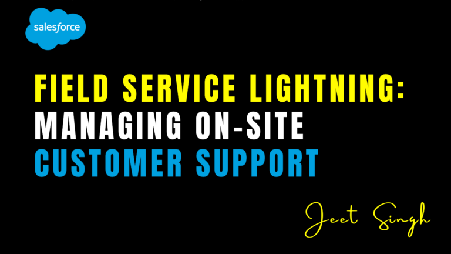

<figure>



<figcaption>

Field Service Lightning: Managing On-Site Customer Support

</figcaption>

</figure>

In industries where customer support requires on-site visits—such as utilities, telecommunications, or healthcare—managing field service operations efficiently is critical. Salesforce’s **Field Service Lightning (FSL)** is a powerful tool designed to streamline on-site customer support, from scheduling and dispatching technicians to tracking work orders and ensuring timely resolutions. By leveraging FSL, businesses can optimize their field operations, improve customer satisfaction, and reduce costs. In this blog, we’ll explore how Field Service Lightning works, its key features, and best practices for managing on-site customer support effectively.

### What is Field Service Lightning?

Field Service Lightning (FSL) is a Salesforce solution designed to manage and optimize field service operations. It provides tools for scheduling, dispatching, and tracking field technicians, as well as managing work orders, inventory, and customer interactions. FSL integrates seamlessly with Salesforce Service Cloud, enabling businesses to deliver a unified customer experience across both on-site and remote support channels.

### Why Use Field Service Lightning?

Field service operations come with unique challenges, such as coordinating schedules, managing travel time, and ensuring technicians have the right tools and parts. FSL addresses these challenges by offering:

1. **Efficient Scheduling and Dispatching**: Automatically assign the right technician to the right job based on skills, location, and availability.
    
2. **Real-Time Tracking**: Monitor technician locations and job progress in real-time.
    
3. **Inventory Management**: Ensure technicians have the necessary parts and equipment for each job.
    
4. **Mobile Access**: Provide technicians with a mobile app to view schedules, update work orders, and communicate with the team.
    
5. **Integration with Service Cloud**: Maintain a unified view of customer interactions, whether they occur on-site or remotely.
    

### Key Features of Field Service Lightning

FSL comes packed with features designed to enhance field service operations:

1. **Scheduling and Dispatching**:
    
    - Use **Gantt charts** and **drag-and-drop scheduling** to assign jobs to technicians.
        
    - Leverage **AI-powered scheduling** to optimize routes and reduce travel time.
        
2. **Mobile App for Technicians**:
    
    - Provide technicians with the **Field Service Mobile App** to access schedules, work orders, and customer information on the go.
        
    - Enable offline access for areas with poor connectivity.
        
3. **Work Order Management**:
    
    - Create and track work orders for each job, including details like customer information, service requirements, and parts needed.
        
    - Update work orders in real-time as technicians complete tasks.
        
4. **Inventory Management**:
    
    - Track inventory levels and ensure technicians have the necessary parts for each job.
        
    - Use **van stock management** to monitor parts carried by technicians in their vehicles.
        
5. **Real-Time Communication**:
    
    - Enable real-time communication between technicians, dispatchers, and customers.
        
    - Use **Chatter** or **in-app messaging** to share updates and resolve issues quickly.
        
6. **Reporting and Analytics**:
    
    - Track key metrics like first-time fix rates, technician productivity, and customer satisfaction.
        
    - Use dashboards to monitor field service performance and identify areas for improvement.
        

### How to Set Up Field Service Lightning

Setting up FSL involves a few key steps. Here’s a step-by-step guide:

1. **Enable Field Service Lightning**:
    
    - Go to **Setup** > **Field Service Settings** and enable FSL.
        
    - Install the **Field Service Mobile App** from the AppExchange.
        
2. **Configure Service Territories**:
    
    - Define service territories based on geographic regions or customer segments.
        
    - Assign technicians to specific territories.
        
3. **Set Up Work Order Types**:
    
    - Create work order types for different services, such as installations, repairs, or maintenance.
        
    - Define the steps and resources required for each type.
        
4. **Configure Scheduling Policies**:
    
    - Set up scheduling policies to optimize job assignments based on skills, location, and availability.
        
    - Use **Dispatcher Console** to manage schedules and dispatches.
        
5. **Train Your Team**:
    
    - Provide training for dispatchers, technicians, and managers on how to use FSL.
        
    - Ensure technicians are familiar with the mobile app and its features.
        
6. **Monitor and Optimize**:
    
    - Use FSL’s reporting tools to track performance and identify areas for improvement.
        
    - Continuously refine scheduling policies and workflows based on feedback and data.
        

### Best Practices for Managing On-Site Customer Support

To get the most out of Field Service Lightning, follow these best practices:

1. **Optimize Scheduling**:
    
    - Use AI-powered scheduling to minimize travel time and maximize technician productivity.
        
    - Balance workloads across technicians to prevent burnout.
        
2. **Equip Technicians with the Right Tools**:
    
    - Ensure technicians have access to the mobile app, necessary parts, and equipment.
        
    - Provide offline access to critical information for areas with poor connectivity.
        
3. **Communicate Proactively**:
    
    - Keep customers informed about technician arrival times and job progress.
        
    - Use automated notifications to provide updates and gather feedback.
        
4. **Track Inventory Efficiently**:
    
    - Monitor inventory levels and ensure technicians are stocked with commonly used parts.
        
    - Use van stock management to reduce delays caused by missing parts.
        
5. **Focus on First-Time Fix Rates**:
    
    - Aim to resolve issues on the first visit to improve customer satisfaction and reduce costs.
        
    - Provide technicians with access to knowledge bases and troubleshooting guides.
        
6. **Leverage Data and Analytics**:
    
    - Use FSL’s reporting tools to track key metrics and identify trends.
        
    - Continuously optimize workflows based on performance data.
        

### Code Examples for FSL Customization

Here are some code snippets to help you customize and enhance your FSL setup:

#### 1\. Automate Work Order Creation (Apex)

```
trigger CaseToWorkOrderTrigger on Case (after insert) {
List workOrders = new List();
for (Case c : Trigger.new) {
if (c.Type == 'On-Site Support') {
WorkOrder wo = new WorkOrder();
wo.Subject = 'On-Site Support for Case ' + c.CaseNumber;
wo.CaseId = c.Id;
wo.Status = 'New';
workOrders.add(wo);
}
}
insert workOrders;
}
```

#### 2\. Create a Flow for Technician Notifications

1. Create a **Record-Triggered Flow** on the WorkOrder object.
    
2. Set the trigger condition to "When a record is created or updated."
    
3. Add an action to send a notification to the assigned technician via the mobile app or email.
    

### Conclusion

Field Service Lightning is a game-changer for managing on-site customer support. By optimizing scheduling, equipping technicians with the right tools, and leveraging real-time data, businesses can deliver efficient and effective field service operations. Whether you’re managing a small team or a large workforce, FSL provides the tools and flexibility to meet your needs.

Ready to transform your field service operations? Start using Salesforce Field Service Lightning today and unlock the full potential of on-site customer support.                                                                                                                                                                                                                                                                   -**Jeet Singh**
