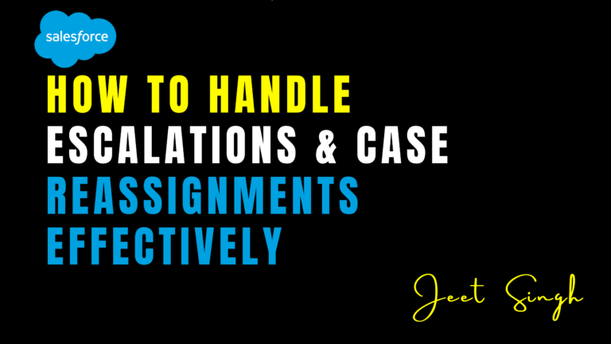

<figure>



<figcaption>

How to Handle Escalations & Case Reassignments Effectively

</figcaption>

</figure>

In customer support, not all cases can be resolved at the first point of contact. Some issues require escalation to specialized teams or reassignment to different agents based on expertise, workload, or priority. Handling escalations and case reassignments effectively is crucial for maintaining customer satisfaction and ensuring timely resolutions. Salesforce Service Cloud provides powerful tools to manage these processes seamlessly. In this blog, we’ll explore best practices for handling escalations and case reassignments, along with tips for automating and streamlining these workflows.

### What Are Escalations and Case Reassignments?

- **Escalations**: When a case cannot be resolved by the initial agent, it is escalated to a higher level of support, such as a senior agent, manager, or specialized team.
    
- **Case Reassignments**: When a case is transferred from one agent to another, often due to workload balancing, expertise requirements, or geographic considerations.
    

Both processes are essential for ensuring that cases are handled by the right person at the right time, but they require careful management to avoid delays and customer frustration.

### Why Are Escalations and Reassignments Important?

1. **Faster Resolutions**: Ensures cases are handled by the most qualified person, reducing resolution times.
    
2. **Improved Customer Satisfaction**: Customers feel heard and supported when their issues are escalated or reassigned appropriately.
    
3. **Better Resource Utilization**: Balances workloads across teams and agents, preventing burnout and improving efficiency.
    
4. **Compliance with SLAs**: Helps meet service level agreements (SLAs) by ensuring cases are escalated or reassigned before deadlines are breached.
    

### Best Practices for Handling Escalations

1. **Define Clear Escalation Rules**:
    
    - Set criteria for when a case should be escalated, such as priority level, case age, or customer type.
        
    - Use Salesforce’s **Escalation Rules** to automate this process.
        
2. **Notify Stakeholders**:
    
    - Notify the receiving agent or team when a case is escalated.
        
    - Use email alerts, Chatter posts, or in-app notifications to keep everyone informed.
        
3. **Provide Context**:
    
    - Ensure the escalated case includes all relevant details, such as customer history, previous interactions, and steps already taken.
        
4. **Monitor Escalated Cases**:
    
    - Track the status of escalated cases using reports and dashboards.
        
    - Set up alerts for cases that are at risk of breaching SLAs.
        
5. **Train Your Team**:
    
    - Ensure agents understand when and how to escalate cases.
        
    - Provide training on handling escalated cases effectively.
        

### Best Practices for Handling Case Reassignments

1. **Use Skills-Based Routing**:
    
    - Assign cases to agents based on their skills, expertise, or availability.
        
    - Use Salesforce’s **Omni-Channel Routing** to automate this process.
        
2. **Balance Workloads**:
    
    - Reassign cases to balance workloads across agents and teams.
        
    - Use dashboards to monitor agent workloads and identify bottlenecks.
        
3. **Communicate Clearly**:
    
    - Notify the receiving agent when a case is reassigned.
        
    - Provide context about why the case was reassigned and any relevant details.
        
4. **Track Reassignment History**:
    
    - Use custom fields or case comments to track reassignment history.
        
    - This helps maintain accountability and provides a clear audit trail.
        
5. **Automate Reassignments**:
    
    - Use **Process Builder**, **Flows**, or **Apex Triggers** to automate case reassignments based on predefined criteria.
        

### How to Set Up Escalation Rules in Salesforce

1. Go to **Setup** > **Escalation Rules**.
    
2. Create a new escalation rule and define the criteria for escalation (e.g., case priority, age, or type).
    
3. Set the actions to be taken when a case is escalated, such as:
    
    - Assigning the case to a specific user or queue.
        
    - Sending email alerts to stakeholders.
        
    - Updating the case status or priority.
        
4. Activate the escalation rule and test it to ensure it works as intended.
    

### How to Automate Case Reassignments in Salesforce

##### Using Process Builder:

- Create a new process on the Case object.
    
- Set the trigger condition (e.g., case priority changes or a specific field is updated).
    
- Add an action to update the case owner or reassign the case to a queue.
    

##### Using Flows:

- Create a **Record-Triggered Flow** on the Case object.
    
- Set the trigger condition (e.g., case age exceeds a certain threshold).
    
- Add an action to reassign the case to the appropriate agent or queue.
    

#### Using Apex Triggers:

```
trigger CaseReassignmentTrigger on Case (before update) {
for (Case c : Trigger.new) {
if (c.Priority == 'High' && c.OwnerId != '005XXXXXXXXXXXXXXX') { // Replace with the target user/queue ID
c.OwnerId = '005XXXXXXXXXXXXXXX'; // Reassign to the target user/queue
}
}
}
```

### Code Examples for Escalation and Reassignment Automation

##### 1\. Automate Escalation Notifications (Apex)

```
trigger CaseEscalationTrigger on Case (before update) {
for (Case c : Trigger.new) {
if (c.Status == 'Escalated') {
// Send email notification to the manager
Messaging.SingleEmailMessage email = new Messaging.SingleEmailMessage();
email.setToAddresses(new String[] {'manager@example.com'});
email.setSubject('Case Escalated: ' + c.CaseNumber);
email.setPlainTextBody('Case ' + c.CaseNumber + ' has been escalated. Please review.');
Messaging.sendEmail(new Messaging.SingleEmailMessage[] {email});
}
}
}
```

#### 2\. Automate Reassignment Based on Skills (Flow)

1. Create a **Record-Triggered Flow** on the Case object.
    
2. Set the trigger condition (e.g., case type is “Technical”).
    
3. Add a decision element to check the agent’s skills.
    
4. Use an assignment element to reassign the case to an agent with the required skills.
    

### Conclusion

Handling escalations and case reassignments effectively is critical for delivering timely and efficient customer support. By defining clear rules, automating workflows, and providing context, businesses can ensure that cases are resolved by the right person at the right time. Salesforce Service Cloud offers powerful tools to streamline these processes, from escalation rules to Omni-Channel routing.

Ready to optimize your escalation and reassignment processes? Start implementing these best practices in Salesforce today and unlock the full potential of your support team.    

                                                                                                                                                              -**Jeet Singh**
