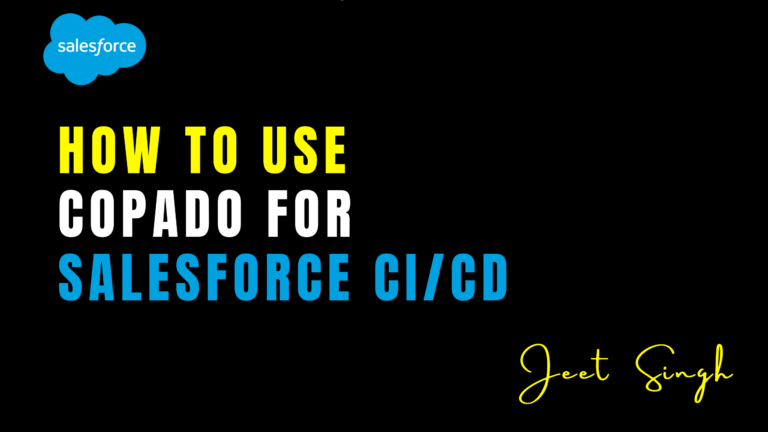

<figure>

<figcaption>

How to Use Copado for Salesforce CI/CD

</figcaption>

</figure>

As Salesforce development becomes more complex, **Continuous Integration and Continuous Deployment (CI/CD)** have become essential for managing releases efficiently. **Copado**, a leading Salesforce DevOps platform, helps teams automate deployments, track changes, and improve collaboration. It provides a **user-friendly, low-code solution** that allows admins and developers to implement **CI/CD pipelines with version control, automated testing, and compliance tracking**.

In this blog, we’ll walk through **how to use Copado for Salesforce CI/CD**, covering key features, setup, and best practices.

## Why Use Copado for CI/CD in Salesforce?

Traditional Salesforce deployment methods like **change sets** are slow, error-prone, and lack version control. Copado **eliminates manual processes** by introducing **automation, tracking, and governance** for deployments.

#### Key Benefits of Using Copado:

- **End-to-End CI/CD Automation** – Automate development, testing, and release cycles.
- **Version Control Integration** – Works with **GitHub, Bitbucket, and Azure DevOps**.
- **Metadata Management** – Easily compare and track changes between environments.
- **Automated Testing** – Ensures quality assurance before deployment.
- **Governance & Compliance** – Provides security, audit tracking, and rollback features.

## Setting Up Copado for Salesforce CI/CD

#### 1\. Connect Copado to Your Salesforce Org

To get started, install **Copado from AppExchange** and set up your **DevOps pipeline** by connecting your Salesforce environments.

- **Install Copado** in your Salesforce org.
- **Authenticate your Salesforce environments** (Developer, QA, Staging, and Production).
- Assign **user permissions** based on roles (Admin, Developer, Tester, Release Manager).

#### 2\. Configure Version Control

Copado supports **Git-based version control**, allowing teams to track and manage metadata changes efficiently.

- Connect Copado to **GitHub, Bitbucket, or Azure DevOps**.
- Define a **branching strategy** (feature branches, main branch, release branches).
- Enable **automatic commit tracking** to sync changes between sandboxes.

#### 3\. Create a User Story for Changes

In Copado, every change is linked to a **User Story**, ensuring traceability and tracking.

- Navigate to **User Stories** and create a new one.
- Assign it to a **developer or admin**.
- Attach **metadata components** related to the change.
- Move the story through the development lifecycle (**In Progress → Ready for Review → Approved**).

#### 4\. Perform Automated Merges & Deployments

Copado simplifies **merging and deploying changes across environments**.

- Use the **Branch Manager** to merge feature branches with the main branch.
- Validate the deployment using **Copado’s static code analysis and dependency checks**.
- Deploy to a **QA sandbox first**, then to **staging, and finally to production**.

#### 5\. Automate Testing with Copado

To ensure high-quality deployments, use **Copado’s automated testing features**:

- Run **Apex unit tests** automatically after deployments.
- Use **Selenium, Provar, or Tosca** for UI testing.
- Automate **API tests** for integrations.

#### 6\. Monitor & Rollback Deployments

Copado provides a **dashboard to track deployment success and errors**. If issues arise, use the **rollback feature** to revert changes.

- Monitor deployments in **Copado Release Management**.
- Generate compliance reports for audits.
- Use the **rollback feature** to revert failed deployments.

## Best Practices for Using Copado in Salesforce CI/CD

- **Adopt a Git-based workflow** for managing branches and deployments.
- **Use automation** for testing and validation to reduce deployment failures.
- **Deploy in smaller batches** to minimize risks and simplify rollbacks.
- **Track all changes through User Stories** for better governance.
- **Schedule regular backups** before critical deployments.

## Conclusion

Copado makes Salesforce **CI/CD easier, faster, and more secure** by automating deployments, version control, and testing. By setting up a **structured pipeline**, teams can **reduce manual work, prevent errors, and accelerate release cycles**. Whether you’re a **developer or an admin**, Copado provides a **low-code solution** to streamline Salesforce DevOps and ensure successful deployments.

                                                                                                                                                                      -**Jeet Singh**
