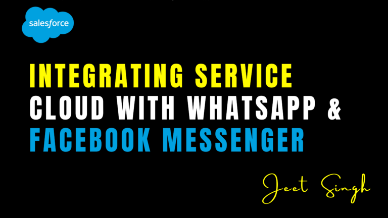

<figure>



<figcaption>

Integrating Service Cloud with WhatsApp & Facebook Messenger

</figcaption>

</figure>

In today’s digital age, customers expect to connect with businesses on the platforms they use every day, such as WhatsApp and Facebook Messenger. Integrating these popular messaging apps with Salesforce Service Cloud allows businesses to provide seamless, real-time support while maintaining a centralized view of customer interactions. By leveraging these integrations, support teams can respond faster, improve customer satisfaction, and streamline their workflows. In this blog, we’ll explore how to integrate WhatsApp and Facebook Messenger with Service Cloud, the benefits of doing so, and best practices for managing these channels effectively.

### Why Integrate WhatsApp & Facebook Messenger with Service Cloud?

WhatsApp and Facebook Messenger are two of the most widely used messaging platforms globally, with billions of active users. Integrating these platforms with Service Cloud offers several benefits:

1. **Meet Customers Where They Are**: Customers prefer using familiar platforms like WhatsApp and Messenger for support, making it easier for them to reach out.
    
2. **Real-Time Support**: Provide instant, real-time responses to customer inquiries, improving satisfaction and reducing resolution times.
    
3. **Centralized Communication**: Manage all customer interactions—across email, chat, phone, and messaging apps—from a single platform.
    
4. **Automation Opportunities**: Use chatbots and automation to handle routine inquiries, freeing up agents for more complex issues.
    
5. **Enhanced Customer Experience**: Deliver personalized, context-aware support by integrating messaging data with your CRM.
    

### How to Integrate WhatsApp with Service Cloud

Integrating WhatsApp with Service Cloud can be done using third-party tools like **Twilio**, **MessageBird**, or Salesforce’s **WhatsApp Business API**. Here’s a step-by-step guide:

#### **1\. Set Up WhatsApp Business API**

- Apply for the WhatsApp Business API through a provider like Twilio or MessageBird.
    
- Verify your business and configure your WhatsApp Business account.
    

#### **2\. Connect WhatsApp to Salesforce**

- Use a middleware platform like Twilio or MuleSoft to connect WhatsApp with Salesforce.
    
- Configure the integration to sync messages between WhatsApp and Service Cloud.
    

#### **3\. Create a Messaging Channel in Service Cloud**

- Go to **Setup** > **Messaging Settings** and create a new messaging channel for WhatsApp.
    
- Configure the channel to route WhatsApp messages to the appropriate agents or queues.
    

#### **4\. Automate Responses with Einstein Bots**

- Use Einstein Bots to automate responses to common inquiries on WhatsApp.
    
- Set up dialog flows to handle tasks like order tracking, FAQs, and appointment scheduling.
    

#### **5\. Monitor and Optimize**

- Use Service Cloud’s reporting tools to track WhatsApp interactions, response times, and customer satisfaction.
    
- Continuously optimize your workflows and bot responses based on performance data.
    

### How to Integrate Facebook Messenger with Service Cloud

Integrating Facebook Messenger with Service Cloud can be done using Salesforce’s **Messaging for Facebook** feature or third-party tools like **Zendesk** or **Sprinklr**. Here’s a step-by-step guide:

#### **1\. Set Up Facebook Messenger**

- Create a Facebook Business Page if you don’t already have one.
    
- Enable Messenger for your page and configure your settings.
    

#### **2\. Connect Messenger to Salesforce**

- Use Salesforce’s **Messaging for Facebook** feature or a third-party integration tool to connect Messenger with Service Cloud.
    
- Sync Messenger conversations with your CRM to maintain a unified view of customer interactions.
    

#### **3\. Create a Messaging Channel in Service Cloud**

- Go to **Setup** > **Messaging Settings** and create a new messaging channel for Facebook Messenger.
    
- Configure the channel to route Messenger messages to the appropriate agents or queues.
    

#### **4\. Automate Responses with Einstein Bots**

- Use Einstein Bots to automate responses to common inquiries on Messenger.
    
- Set up dialog flows to handle tasks like order tracking, FAQs, and appointment scheduling.
    

#### **5\. Monitor and Optimize**

- Use Service Cloud’s reporting tools to track Messenger interactions, response times, and customer satisfaction.
    
- Continuously optimize your workflows and bot responses based on performance data.
    

### Best Practices for Managing WhatsApp & Messenger in Service Cloud

To get the most out of these integrations, follow these best practices:

1. **Set Clear Expectations**: Inform customers about response times and availability on WhatsApp and Messenger.
    
2. **Use Automation Wisely**: Automate routine inquiries but ensure a seamless handoff to human agents for complex issues.
    
3. **Personalize Interactions**: Use customer data from Salesforce to provide personalized, context-aware support.
    
4. **Monitor Performance**: Track key metrics like response time, resolution time, and customer satisfaction.
    
5. **Train Your Team**: Ensure agents are trained to handle inquiries on WhatsApp and Messenger effectively.
    
6. **Maintain Consistency**: Ensure that the tone and quality of support are consistent across all channels.
    

### Code Examples for Custom Integrations

Here are some code snippets to help you customize and enhance your WhatsApp and Messenger integrations:

##### 1\. Automate WhatsApp Responses with Apex

```
public class WhatsAppResponseHandler {
@AuraEnabled
public static void sendWhatsAppMessage(String phoneNumber, String message) {
// Use Twilio or MessageBird API to send a WhatsApp message
HttpRequest req = new HttpRequest();
req.setEndpoint('https://api.twilio.com/2010-04-01/Accounts/{AccountSID}/Messages.json');
req.setMethod('POST');
req.setHeader('Content-Type', 'application/x-www-form-urlencoded');
req.setBody('From=whatsapp:+14155238886&To=whatsapp:' + phoneNumber + '&Body=' + message);
Http http = new Http();
HttpResponse res = http.send(req);
}
}
```

##### 2\. Create a Flow for Messenger Case Creation

1. Create a **Record-Triggered Flow** on the Case object.
    
2. Set the trigger condition to "When a record is created."
    
3. Add an action to send an automated response via Messenger using the Facebook Graph API.
    

### Conclusion

Integrating WhatsApp and Facebook Messenger with Salesforce Service Cloud enables businesses to deliver real-time, personalized support on the platforms customers love. By centralizing these interactions in Service Cloud, support teams can streamline workflows, improve efficiency, and enhance the customer experience. Whether you’re automating responses with Einstein Bots or tracking performance with dashboards, these integrations can transform your support strategy.

Ready to take your customer support to the next level? Start integrating WhatsApp and Facebook Messenger with Service Cloud today and unlock the power of seamless, omnichannel support.

                                                                                                                                                                 **\-Jeet Singh**
