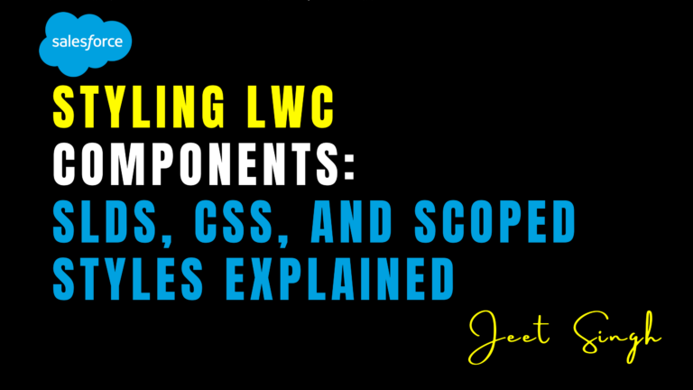

<figure>



<figcaption>

Styling LWC Components: SLDS, CSS, and Scoped Styles Explained

</figcaption>

</figure>

In Lightning Web Components (LWC), styling is a crucial part of creating visually appealing and user-friendly interfaces. Salesforce provides several tools and techniques for styling your components, including the **Salesforce Lightning Design System (SLDS)**, custom **CSS**, and **scoped styles**. In this blog, we’ll explore these options, explain how they work, and show you how to use them effectively in your LWC components.

### Why Is Styling Important in LWC?

Styling is more than just making your components look good—it’s about creating a consistent and intuitive user experience. Well-styled components are easier to use, improve user engagement, and align with Salesforce’s design principles. By leveraging SLDS, custom CSS, and scoped styles, you can create components that are both beautiful and functional.

### Using the Salesforce Lightning Design System (SLDS)

The Salesforce Lightning Design System (SLDS) is a collection of design guidelines, components, and CSS frameworks that help you build applications that look and feel like Salesforce. SLDS provides pre-built styles and components, making it easy to create consistent and professional-looking interfaces.

To use SLDS in your LWC components, you can include SLDS classes directly in your HTML templates. For example, if you want to style a button, you can use the `slds-button` class:

```
< template>
< button >Click Me< /button>
< /template>

```

SLDS also provides utility classes for spacing, alignment, and more. For example, you can use `slds-m-top_medium` to add top margin or `slds-text-align_center` to center-align text.

### Writing Custom CSS

While SLDS provides a solid foundation, you may need to write custom CSS to achieve specific designs or branding requirements. In LWC, you can write CSS directly in the component’s style file, which is automatically scoped to the component.

For example, if you want to create a custom button style, you can define it in your CSS file:

```
/* myButton.css */
.custom-button {
background-color: #0070d2;
color: white;
padding: 10px 20px;
border-radius: 4px;
}
```

Then, apply the class in your HTML template:

```
< template>
< button>Custom Button< /button>
< /template>
```

Custom CSS gives you full control over your component’s appearance, but it’s important to use it sparingly to maintain consistency with the rest of your application.

### Understanding Scoped Styles

One of the key features of LWC is **scoped styles**, which ensure that your CSS only applies to the current component. This prevents styles from leaking into other components and causing unintended side effects.

Scoped styles are automatically applied when you write CSS in the component’s style file. For example, if you define a class in `myComponent.css`, it will only affect elements within `myComponent`.

```
/* myComponent.css */
.my-class {
font-size: 16px;
color: #16325c;
}
```

In your HTML template, you can use the class like this:

```
< template>
< div>This text is styled with scoped CSS.< /div >< /template>
```

Scoped styles make it easier to manage CSS in large projects, as you don’t have to worry about global styles affecting your components.

### Combining SLDS, Custom CSS, and Scoped Styles

In most cases, you’ll use a combination of SLDS, custom CSS, and scoped styles to create your components. Start with SLDS to leverage pre-built styles and ensure consistency with Salesforce’s design system. Use custom CSS for specific design requirements, and rely on scoped styles to keep your CSS organized and isolated.

For example, you might use SLDS classes for layout and basic styling, then add custom CSS for branding or unique design elements. Scoped styles ensure that your custom CSS doesn’t interfere with other components.

### Best Practices for Styling LWC Components

When styling LWC components, keep these best practices in mind. First, use SLDS as much as possible to maintain consistency with Salesforce’s design system. Second, use custom CSS sparingly and only for specific design needs. Third, leverage scoped styles to keep your CSS organized and prevent style conflicts. Finally, test your components in different browsers and devices to ensure they look great everywhere.

### Conclusion

Styling is a critical part of building LWC components that are both functional and visually appealing. By using the Salesforce Lightning Design System, writing custom CSS, and leveraging scoped styles, you can create components that align with Salesforce’s design principles and meet your specific requirements.

Remember: **Great styling isn’t just about looks—it’s about creating a seamless and intuitive user experience.** Start using SLDS, custom CSS, and scoped styles in your LWC components today!

                                                                                                                                                      **-JEET SINGH**
