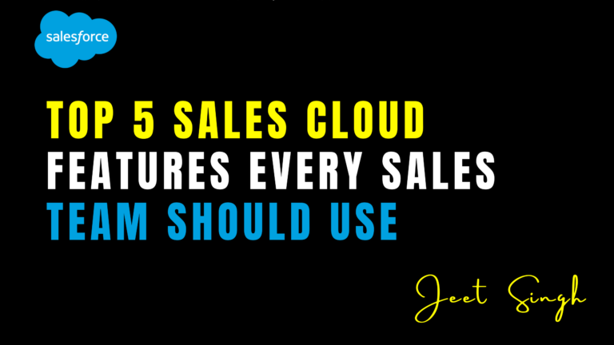

<figure>



<figcaption>

Top 5 Sales Cloud Features Every Sales Team Should Use

</figcaption>

</figure>

Salesforce Sales Cloud is one of the most powerful CRM platforms available, offering a wide range of features designed to help sales teams work smarter, not harder. However, with so many tools and functionalities at your fingertips, it can be overwhelming to know where to start. To help you get the most out of Sales Cloud, we’ve compiled a list of the top five features every sales team should use. These features can streamline your sales process, improve productivity, and drive better results. Let’s dive in!

### 1\. Lead Management and Scoring

Effective lead management is the foundation of any successful sales process. Sales Cloud’s lead management tools allow you to capture, track, and prioritize leads from multiple sources, such as websites, social media, and email campaigns. With lead scoring, you can automatically rank leads based on their likelihood to convert, using criteria like demographics, behavior, and engagement levels. This helps your sales team focus on high-quality leads and avoid wasting time on unqualified prospects. By streamlining lead management, Sales Cloud ensures that no opportunity slips through the cracks.

##### Example of Lead Scoring Automation (Apex Code):

```
trigger LeadScoringTrigger on Lead (before insert, before update) {
for (Lead lead : Trigger.new) {
Integer score = 0;
// Score based on industry
if (lead.Industry == 'Technology') {
score += 30;
} else if (lead.Industry == 'Finance') {
score += 20;
}
// Score based on company size
if (lead.NumberOfEmployees > 1000) {
score += 25;
}
// Update lead score
lead.Lead_Score__c = score;
// Assign priority based on score
if (score >= 50) {
lead.Priority__c = 'High';
} else if (score >= 30) {
lead.Priority__c = 'Medium';
} else {
lead.Priority__c = 'Low';
}
}
}
```

### 2\. Opportunity Management

Opportunity management is another must-use feature in Sales Cloud. This tool allows you to track deals through every stage of the sales pipeline, from initial contact to closing. You can create detailed opportunity records that include information like deal value, expected close date, and competitor analysis. Sales Cloud also provides visibility into your pipeline, so you can identify bottlenecks, forecast revenue, and make data-driven decisions. With opportunity management, your team can stay organized, prioritize effectively, and close deals faster.

**Example of Opportunity Stage Update (Flow):**

1. Create a **Record-Triggered Flow** on the Opportunity object.
    
2. Set the trigger condition to "When a record is created or updated."
    
3. Add a decision element to check if the Stage is "Closed Won."
    
4. If true, update a custom field like "Won\_Date\_\_c" with the current date.
    

### 3\. Einstein Analytics

Einstein Analytics is Salesforce’s AI-powered analytics tool, and it’s a game-changer for sales teams. This feature provides actionable insights into your sales performance, helping you identify trends, predict outcomes, and optimize your strategy. For example, Einstein Analytics can analyze historical data to forecast sales, recommend the best next steps for deals, and even highlight at-risk opportunities. With interactive dashboards and real-time data, your team can make smarter decisions and stay ahead of the competition. Einstein Analytics takes the guesswork out of sales and empowers your team to focus on what matters most.

**Example of Einstein Analytics Dashboard:**

- Create a dashboard to track key metrics like:
    
    - Pipeline Value by Stage
        
    - Win Rate by Sales Rep
        
    - Average Deal Size by Region
        
- Use predictive insights to identify deals at risk of slipping.
    

### 4\. Email Integration and Automation

Communication is key in sales, and Sales Cloud’s email integration and automation features make it easier than ever to stay connected with prospects and customers. With tools like Salesforce Inbox and Email Templates, you can send personalized emails directly from the platform, track opens and clicks, and schedule follow-ups. Automation features like Workflow Rules and Process Builder allow you to automate repetitive tasks, such as sending welcome emails or updating records. By streamlining communication, Sales Cloud helps your team save time, improve response rates, and build stronger relationships.

**Example of Email Automation (Process Builder):**

1. Create a new Process on the Lead object.
    
2. Set the trigger to "When a record is created or updated."
    
3. Add an action to send an email using an Email Template.
    
4. Set conditions to send the email only if the Lead Status is "New."
    

### 5\. Mobile App

In today’s fast-paced world, sales teams need to be able to work from anywhere. The Salesforce Mobile App brings the power of Sales Cloud to your fingertips, allowing you to access critical information, update records, and collaborate with your team on the go. Whether you’re in a client meeting, traveling, or working remotely, the mobile app ensures that you never miss an opportunity. With features like offline access and real-time notifications, your team can stay productive and responsive no matter where they are.

**Example of Mobile-Optimized Page Layout:**

1. Go to **Object Manager** and select the Lead or Opportunity object.
    
2. Navigate to **Page Layouts** and create a new layout optimized for mobile.
    
3. Add only the most critical fields, such as Name, Status, and Next Steps.
    
4. Test the layout on the Salesforce Mobile App to ensure usability.
    

### Conclusion

Salesforce Sales Cloud is packed with features designed to help sales teams work more efficiently and effectively. By leveraging tools like lead management, opportunity tracking, Einstein Analytics, email automation, and the mobile app, your team can streamline processes, improve productivity, and drive better results. These features not only save time but also provide the insights and tools needed to close more deals and grow your business.

Ready to take your sales process to the next level? Start using these top Sales Cloud features today and unlock the full potential of your sales team.

                                                                                                                                                             **-Jeet Singh**
