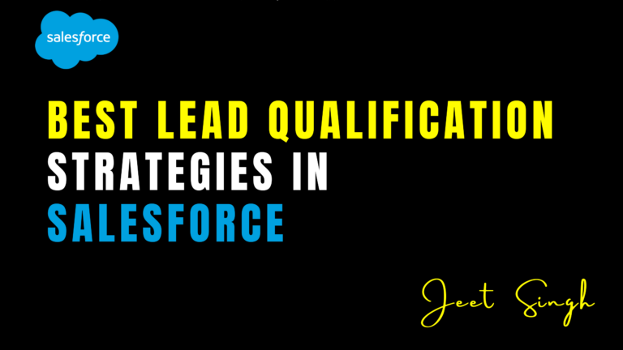

<figure>

<figcaption>

Best Lead Qualification Strategies in Salesforce

</figcaption>

</figure>

Salesforce is a powerful CRM tool that enables businesses to streamline their sales process and improve lead qualification. However, to maximize its potential, companies need to implement effective lead qualification strategies. By properly qualifying leads, sales teams can focus on high-value prospects and improve conversion rates. Here are some of the best lead qualification strategies in Salesforce:

## 1\. Utilize Lead Scoring

Lead scoring is an essential feature in Salesforce that helps prioritize leads based on predefined criteria. Assigning scores to leads based on factors such as engagement level, industry, company size, and past interactions helps sales teams focus on the most promising opportunities. Salesforce allows businesses to automate lead scoring by integrating AI-powered tools like Einstein Lead Scoring, which uses machine learning to refine and improve lead prioritization.

## 2\. Define Your Ideal Customer Profile (ICP)

A well-defined Ideal Customer Profile (ICP) ensures that your sales team focuses on leads that have the highest potential to convert. In Salesforce, you can categorize leads based on demographics, industry, business size, and other relevant attributes. By clearly defining your ICP, you can filter out unqualified leads early in the sales cycle, allowing sales teams to dedicate time to prospects that align with your business goals.

## 3\. Implement Lead Stages and Statuses

Establishing clear lead stages and statuses in Salesforce ensures that all leads are properly tracked throughout the sales funnel. Common lead statuses include "New," "Contacted," "Qualified," "Unqualified," and "Converted." By defining these stages in Salesforce, sales teams can monitor progress, nurture leads effectively, and prevent potential leads from slipping through the cracks.

## 4\. Leverage Salesforce Automation

Salesforce offers automation tools like Process Builder and Flow, which help streamline lead qualification by automating repetitive tasks. Automated workflows can assign leads to the right sales representatives, trigger follow-up emails, and update lead statuses based on specific criteria. This not only saves time but also ensures that leads are managed efficiently.

## 5\. Use AI-Powered Insights

Salesforce’s AI-driven tools, such as Einstein Analytics, provide valuable insights that help sales teams make informed decisions. By analyzing historical data, AI can predict which leads are more likely to convert, helping teams focus on high-quality prospects. These insights enable data-driven decision-making, increasing efficiency in the sales process.

## 6\. Implement Lead Routing and Assignment Rules

To ensure that leads are handled by the right sales representatives, Salesforce allows businesses to set up lead assignment and routing rules. Leads can be assigned based on geography, product interest, industry, or sales team expertise. This ensures that the most qualified person handles each lead, improving response times and conversion rates.

## 7\. Track Lead Engagement

Salesforce provides features that track lead engagement, such as email interactions, website visits, and social media activity. By monitoring these interactions, sales teams can identify highly engaged leads and prioritize them accordingly. Salesforce’s built-in analytics and third-party integrations allow businesses to gather valuable engagement data and optimize their lead nurturing strategies.

## 8\. Regularly Cleanse and Update Lead Data

Maintaining accurate and up-to-date lead data is crucial for effective lead qualification. Salesforce enables businesses to standardize data entry, remove duplicate records, and enrich lead information using third-party data providers. Keeping lead data clean ensures that sales teams work with reliable information, reducing time wasted on outdated or irrelevant leads.

## Conclusion

Effective lead qualification in Salesforce helps businesses improve efficiency, boost conversions, and enhance overall sales performance. By leveraging lead scoring, automation, AI-powered insights, and proper lead tracking, companies can ensure that sales teams focus on the most valuable opportunities. Implementing these strategies will optimize your Salesforce CRM and drive better results for your sales pipeline.

                                                                                                                                                                  -**Jeet Singh**
