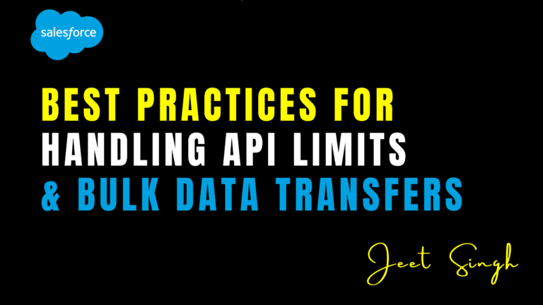

<figure>

<figcaption>

Best Practices for Handling API Limits & Bulk Data Transfers

</figcaption>

</figure>

Salesforce imposes API limits to ensure fair usage and system performance. When integrating external systems or handling large data transfers, managing these limits efficiently is critical to avoid service disruptions and performance bottlenecks. This guide explores best practices for handling **Salesforce API limits** and **bulk data transfers**, ensuring seamless data processing while optimizing resource usage.

## Understanding Salesforce API Limits

Salesforce enforces daily and per-transaction API limits depending on the **edition, license type, and integration usage**. The main API limits include:

- **REST & SOAP API Calls** – Limited based on the organization's license.
    
- **Bulk API Limits** – Allows processing of large volumes of records in a batch.
    
- **Streaming & Pub/Sub API Limits** – Restrict the number of event notifications per hour.
    
- **Concurrent Request Limits** – Prevent excessive simultaneous API requests.
    

To check your organization's API usage, navigate to **Setup → System Overview → API Usage** or use the **Limits API** (`/services/data/vXX.X/limits`).

## Best Practices for Managing API Limits

#### **1\. Optimize API Call Usage**

- **Use Composite API** to bundle multiple requests into a single call.
    
- **Minimize Unnecessary API Calls** by caching responses instead of making repeated requests.
    
- **Leverage Salesforce Reports & Dashboards** instead of querying data through APIs.
    
- **Use Query Pagination** (`LIMIT` and `OFFSET`) to avoid retrieving excessive data in one call.
    

#### **2\. Use Bulk API for Large Data Transfers**

- **Prefer Bulk API 2.0** over REST/SOAP API when dealing with large data sets.
    
- **Split Large Data Sets into Batches** (up to 10,000 records per batch).
    
- **Enable Parallel Processing** when inserting/updating millions of records.
    
- **Use Hard Deletes** in Bulk API to permanently remove records without moving them to the Recycle Bin.
    

#### **3\. Monitor & Handle API Usage Efficiently**

- **Enable API Usage Notifications** in Setup to get alerts when reaching API limits.
    
- **Use Event Monitoring** to analyze API consumption trends.
    
- **Implement Retry Logic with Exponential Backoff** to handle rate-limiting errors gracefully.
    
- **Use Governor Limits Debugging** (`System.Limits.getCallouts()` in Apex) to track API consumption.
    

#### **4\. Use Asynchronous Processing for Data Operations**

- **Use Batch Apex** for processing large data asynchronously.
    
- **Leverage Platform Events** for real-time data synchronization instead of frequent API polling.
    
- **Use Scheduled Jobs** (`System.schedule()`) for periodic data processing to avoid peak-hour overloads.
    

#### **5\. Optimize Data Transfers for Performance**

- **Filter Queries Efficiently** using indexed fields and SOQL best practices.
    
- **Avoid SELECT \* Queries**, instead, retrieve only necessary fields.
    
- **Use Compression (Gzip)** to reduce API response payload size.
    
- **Enable Data Skew Management** to prevent performance degradation in large record volumes.
    

## Conclusion

Handling API limits and bulk data transfers effectively is essential for **scaling Salesforce integrations** and ensuring system reliability. By following best practices such as **optimizing API calls, using Bulk API, implementing monitoring strategies, leveraging asynchronous processing, and improving query efficiency**, businesses can maximize performance while staying within Salesforce-imposed limits.

Need help optimizing your **Salesforce data transfers and integrations**? Contact us for expert guidance!

                                                                                                                                                                     **-Jeet Singh**
