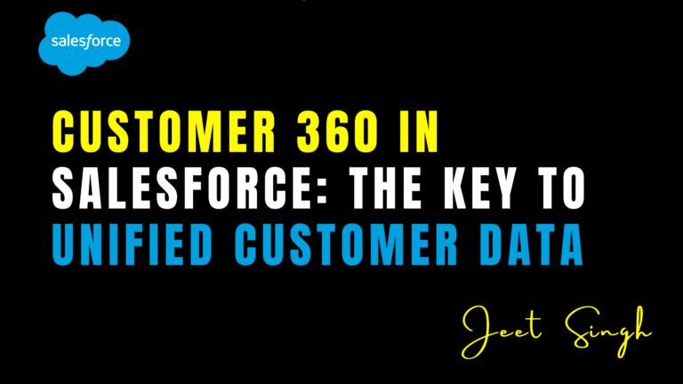

<figure>

<figcaption>

Customer 360 in Salesforce: The Key to Unified Customer Data

</figcaption>

</figure>

In today’s digital landscape, businesses must provide seamless, personalized customer experiences to stay competitive. Salesforce **Customer 360** is a powerful solution that unifies customer data across all touchpoints, enabling companies to gain a comprehensive view of their customers. By breaking down data silos and centralizing insights, Customer 360 helps businesses deliver more meaningful interactions, enhance customer satisfaction, and drive revenue growth. In this guide, we’ll explore how Customer 360 works, its benefits, and best practices for implementation.

## 1\. What is Salesforce Customer 360?

Salesforce **Customer 360** is a suite of integrated tools designed to create a **single source of truth** for customer data. It connects data from various departments—including sales, service, marketing, commerce, and IT—giving businesses a **360-degree view** of their customers. By consolidating data from different sources, Customer 360 enables teams to work collaboratively and provide consistent customer experiences.

Customer 360 achieves this by using **Salesforce CDP (Customer Data Platform)**, **Data Cloud**, and **AI-powered analytics** to unify and analyze data in real time. This integration ensures businesses have a comprehensive and accurate understanding of customer behaviors, preferences, and interactions across multiple channels.

## 2\. Benefits of Customer 360

#### **a. Unified Customer Data**

One of the biggest challenges businesses face is fragmented customer data stored in different systems. Customer 360 eliminates data silos, providing a **single, unified profile** for each customer. This improves data accuracy and consistency across all departments.

#### **b. Personalized Customer Experiences**

With a complete view of customer interactions, businesses can tailor their marketing, sales, and service strategies based on customer preferences. Personalized recommendations, proactive support, and targeted marketing campaigns enhance customer engagement and satisfaction.

#### **c. Improved Collaboration Between Teams**

Customer 360 ensures that sales, marketing, and customer service teams have access to the same customer data. This enhances cross-team collaboration, leading to better coordination and improved response times.

#### **d. Enhanced Customer Support**

By integrating data from multiple sources, support agents can quickly access past interactions, purchase history, and customer preferences. This allows them to resolve issues faster and provide a more personalized support experience.

#### **e. Data-Driven Decision Making**

Customer 360 provides real-time insights and AI-driven analytics, helping businesses make informed decisions. Predictive analytics and trend analysis allow companies to anticipate customer needs and optimize their strategies accordingly.

## 3\. Key Features of Salesforce Customer 360

- **Data Cloud:** Unifies and organizes customer data from different sources into a single platform.
    
- **Identity Resolution:** Uses AI to merge duplicate records and create a **single customer identity**.
    
- **Cross-Channel Integration:** Connects customer data across email, social media, mobile, and web interactions.
    
- **AI-Powered Insights:** Provides predictive analytics and personalized recommendations using **Salesforce Einstein AI**.
    
- **Security & Compliance:** Ensures data privacy and regulatory compliance, including **GDPR** and **CCPA** requirements.
    

## 4\. Best Practices for Implementing Customer 360

#### **a. Define Your Business Objectives**

Before implementing Customer 360, identify the key objectives you want to achieve. Whether it’s improving customer retention, streamlining sales processes, or enhancing support efficiency, having clear goals will guide your implementation strategy.

#### **b. Integrate Data from All Sources**

Ensure that data from **CRM systems, marketing platforms, e-commerce stores, and customer support systems** is integrated into Customer 360. This creates a holistic view of the customer journey.

#### **c. Use AI for Personalization**

Leverage **Salesforce Einstein AI** to analyze customer behavior and predict their needs. AI-powered insights enable businesses to personalize messaging, recommend products, and automate customer interactions effectively.

#### **d. Train Teams on Data Usage**

Providing training for sales, marketing, and customer service teams ensures they can effectively use Customer 360’s insights to enhance customer interactions and decision-making.

#### **e. Monitor and Optimize Performance**

Regularly review **Customer 360 analytics** and dashboards to measure effectiveness. Track key performance metrics such as customer engagement, conversion rates, and case resolution times to continuously improve your strategy.

## 5\. Measuring Success with Customer 360

To evaluate the impact of Customer 360, businesses should track key metrics such as:

- **Customer Satisfaction Scores (CSAT):** Measure improvements in customer service and experience.
    
- **Net Promoter Score (NPS):** Gauge customer loyalty and advocacy.
    
- **First Contact Resolution (FCR):** Assess how efficiently customer issues are resolved.
    
- **Sales Conversion Rates:** Analyze how personalized customer engagement drives revenue growth.
    
- **Customer Retention Rates:** Determine if unified data improves customer loyalty.
    

## Conclusion

Salesforce **Customer 360** is a powerful solution for businesses looking to unify customer data, enhance collaboration, and deliver exceptional customer experiences. By breaking down data silos and leveraging AI-powered insights, companies can create personalized, seamless interactions across every touchpoint. Implementing best practices ensures that Customer 360 delivers maximum value, helping businesses drive customer satisfaction, efficiency, and revenue growth.

Looking to implement **Customer 360** in your organization? Contact us for expert guidance!

                                                                                                                                                              **-Jeet Singh**
