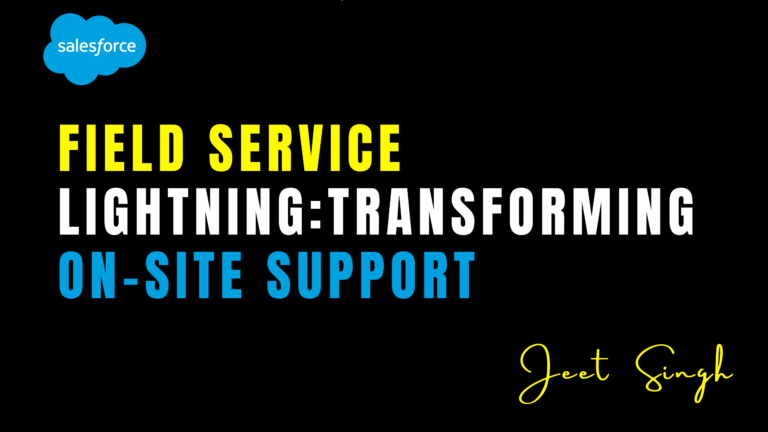

<figure>

<figcaption>

Field Service Lightning: Transforming On-Site Support

</figcaption>

</figure>

In today’s fast-paced business environment, efficient on-site support is crucial for customer satisfaction. **Salesforce Field Service Lightning (FSL)** is a powerful tool designed to optimize field service operations, ensuring seamless scheduling, real-time tracking, and enhanced customer experiences. By leveraging automation, AI-driven insights, and mobile-first solutions, businesses can transform their on-site support capabilities. In this guide, we’ll explore how FSL enhances service delivery and best practices for implementation.

## 1\. What is Field Service Lightning?

Field Service Lightning (FSL) is a comprehensive solution within **Salesforce Service Cloud** that helps organizations manage their field service teams efficiently. It enables businesses to schedule appointments, assign jobs to technicians, track work progress in real-time, and provide mobile support—all from a single platform. By integrating **AI-powered scheduling, workforce management, and IoT-driven predictive maintenance**, FSL ensures that field service teams operate at maximum efficiency while delivering top-tier customer experiences. With these advanced capabilities, businesses can minimize service delays, optimize resource utilization, and improve overall customer satisfaction.

## 2\. Key Benefits of Field Service Lightning

One of the most valuable aspects of FSL is its **Intelligent Scheduling & Dispatching** feature. FSL’s AI-driven **Smart Scheduling** automatically assigns tasks to the right technician based on availability, location, skill set, and job priority. This ensures efficient resource allocation and minimizes downtime, reducing unnecessary delays in field service operations. By automating the scheduling process, businesses can ensure that their technicians are always assigned to the right job at the right time, leading to improved service efficiency.

Another major benefit is **Real-Time Tracking & Mobile Connectivity**. Field technicians can access job details, customer history, and service requests using the **Field Service Mobile App**. With GPS tracking, managers can monitor technician locations and estimated arrival times, ensuring accurate service updates and more precise scheduling. This connectivity not only helps technicians stay informed but also enhances customer satisfaction by providing timely updates on service status.

Enhancing the **Customer Experience** is another core advantage of FSL. Customers receive automated appointment reminders, live technician tracking, and service updates via **SMS or email notifications**, keeping them informed and engaged. These automated touchpoints help improve transparency, leading to greater trust between businesses and their customers.

Predictive maintenance is also a game-changer, thanks to **IoT Integration**. Businesses can leverage **IoT sensors** to monitor equipment health and proactively schedule maintenance before failures occur. This proactive approach significantly reduces downtime, prevents costly repairs, and extends the lifespan of equipment, ultimately improving customer satisfaction and reducing service disruptions.

FSL also **Automates Workflows & Reporting**, reducing the burden of manual tasks for service teams. Work orders, invoicing, and follow-ups can be automated, allowing service managers to focus on optimizing operations rather than dealing with administrative tasks. With powerful reporting tools and dashboards, managers can analyze performance metrics, identify inefficiencies, and continuously improve field service operations.

## 3\. Implementing Field Service Lightning

The first step in implementing FSL is to **Configure Field Service Settings**. Businesses must enable FSL in Salesforce, assign necessary licenses to service agents and technicians, and configure the system based on their operational needs. Once configured, work orders and service appointments can be created to manage field service tasks effectively.

To enhance automation, businesses can create **Work Orders & Service Appointments** using custom workflows and triggers. For example, a new service request can automatically generate a work order whenever a customer case is logged. This ensures that field service tasks are initiated promptly and assigned to the appropriate technician.

Optimizing scheduling with AI-powered tools ensures that jobs are prioritized based on urgency and technician skill levels. Businesses can configure **Scheduling Policies** to balance workload distribution, ensuring efficient job allocation. The **Dispatch Console** allows managers to oversee technician assignments in real-time and make necessary adjustments to optimize scheduling.

Another crucial step is deploying the **Field Service Mobile App**, which enables field technicians to access job details, update service records, and capture customer signatures—all while working remotely. Offline access ensures that technicians can continue working even in areas with limited connectivity. Training technicians to use the app effectively ensures smoother service execution and improved reporting accuracy.

## 4\. Best Practices for Field Service Lightning

To maximize the benefits of FSL, businesses should focus on **Leverage Automation for Efficiency**. Automating scheduling, notifications, and service reports minimizes manual efforts and speeds up response times, allowing technicians to focus on completing service requests efficiently.

Training technicians on **Mobile Usage** is equally important. Since the **Field Service Mobile App** is a crucial tool, ensuring that field technicians can efficiently navigate the app, update service records, and communicate with dispatchers will significantly improve operational efficiency.

Another best practice is to **Integrate with IoT for Proactive Service**. By leveraging IoT sensors to detect potential equipment issues, businesses can proactively schedule maintenance before failures occur, minimizing service disruptions and enhancing customer satisfaction.

**Monitoring Performance with Dashboards** helps businesses track key field service metrics such as job completion rates, first-time fix rates, and customer satisfaction scores. By continuously analyzing performance, businesses can make data-driven improvements to their field service strategies.

Additionally, enhancing **Customer Communication** is vital. Automated notifications and real-time technician tracking keep customers informed about service appointments, improving overall transparency and engagement. Keeping customers updated with service progress reduces uncertainty and increases satisfaction with field service operations.

## 5\. Measuring Success with FSL

To evaluate the effectiveness of Field Service Lightning, businesses should monitor various performance metrics. **First-Time Fix Rate (FTFR)** is a critical indicator, measuring the percentage of service requests resolved on the first visit. A higher FTFR signifies efficient problem resolution and reduces the need for follow-up appointments.

**Average Response Time** is another key metric, tracking how quickly technicians reach customer sites. A lower response time indicates efficient dispatching and quicker resolution of service requests.

The **Job Completion Rate** assesses technician productivity and operational efficiency. A high completion rate reflects effective scheduling and well-managed field operations.

Customer feedback is essential for continuous improvement. **Customer Satisfaction (CSAT) Scores** provide insights into how customers perceive the service quality, helping businesses refine their service delivery strategies.

Finally, **Operational Cost Reduction** is an important success factor. By leveraging automation, predictive maintenance, and AI-driven scheduling, businesses can minimize costs while optimizing service quality and technician efficiency.

## Conclusion

Salesforce **Field Service Lightning** is a transformative solution for businesses that rely on on-site service operations. By leveraging AI-driven scheduling, real-time tracking, and automated workflows, organizations can enhance efficiency, improve customer satisfaction, and reduce operational costs. Implementing best practices, monitoring key performance metrics, and continuously optimizing processes ensure that businesses maximize the value of FSL, revolutionizing their field service capabilities.

Looking to implement **Field Service Lightning**? Contact us for expert guidance!

                                                                                                                                                                    **\-Jeet Singh**
