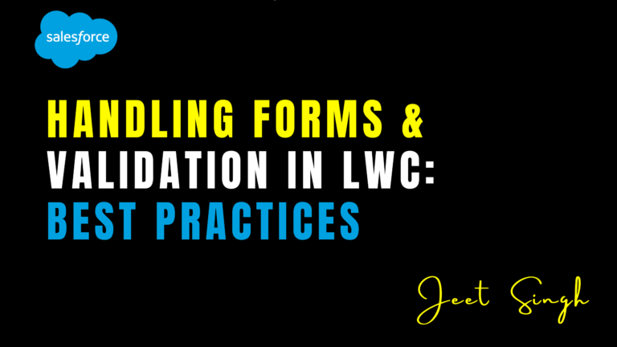

<figure>



<figcaption>

Handling Forms & Validation in LWC: Best Practices

</figcaption>

</figure>

Forms are a fundamental part of most web applications, allowing users to input and submit data. In Lightning Web Components (LWC), building forms that are both user-friendly and secure requires careful planning and implementation. Proper form handling and validation are essential to ensure data integrity, improve user experience, and prevent errors. In this blog post, we’ll explore best practices for handling forms and validation in LWC.

### 1\. Use Base Lightning Components for Forms

Salesforce provides a set of **base Lightning components** specifically designed for building forms. These components are optimized for performance, accessibility, and security, and they automatically handle many common form-related tasks.

### **Recommended Components:**

- **`lightning-input`**: For text, number, email, and other input types.
    
- **`lightning-combobox`**: For dropdown selections.
    
- **`lightning-radio-group`**: For radio button groups.
    
- **`lightning-checkbox-group`**: For checkbox groups.
    
- **`lightning-textarea`**: For multi-line text input.
    
- **`lightning-record-form`**: For creating or editing records with built-in validation.
    

### **Benefits:**

- Built-in accessibility features.
    
- Automatic handling of labels, placeholders, and error messages.
    
- Consistent styling and behavior across Salesforce.
    

### 2\. Implement Client-Side Validation

Client-side validation ensures that users provide valid data before submitting a form. It improves user experience by providing immediate feedback and reducing server load.

### **Best Practices for Client-Side Validation:**

- **Use Built-in Validation**: Base Lightning components like `lightning-input` and `lightning-combobox` come with built-in validation for common use cases (e.g., required fields, email format, number ranges).
    
- **Custom Validation**: For complex validation rules, use JavaScript to validate form data before submission.
    
- **Display Clear Error Messages**: Use the `setCustomValidity()` method to display custom error messages when validation fails.
    

### **Example:**

```

    handleInputChange(event) {
    const inputField = event.target;
    if (inputField.value.length < 5) {
        inputField.setCustomValidity('Input must be at least 5 characters long.');
    } else {
        inputField.setCustomValidity('');
    }
    inputField.reportValidity();
} 
```

### 3\. Leverage Server-Side Validation

While client-side validation improves user experience, it can be bypassed by malicious users. Always implement server-side validation to ensure data integrity and security.

### **Best Practices for Server-Side Validation:**

- **Use Apex for Validation**: Perform additional validation in Apex controllers before saving data to the database.
    
- **Return Meaningful Error Messages**: If validation fails in Apex, return clear and actionable error messages to the user.
    
- **Validate Field-Level Security (FLS)**: Ensure that users have the necessary permissions to access or modify fields.
    

### **Example:**

```
 public with sharing class FormController {
    @AuraEnabled
    public static String saveRecord(MyObject__c record) {
        try {
            // Perform server-side validation
            if (record.Name == null || record.Name.length() < 5) {
                throw new AuraHandledException('Name must be at least 5 characters long.');
            }
            insert record;
            return 'Record saved successfully!';
        } catch (Exception e) {
            throw new AuraHandledException('Error: ' + e.getMessage());
        }
    }
}
```

### 4\. Handle Form Submission Gracefully

Form submission is a critical step in the user journey. Ensure that the process is smooth, informative, and error-resistant.

### **Best Practices for Form Submission:**

- **Disable the Submit Button**: Disable the submit button while the form is being processed to prevent duplicate submissions.
    
- **Show a Loading Indicator**: Use a spinner or loading message to inform users that their submission is being processed.
    
- **Handle Errors Gracefully**: Display clear error messages if the submission fails and guide users on how to fix the issue.
    

### **Example:**

```
 handleSubmit(event) {
    event.preventDefault();
    this.isLoading = true;
    saveRecord({ record: this.formData })
        .then(result => {
            this.isLoading = false;
            this.showToast('Success', result, 'success');
        })
        .catch(error => {
            this.isLoading = false;
            this.showToast('Error', error.body.message, 'error');
        });
}
```

### 5\. Use lightning-record-form for Record-Based Forms

If your form is tied to a Salesforce record, use the `lightning-record-form` component. It simplifies form creation by automatically handling:

- Field layouts.
    
- Field-level security (FLS).
    
- Built-in validation.
    
- Record saving and error handling.
    

### **Example:**

```
< lightning-record-form
    record-id={recordId}
    object-api-name="Account"
    fields={fields}
    onsuccess={handleSuccess}
    onerror={handleError}>
< /lightning-record-form>
```

### 6\. Ensure Accessibility

Accessibility is a key consideration when building forms. Ensure that your forms are usable by everyone, including users with disabilities.

### **Best Practices for Accessibility:**

- Use semantic HTML elements like `<form>`, `<label>`, and `<input>`.
    
- Ensure all form controls have associated labels.
    
- Use ARIA attributes to provide additional context for screen readers.
    
- Test your forms with accessibility tools like **Salesforce Accessibility Checker**.
    

### 7\. Test Thoroughly

Thorough testing ensures that your forms work as expected and provide a seamless user experience.

### **Testing Tips:**

- **Unit Testing**: Use **Jest** to test JavaScript logic and validation.
    
- **End-to-End Testing**: Use tools like **Salesforce DX** or **Selenium** to test form submission and integration with Apex.
    
- **User Testing**: Gather feedback from real users to identify usability issues.
    

## Conclusion

Handling forms and validation in LWC requires a combination of client-side and server-side techniques to ensure data integrity, security, and a great user experience. By leveraging base Lightning components, implementing robust validation, and following best practices for form submission and accessibility, you can build forms that are both functional and user-friendly.

Remember, forms are often the primary way users interact with your application, so investing time in getting them right will pay off in the long run. Start applying these best practices in your LWC projects today and create forms that users will love!

                                                                                                                                              **-Jeet Singh**
