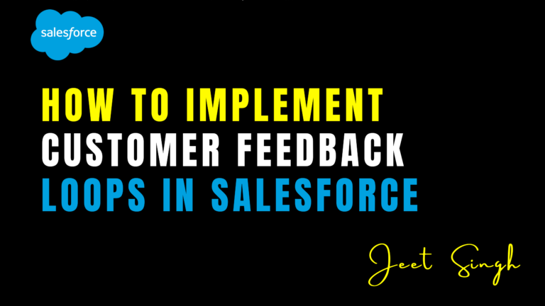

<figure>

<figcaption>

How to Implement Customer Feedback Loops in Salesforce

</figcaption>

</figure>

In today’s competitive landscape, businesses must prioritize customer feedback to improve products, services, and overall customer experience. **Customer feedback loops** help organizations collect, analyze, and act on customer input effectively. By leveraging **Salesforce**, businesses can automate feedback collection, track customer sentiments, and implement continuous improvements. This guide will walk you through the process of implementing **customer feedback loops in Salesforce** to enhance customer satisfaction and drive business growth.

## 1\. Understanding Customer Feedback Loops

A **customer feedback loop** is a structured process of gathering customer feedback, analyzing it, implementing improvements, and communicating changes back to customers. In **Salesforce**, feedback loops can be integrated into various customer touchpoints, enabling organizations to make data-driven decisions and foster customer loyalty.

The key components of a successful feedback loop include:

- **Collection** – Gathering feedback through surveys, support interactions, and social media.
    
- **Analysis** – Identifying trends and key areas for improvement.
    
- **Action** – Implementing changes based on insights.
    
- **Follow-Up** – Communicating updates to customers and measuring improvements.
    

## 2\. Collecting Customer Feedback in Salesforce

Salesforce provides multiple tools to collect feedback from customers at different stages of their journey. The most effective methods include:

#### **a. Using Salesforce Surveys**

Salesforce **Surveys** allow businesses to gather structured feedback directly within the platform. To implement surveys:

1. Enable **Salesforce Surveys** in **Setup**.
    
2. Create a new survey with relevant questions (e.g., Net Promoter Score, customer satisfaction rating, or open-ended feedback).
    
3. Embed the survey link in **emails, cases, or communities** to collect responses.
    
4. Store responses in **Salesforce records** for further analysis.
    

#### **b. Capturing Feedback via Case Management**

Customer support interactions provide valuable insights into service quality. Businesses can:

- Add a **CSAT (Customer Satisfaction) field** in Case objects to record feedback.
    
- Automate post-case surveys to capture customer opinions after issue resolution.
    
- Track and analyze common customer pain points using **Case Reports & Dashboards**.
    

#### **c. Social Media & Community Feedback**

Salesforce **Social Studio** and **Experience Cloud** enable businesses to monitor customer feedback on social media and community forums. These tools help track customer sentiment and respond proactively to concerns.

## 3\. Analyzing Customer Feedback in Salesforce

Once feedback is collected, the next step is to analyze trends and identify improvement areas. **Salesforce Reports & Dashboards** provide real-time insights into customer sentiment.

#### **a. Creating Feedback Dashboards**

Businesses can set up dashboards that display key customer feedback metrics such as:

- **Net Promoter Score (NPS)** trends
    
- **Customer Satisfaction Score (CSAT)** performance
    
- **Common support issues & pain points**
    
- **Sentiment analysis from surveys and cases**
    

#### **b. Using Einstein Analytics for Deeper Insights**

Salesforce **Einstein Analytics** enables AI-driven sentiment analysis and predictive insights. Businesses can use AI to:

- Identify common themes in customer feedback.
    
- Predict churn risk based on negative sentiment trends.
    
- Recommend proactive service improvements based on historical data.
    

## 4\. Acting on Customer Feedback

Insights from feedback analysis should drive real business improvements. Key actions include:

- **Product & Service Enhancements** – Address common customer concerns by updating offerings.
    
- **Process Optimization** – Improve response times, agent training, or support workflows.
    
- **Proactive Customer Engagement** – Use Salesforce **Marketing Cloud Journeys** to send personalized follow-ups and updates based on feedback.
    

## 5\. Closing the Feedback Loop: Following Up with Customers

The final step in a feedback loop is letting customers know their input was valued. Businesses can:

- Send **personalized follow-up emails** thanking customers for their feedback.
    
- Share updates on product or service improvements influenced by feedback.
    
- Use Salesforce **Communities or Social Studio** to publicly communicate changes.
    
- Offer loyalty rewards or incentives for customers who participate in surveys.
    

## 6\. Measuring the Effectiveness of Feedback Loops

To ensure continuous improvement, track key performance indicators such as:

- **Survey response rates** – Measure engagement levels.
    
- **Customer retention rates** – Assess the impact of changes on loyalty.
    
- **Reduction in customer complaints** – Determine if feedback-driven improvements are effective.
    
- **Increase in NPS and CSAT scores** – Evaluate overall customer satisfaction trends.
    

## Conclusion

Implementing **customer feedback loops in Salesforce** is essential for improving customer experience and building long-term relationships. By leveraging **Salesforce Surveys, Case Management, Social Studio, and AI-driven insights**, businesses can systematically collect, analyze, and act on customer feedback. Following up with customers ensures they feel heard, fostering loyalty and continuous engagement.

Ready to enhance your customer feedback strategy? Contact us for expert guidance on implementing Salesforce-powered feedback loops!

                                                                                                                                                           **-Jeet Singh**
