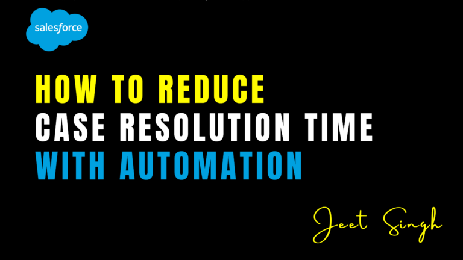

<figure>

<figcaption>

How to Reduce Case Resolution Time with Automation

</figcaption>

</figure>

In today's fast-paced business world, delivering exceptional customer service is a priority. One of the biggest challenges faced by support teams is reducing case resolution time while maintaining high customer satisfaction. Slow response times and inefficient workflows can lead to frustrated customers and lost business opportunities. Fortunately, automation in Salesforce can streamline case management, reduce manual efforts, and ensure faster issue resolution. By leveraging intelligent workflows, AI-driven automation, and proactive communication, businesses can enhance their customer service experience while improving agent productivity. In this guide, we will explore the key automation strategies to enhance case resolution efficiency and build a more agile support system.

## 1\. Automate Case Assignment

One of the most time-consuming aspects of case management is manually assigning cases to the appropriate agents. Support teams often spend valuable time triaging cases, leading to delays in responses and inefficient workflows. With **Case Assignment Rules** in Salesforce, cases can be automatically assigned to the right team or agent based on predefined criteria such as priority, customer type, or issue category. This ensures that cases reach the right person instantly, reducing delays and improving response times. By eliminating the need for manual assignment, agents can focus on resolving cases rather than figuring out who should handle them. Furthermore, intelligent case routing ensures that more experienced agents handle complex cases, while simpler cases are assigned to junior representatives, optimizing the workload distribution.

## 2\. Use Macros for Quick Responses

Sales agents often need to perform repetitive actions such as sending follow-up emails, updating case statuses, or logging notes, which can slow down the resolution process. **Macros** in Salesforce allow agents to automate these tasks with a single click, saving valuable time and ensuring consistency in customer interactions. By using macros, agents can execute multiple actions at once, such as sending a predefined email response while simultaneously updating case fields and closing the case if needed. This not only speeds up the resolution process but also minimizes errors caused by manual updates. Over time, macros help standardize responses across the support team, leading to a more cohesive and professional customer experience. By reducing the time spent on routine administrative tasks, agents can prioritize complex cases that require personalized attention.

## 3\. Leverage Auto-Responses for Immediate Engagement

Customers expect instant acknowledgment when they submit a case, and delays in communication can lead to dissatisfaction. **Auto-response rules** enable businesses to send automated emails confirming receipt of the case, providing case numbers, and setting expectations regarding resolution timelines. This not only improves transparency but also enhances customer trust while agents work on resolving the issue. Auto-responses can be personalized with customer details and relevant troubleshooting information, reducing unnecessary follow-up inquiries. Additionally, companies can configure different auto-response templates based on the case type or priority level, ensuring that high-priority cases receive a more immediate and detailed response. By setting clear expectations from the beginning, businesses can reduce customer frustration and improve overall service perception.

## 4\. Implement Escalation Rules for Faster Resolution

Some cases may require urgent attention, especially those involving high-priority customers or critical issues that could impact business operations. **Escalation rules** in Salesforce help automatically escalate cases to senior support members or managers if they remain unresolved within a specified time frame. This ensures that high-priority cases are addressed promptly, preventing customer dissatisfaction and potential churn. Businesses can define multiple escalation levels, ensuring that unresolved cases receive increasing levels of attention until they are resolved. Automated escalation reduces the risk of cases slipping through the cracks and provides management with real-time visibility into ongoing issues. This not only improves case resolution efficiency but also reinforces a proactive customer service approach, ensuring that customers feel valued and prioritized.

## 5\. Enable Knowledge Base & Self-Service Options

Empowering customers with self-service options can significantly reduce case volumes and resolution times. Many customers prefer to find answers on their own rather than waiting for a support agent. By leveraging Salesforce’s **Knowledge Base**, businesses can create a repository of FAQs, troubleshooting guides, and solution articles that customers can access anytime. A well-structured knowledge base enables users to resolve their issues independently, reducing the number of cases that require agent intervention. Additionally, integrating a **Chatbot** or **Self-Service Portal** allows customers to find relevant solutions through AI-powered recommendations, further decreasing case resolution time. As a result, support teams can focus on more complex cases while customers receive quick and efficient resolutions without waiting for human assistance.

## 6\. Automate Case Updates & Status Notifications

Keeping customers informed about the status of their cases is crucial for maintaining a positive experience. Uncertainty about case progress can lead to frustration and repeated follow-up inquiries. With **Workflow Rules and Process Builder**, businesses can automate case status updates, sending notifications at key stages of the resolution process. This eliminates the need for manual follow-ups and ensures customers are always up to date. Automated notifications can be configured to provide updates when a case moves from one stage to another, when additional information is required, or when the case is resolved. By proactively communicating with customers, businesses can reduce the number of inbound inquiries and increase customer confidence in their support process. Additionally, notifications can be customized to include estimated resolution times, agent details, and relevant troubleshooting steps, creating a seamless and informative customer experience.

## 7\. Utilize AI-Powered Case Routing with Einstein

Salesforce **Einstein Case Routing** uses artificial intelligence to analyze case details and intelligently route them to the best-suited agent. This reduces the time spent on manual triage and ensures that cases are handled by agents with the right expertise. AI-driven automation also helps predict case resolution times and suggest the best course of action based on past trends. Einstein can also detect case sentiment, urgency, and complexity, allowing businesses to prioritize and handle cases more efficiently. By leveraging AI-driven insights, companies can continuously improve their case handling processes, enhancing customer satisfaction while optimizing workforce efficiency.

## 8\. Track Performance with Reports & Dashboards

To continuously improve case resolution time, it’s essential to monitor performance and identify bottlenecks. Salesforce’s **Reports & Dashboards** provide insights into case handling efficiency, agent productivity, and overall resolution times. Businesses can track key metrics such as average response time, case backlog, customer satisfaction scores, and first-contact resolution rates. By analyzing these metrics, businesses can identify areas for improvement and further optimize automation strategies. Identifying recurring issues, common delays, or agent workload imbalances enables support teams to make data-driven decisions that enhance service efficiency. Ongoing performance tracking ensures that automation efforts remain effective and aligned with business goals.

## Conclusion

Reducing case resolution time with automation in Salesforce enhances customer satisfaction, improves agent productivity, and ensures faster issue resolution. By implementing automated case assignment, macros, AI-driven routing, and self-service options, businesses can optimize their support operations and deliver a seamless customer experience. Proactively addressing inefficiencies through automation allows businesses to stay competitive while improving customer loyalty. With the right tools and strategies in place, companies can transform their support processes, ensuring that cases are resolved quickly, accurately, and with minimal friction.

Want to enhance your case resolution process with Salesforce automation? Contact us for expert guidance!

                                                                                                                                                        **-Jeet Singh**
