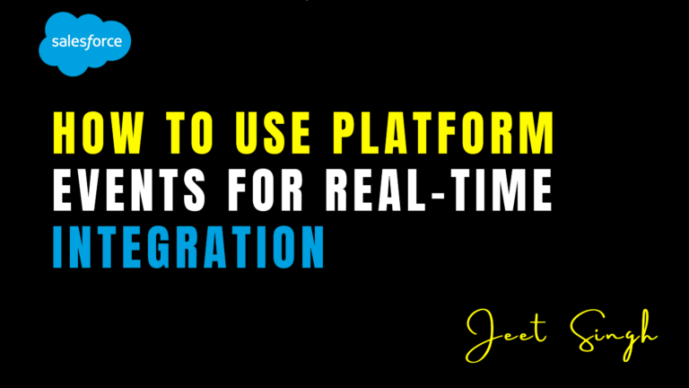

<figure>



<figcaption>

How to Use Platform Events for Real-Time Integration

</figcaption>

</figure>

Salesforce **Platform Events** provide a powerful way to enable **real-time event-driven communication** between applications, both within and outside Salesforce. By leveraging **publish-subscribe architecture**, businesses can streamline integrations and automate workflows efficiently. This guide explains how Platform Events work, their benefits, and a step-by-step process for implementation.

## 1\. What Are Platform Events?

Platform Events are a part of Salesforce’s **event-driven architecture**, enabling applications to **send and receive asynchronous notifications** in real time. They work similarly to a messaging system, where one system **publishes an event** and another **subscribes to it** to react accordingly.

#### **Key Features of Platform Events:**

- **Asynchronous Processing:** Events are queued and delivered without blocking operations.
    
- **Scalability:** Handles large volumes of messages efficiently.
    
- **Event Bus:** Acts as a channel for broadcasting messages to multiple subscribers.
    
- **Reliable Messaging:** Ensures message delivery with built-in replay and retention features.
    
- **Seamless Integration:** Enables communication between Salesforce, external systems, and third-party apps.
    

## 2\. Common Use Cases for Platform Events

- **Real-time Order Processing:** Notify external inventory systems when an order is placed.
    
- **IoT Device Alerts:** Trigger actions when IoT devices detect anomalies.
    
- **Customer Support Automation:** Auto-create support cases upon service failures.
    
- **Integration with External Apps:** Sync Salesforce data with ERP, payment systems, and marketing platforms.
    

## 3\. Step-by-Step Guide to Implementing Platform Events

#### **Step 1: Define a Platform Event**

1. Navigate to **Setup > Platform Events**.
    
2. Click **New Platform Event**.
    
3. Provide a **Label** (e.g., `Order_Update`).
    
4. Add **Custom Fields** (e.g., `OrderID`, `Status`, `CustomerEmail`).
    
5. Set **Publish Behavior** to either:
    
    - **Publish After Commit:** Event fires after a successful transaction.
        
    - **Publish Immediately:** Event fires instantly.
        
6. Click **Save** and then **Edit Layout** to customize fields.
    

#### **Step 2: Publish a Platform Event in Apex**

You can publish an event using Apex code in a **trigger, class, or flow**.

```
Order_Update__e newEvent = new Order_Update__e(
    OrderID__c = '12345',
    Status__c = 'Shipped',
    CustomerEmail__c = 'customer@example.com'
);
EventBus.publish(newEvent);
```

Alternatively, use **Flows or Process Builder** to publish events declaratively.

#### **Step 3: Subscribe to Platform Events**

Subscriptions can be handled in **Apex Triggers, External Apps, or Salesforce Flows**.

- **Apex Trigger Subscription:**
    

```
 trigger OrderUpdateTrigger on Order_Update__e (after insert) {
    for (Order_Update__e event : Trigger.new) {
        System.debug('Order ID: ' + event.OrderID__c);
        System.debug('Status: ' + event.Status__c);
    }
}
```

- **External System Subscription (Streaming API)**: External apps can subscribe using **CometD, WebSockets, or Middleware (MuleSoft, Zapier)**.
    

#### **Step 4: Monitor and Debug Platform Events**

1. Navigate to **Setup > Platform Events > Event Manager**.
    
2. Use **Event Logs** to track published and received events.
    
3. Implement error handling using **Dead Letter Queue (DLQ)** for undelivered events.
    
4. Use **Workbench or Developer Console** to test event publishing.
    

## 4\. Best Practices for Platform Events

- **Minimize Payload Size:** Keep event messages lightweight for faster processing.
    
- **Set Event Retention Policy:** Define a retention period to replay missed events.
    
- **Monitor Event Limits:** Salesforce imposes event publishing limits—optimize API calls.
    
- **Enable Retry Mechanisms:** Ensure subscribers handle failures gracefully.
    
- **Use Change Data Capture (CDC) if Needed:** If tracking field changes is the goal, consider **CDC instead of Platform Events**.
    

## 5\. Measuring Success of Platform Event Implementation

To evaluate effectiveness, track:

- **Event Delivery Time:** Ensure minimal latency between event publication and subscription.
    
- **System Uptime & Reliability:** Monitor event failures and retries.
    
- **Subscriber Processing Rate:** Check if subscribers process events within the expected time.
    
- **Error Handling & Logging:** Ensure proper logging for debugging failed events.
    

## Conclusion

Salesforce **Platform Events** offer a robust mechanism for **real-time data exchange** across applications, enhancing automation and improving system interoperability. Whether you’re integrating with third-party apps, automating workflows, or enabling IoT-based interactions, Platform Events provide a **scalable and reliable** approach. By following best practices and leveraging monitoring tools, businesses can **seamlessly implement event-driven integrations** in Salesforce.

Looking to implement **real-time integration** with Platform Events? Contact us for expert guidance!

                                                                                                                                                              **-Jeet Singh**
