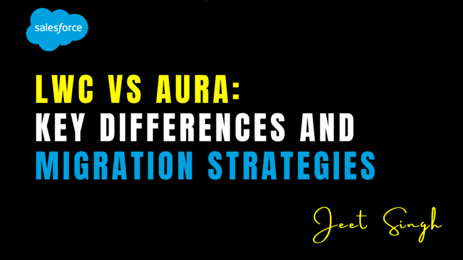

<figure>

<figcaption>

LWC vs Aura: Key Differences and Migration Strategies

</figcaption>

</figure>

Lorem ipsum dolor sit amet, consectetur adipiscing elit. Ut elit tellus, luctus nec ullamcorper mattis, pulvinar dapibus leo.When building applications on the Salesforce platform, developers have two primary frameworks to choose from: **Lightning Web Components (LWC)** and **Aura Components**. While both frameworks serve the same purpose—creating dynamic and reusable UI components—they differ significantly in terms of architecture, performance, and development practices. As Salesforce continues to push LWC as the modern standard, many organizations are considering migrating from Aura to LWC. In this blog post, we’ll explore the key differences between LWC and Aura and discuss strategies for migrating from Aura to LWC.

### Key Differences Between LWC and Aura

#### 1\. Architecture

- **Aura Components**: Aura is built on a proprietary framework that uses a component-based architecture. It relies on a verbose syntax and a custom rendering engine, which can lead to performance bottlenecks.
    
- **LWC**: LWC is built on modern web standards like **Web Components**, **ES6+ JavaScript**, and **HTML**. It leverages the browser’s native capabilities, making it lighter and faster than Aura.
    

#### 2\. Performance

- **Aura Components**: Aura’s rendering engine is heavier and less efficient, which can result in slower load times and reduced performance, especially for complex applications.
    
- **LWC**: LWC is optimized for performance. It uses the browser’s native rendering engine, resulting in faster load times and better overall performance.
    

#### 3\. Development Experience

- **Aura Components**: Aura uses a more complex and verbose syntax, which can make development slower and more error-prone. It also requires developers to learn Salesforce-specific concepts and syntax.
    
- **LWC**: LWC is based on modern web standards, making it easier for developers familiar with JavaScript, HTML, and CSS to get started. Its syntax is cleaner and more intuitive, leading to faster development cycles.
    

#### 4\. Reusability

- **Aura Components**: While Aura components are reusable, their proprietary nature makes them less portable outside the Salesforce ecosystem.
    
- **LWC**: LWC components are highly reusable and can even be used outside of Salesforce, thanks to their adherence to web standards.
    

#### 5\. Learning Curve

- **Aura Components**: Aura has a steeper learning curve due to its proprietary framework and unique syntax.
    
- **LWC**: LWC is easier to learn, especially for developers with experience in modern web development.
    

#### 6\. Community and Support

- **Aura Components**: Aura is considered a legacy framework, and Salesforce has shifted its focus to LWC. As a result, community support and new features for Aura are limited.
    
- **LWC**: LWC is the future of Salesforce development. It receives regular updates, new features, and strong community support.
    

### Why Migrate from Aura to LWC?

1. **Improved Performance**: LWC’s lightweight architecture and use of native browser capabilities result in faster and more efficient applications.
    
2. **Modern Development Practices**: LWC aligns with modern web standards, making it easier to adopt best practices and leverage the latest web technologies.
    
3. **Future-Proofing**: Salesforce is heavily investing in LWC, and it’s clear that LWC is the future of Salesforce development. Migrating to LWC ensures your applications remain supported and up-to-date.
    
4. **Better Developer Experience**: LWC’s cleaner syntax and modern tooling make development faster and more enjoyable.
    

### Migration Strategies from Aura to LWC

Migrating from Aura to LWC requires careful planning and execution. Here are some strategies to ensure a smooth transition:

### 1. **Assess Your Current Aura Components**

- Start by auditing your existing Aura components to identify which ones are critical and need to be migrated first.
    
- Prioritize components that are performance-intensive or frequently used.
    

### 2. **Adopt a Gradual Migration Approach**

- Instead of rewriting all Aura components at once, adopt a phased approach. Migrate one component or feature at a time.
    
- Use **Aura wrappers** to embed LWC components within existing Aura components during the transition.
    

### 3. **Leverage Salesforce Tools**

- Use tools like **Lightning Component Library** and **LWC Recipes** to understand best practices and see examples of LWC components.
    
- Utilize **Salesforce CLI** and **VS Code extensions** to streamline development and testing.
    

### 4. **Train Your Team**

- Ensure your development team is trained in LWC and modern web standards. Salesforce provides excellent resources, including Trailhead modules, to help developers get up to speed.
    

### 5. **Refactor and Optimize**

- Use the migration as an opportunity to refactor and optimize your code. Simplify complex logic, improve performance, and adopt modern design patterns.
    
- Take advantage of LWC’s modular architecture to create reusable and maintainable components.
    

### 6. **Test Thoroughly**

- Rigorously test each migrated component to ensure it functions as expected and integrates seamlessly with the rest of your application.
    
- Use tools like **Jest** for unit testing and **Salesforce DX** for automated testing.
    

### 7. **Monitor and Iterate**

- After migration, monitor the performance and usability of your LWC components. Gather feedback from users and developers to identify areas for improvement.
    
- Continuously iterate and refine your components to ensure they meet business and user needs.
    

### Challenges in Migration

- **Complex Aura Components**: Some Aura components may have complex logic or dependencies that are difficult to replicate in LWC. Break them down into smaller, manageable pieces during migration.
    
- **Data Binding Differences**: Aura and LWC handle data binding differently. Be prepared to refactor your data handling logic.
    
- **Learning Curve**: Developers accustomed to Aura may need time to adapt to LWC’s modern syntax and practices.
    

### Conclusion

While Aura Components have served as the backbone of Salesforce development for years, LWC represents the future. With its modern architecture, improved performance, and alignment with web standards, LWC offers a superior development experience and better outcomes for businesses. Migrating from Aura to LWC may seem daunting, but with a well-planned strategy and the right tools, it can be a smooth and rewarding process.

By embracing LWC, you’re not only future-proofing your applications but also unlocking new possibilities for innovation and efficiency. Start your migration journey today and take full advantage of what LWC has to offer! 

                                                                                                                                                          **\-Jeet Singh**
