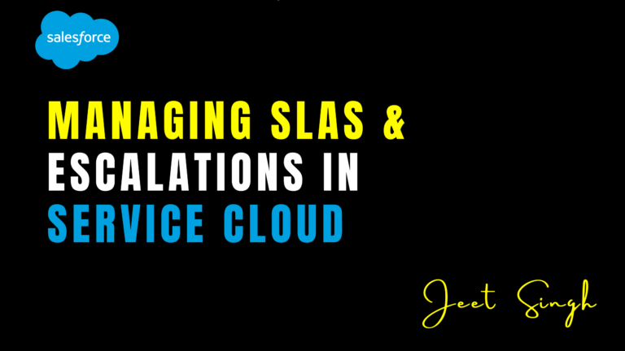

<figure>

<figcaption>

Managing SLAs & Escalations in Service Cloud

</figcaption>

</figure>

In today’s customer-centric world, businesses must ensure timely and efficient customer support. **Service Level Agreements (SLAs)** and **Escalation Rules** play a critical role in maintaining service quality, meeting customer expectations, and ensuring compliance with agreed-upon response times. **Salesforce Service Cloud** provides robust tools for managing SLAs and automating escalations to improve customer service efficiency. In this guide, we will explore how to set up and optimize SLAs and escalations in Service Cloud.

## 1\. Understanding SLAs in Service Cloud

A **Service Level Agreement (SLA)** defines the level of service a company commits to providing customers. It includes response and resolution time commitments, ensuring timely support based on contract terms. In **Service Cloud**, SLAs are managed using **Entitlement Processes**, which help automate case tracking, time-based actions, and escalation workflows.

Businesses can configure SLAs to prioritize cases based on urgency, ensuring that high-priority issues receive faster responses while maintaining efficiency across all customer service channels.

## 2\. Key Components of SLAs in Service Cloud

#### **a. Entitlements**

Entitlements define what kind of support a customer is entitled to. These can be based on customer contracts, subscriptions, or purchased support packages. Service Cloud allows businesses to create different entitlement types for various service levels.

#### **b. Milestones**

Milestones represent time-based commitments within an SLA, such as first response time and case resolution time. Businesses can configure milestones to trigger automated alerts or actions when an SLA is about to be breached.

#### **c. Entitlement Processes**

An **Entitlement Process** in Salesforce allows organizations to automate SLA tracking by defining rules, milestones, and actions for different service levels. It helps ensure that cases progress within the defined timelines, reducing delays and improving service efficiency.

## 3\. Setting Up SLAs in Salesforce

To configure SLAs in **Service Cloud**, follow these steps:

1. **Enable Entitlements** – Navigate to **Setup** > **Entitlement Management** > **Enable Entitlements**.
    
2. **Create an Entitlement Process** – Define the SLA rules, including applicable case types, timelines, and conditions for escalation.
    
3. **Define Milestones** – Set up key milestones such as response time, resolution time, and SLA breach notifications.
    
4. **Associate Entitlements with Cases** – Link entitlement processes to customer cases, ensuring automated tracking of SLA commitments.
    

By implementing SLAs correctly, businesses can streamline case management, improve response times, and enhance overall customer satisfaction.

## 4\. Managing Escalations in Service Cloud

When SLAs are not met, **Escalation Rules** automatically route cases to higher priority queues or managers. This ensures that overdue cases receive the necessary attention to prevent customer dissatisfaction.

#### **a. What Are Escalation Rules?**

Escalation Rules define conditions under which cases should be escalated. These rules are triggered based on predefined criteria, such as response time breaches or case priority levels.

#### **b. How to Set Up Escalation Rules**

To configure **Escalation Rules** in Service Cloud:

1. Navigate to **Setup** > **Case Escalation Rules**.
    
2. Click **New Rule** and define criteria for escalation (e.g., case status, priority, or response time exceeded).
    
3. Set **Escalation Actions**, such as reassigning the case, sending notifications, or increasing priority.
    
4. Activate the Escalation Rule to ensure automated monitoring and case escalation.
    

#### **c. Best Practices for Escalation Management**

- **Define Clear Escalation Policies** – Establish guidelines for when and how cases should be escalated.
    
- **Use Notifications and Alerts** – Ensure that managers receive real-time alerts when escalations occur.
    
- **Monitor Escalation Reports** – Track escalated cases to identify patterns and improve support workflows.
    

## 5\. Measuring SLA Performance and Escalation Efficiency

To ensure the effectiveness of SLAs and escalations, businesses should track key metrics such as:

- **SLA Compliance Rate** – The percentage of cases resolved within SLA commitments.
    
- **Escalation Rate** – The number of cases escalated due to missed SLAs.
    
- **First Response Time** – The average time taken to provide the first response to a customer.
    
- **Resolution Time** – The average time taken to resolve a case.
    

Salesforce **Reports and Dashboards** provide real-time insights into SLA performance, helping businesses make data-driven improvements to service operations.

## Conclusion

Managing **SLAs and Escalations in Service Cloud** ensures timely responses, higher customer satisfaction, and compliance with service agreements. By leveraging **Entitlements, Milestones, and Escalation Rules**, businesses can automate service workflows and proactively address potential delays. Regular monitoring of SLA metrics helps organizations refine their support strategies, ultimately leading to improved service quality and customer retention.

Looking to optimize SLA management in Service Cloud? Contact us for expert implementation guidance!

                                                                                                                                                                     -**Jeet Singh**
