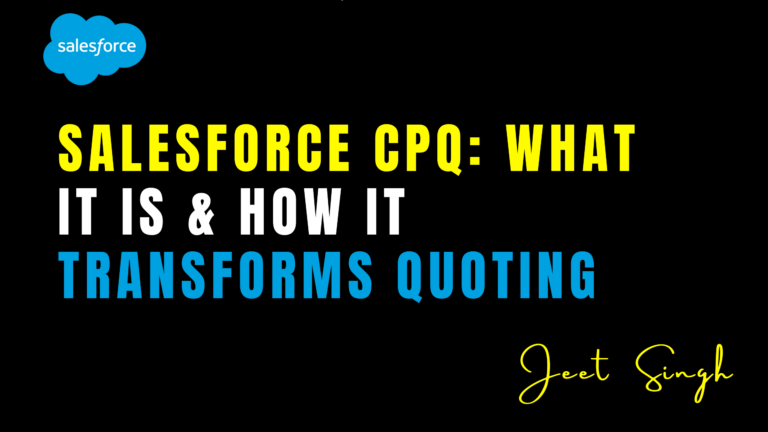

<figure>

<figcaption>

Salesforce CPQ: What It Is & How It Transforms Quoting

</figcaption>

</figure>

## What is Salesforce CPQ?

Salesforce CPQ (Configure, Price, Quote) is a powerful sales tool that helps businesses automate and streamline their quoting process. Built natively on the Salesforce platform, CPQ enables sales teams to configure complex products, apply accurate pricing, and generate professional quotes with ease. By eliminating manual processes and errors, CPQ improves efficiency, accelerates deal cycles, and enhances customer experience.

#### Key Features of Salesforce CPQ

1. **Product Configuration** – Sales reps can customize product offerings based on customer needs, ensuring the right product mix while avoiding incompatible selections.
    
2. **Automated Pricing Rules** – CPQ applies dynamic pricing based on discounts, volume, promotions, and contract terms, ensuring accurate quotes.
    
3. **Guided Selling** – AI-driven recommendations help reps choose the best solutions for customers based on their requirements and previous purchases.
    
4. **Approval Workflows** – Automate discount approvals and pricing exceptions, reducing delays and ensuring compliance.
    
5. **Quote Generation** – Generate professional, error-free quotes in multiple formats with branding and legal terms included.
    

## How Salesforce CPQ Transforms Quoting

#### **1\. Increased Accuracy & Consistency**

Manual quoting often leads to pricing errors, inconsistencies, and lost revenue. With CPQ, businesses can ensure every quote adheres to pricing policies and is free from manual errors, resulting in greater accuracy and trustworthiness.

#### **2\. Faster Sales Cycles**

CPQ reduces the time spent on configuring products and generating quotes, allowing sales teams to respond to customer inquiries quickly. With automated approvals and streamlined workflows, deals can close faster, improving overall sales efficiency.

#### **3\. Enhanced Customer Experience**

A well-structured, error-free quote enhances customer trust and satisfaction. With Salesforce CPQ, customers receive detailed, customized quotes that accurately reflect their requirements, leading to a smoother buying process.

#### **4\. Improved Profitability**

CPQ ensures that pricing and discounting strategies align with business goals. By reducing underpricing and unnecessary discounts, businesses can maximize profit margins while maintaining competitiveness.

#### **5\. Seamless Integration with Salesforce Ecosystem**

As a native Salesforce solution, CPQ integrates seamlessly with Sales Cloud, Service Cloud, and other Salesforce applications. This integration ensures a unified view of customer interactions, allowing for better data-driven decision-making.

## Conclusion

Salesforce CPQ revolutionizes the quoting process by automating product configuration, pricing, and approvals. It enhances sales efficiency, improves customer experience, and boosts revenue growth. By implementing Salesforce CPQ, businesses can achieve a more streamlined, error-free, and scalable sales process, ultimately driving higher sales performance and customer satisfaction.

                                                                                                                                                                     -**Jeet Singh**
