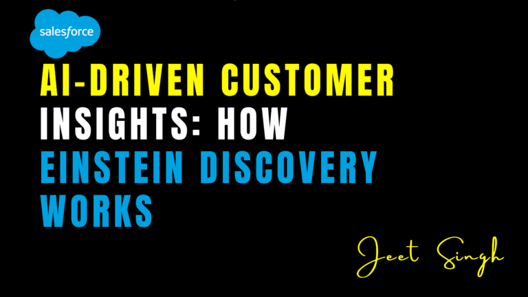

<figure>

<figcaption>

AI-Driven Customer Insights: How Einstein Discovery Works

</figcaption>

</figure>

In the age of data-driven decision-making, businesses need advanced tools to uncover meaningful insights from vast amounts of data. **Einstein Discovery**, a key component of Salesforce’s AI-powered analytics, enables organizations to harness machine learning to analyze patterns, predict outcomes, and make smarter business decisions. By automating complex data analysis, it allows businesses to gain valuable insights faster and take action based on AI-driven recommendations.

### What is Einstein Discovery?

Einstein Discovery is an AI-powered analytics tool within Salesforce that automates data analysis, provides predictive insights, and recommends next-best actions. By leveraging machine learning, it helps businesses make data-driven decisions quickly and efficiently without requiring deep data science expertise. The tool enables users to extract value from their data by identifying key factors influencing outcomes, detecting trends, and suggesting optimal strategies to enhance performance.

### Key Features of Einstein Discovery

1. **Automated Data Analysis** – The platform scans datasets to identify trends, correlations, and anomalies, helping businesses find hidden insights they may have otherwise missed.
    
2. **Predictive and Prescriptive Analytics** – Einstein Discovery not only forecasts future outcomes based on historical data but also provides actionable recommendations to improve business strategies and performance.
    
3. **Natural Language Explanations** – AI-driven insights are presented in clear, easy-to-understand language, making advanced analytics accessible to users without technical expertise.
    
4. **Seamless Salesforce Integration** – Fully integrated with Salesforce CRM and Analytics Cloud, ensuring that insights are readily available in the tools businesses already use.
    
5. **No-Code AI Modeling** – Users can create and refine machine learning models without writing any code, making AI-powered analytics more accessible to non-technical teams.
    
6. **What-If Scenario Analysis** – Businesses can test different strategies and predict their potential impact before implementing changes, allowing for more informed decision-making.
    
7. **Bias Detection and Mitigation** – The tool identifies potential biases in data and provides recommendations to create fairer and more balanced predictive models.
    

## How Einstein Discovery Works

#### 1\. **Data Ingestion and Processing**

Einstein Discovery connects to multiple data sources, including Salesforce CRM, third-party applications, and external databases. It automatically cleans, structures, and prepares data for analysis, ensuring high-quality insights. The tool can handle both structured and unstructured data, making it a flexible solution for businesses in various industries.

#### 2\. **Automated AI Analysis**

Once the data is processed, Einstein Discovery employs machine learning algorithms to scan datasets for meaningful patterns, correlations, and anomalies. It identifies key drivers influencing business outcomes, such as factors affecting customer churn, sales performance, or marketing campaign success. The platform continuously refines its models, ensuring up-to-date and reliable insights.

#### 3\. **Predictive Modeling and Insights**

The AI-driven engine builds predictive models to forecast business trends based on historical data. For example, it can predict which customers are most likely to leave, which sales strategies will generate the highest revenue, or which marketing campaigns will yield the best engagement. Additionally, the system generates prescriptive analytics, offering actionable steps to improve predicted outcomes.

#### 4\. **Actionable Recommendations**

Rather than just presenting data insights, Einstein Discovery provides clear, AI-generated recommendations to help businesses optimize operations. These recommendations appear within Salesforce dashboards, allowing sales, marketing, and customer service teams to act on them in real time. Teams can implement suggested actions with a single click, streamlining workflow efficiency.

#### 5\. **What-If Scenario Analysis**

A unique capability of Einstein Discovery is its ability to perform **what-if scenario analysis**. Businesses can input hypothetical changes—such as adjusting pricing, modifying marketing tactics, or altering customer engagement strategies—to predict the potential impact of those decisions before execution. This feature enables data-driven decision-making while minimizing risk.

#### 6\. **Continuous Learning and Optimization**

As new data is added, Einstein Discovery continuously updates and refines its predictive models. This ensures businesses stay ahead of evolving market trends and customer behaviors. The system’s machine learning capabilities allow it to adapt over time, making it a powerful tool for long-term strategic planning.

### Real-World Applications of Einstein Discovery

- **Sales Optimization** – Sales teams can use Einstein Discovery to identify high-value prospects, optimize pricing strategies, and improve customer retention rates.
    
- **Customer Service Enhancement** – Support teams can predict common customer issues and proactively resolve them before they escalate.
    
- **Marketing Campaign Optimization** – Marketers can analyze campaign performance, refine audience segmentation, and personalize content for better engagement.
    
- **Healthcare Predictions** – In the healthcare industry, Einstein Discovery can forecast patient outcomes, optimize resource allocation, and improve care quality.
    
- **Retail and E-Commerce Insights** – Retailers can predict shopping behaviors, optimize inventory levels, and recommend personalized products to customers.
    

## Conclusion

Einstein Discovery revolutionizes the way businesses analyze data by providing AI-driven insights, predictive modeling, and actionable recommendations—all without requiring deep technical knowledge. By integrating seamlessly into Salesforce, it empowers organizations to make smarter, faster, and more informed decisions. The tool’s ability to automate complex analytics, provide natural language explanations, and simulate business scenarios makes it an invaluable asset for any data-driven organization.

As businesses continue to navigate an increasingly competitive landscape, leveraging AI-powered tools like Einstein Discovery will be critical in staying ahead. Whether you’re in sales, marketing, customer service, or operations, Einstein Discovery can help transform your raw data into meaningful actions that drive growth and success.

Are you ready to unlock the power of AI-driven customer insights? With Einstein Discovery, you can gain a competitive edge and make data-backed decisions with confidence.

                                                                                                                                                               **-Jeet Singh**
