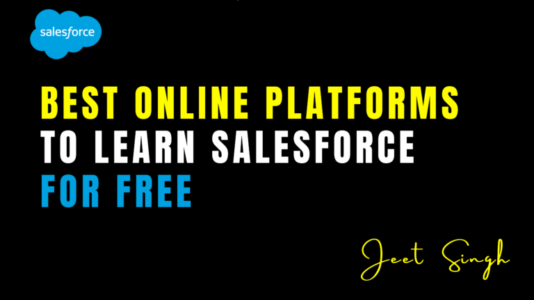

<figure>

<figcaption>

Best Online Platforms to Learn Salesforce for Free

</figcaption>

</figure>

Salesforce is one of the most in-demand CRM platforms globally, with businesses of all sizes using it to manage their customer relationships. Learning Salesforce can open up numerous career opportunities, from becoming a Salesforce Administrator to a Salesforce Developer or Consultant. However, many aspiring professionals wonder where they can learn Salesforce without spending a fortune. Fortunately, several online platforms offer free Salesforce training, making it accessible to beginners and experienced professionals alike. In this article, we will explore the best online platforms where you can learn Salesforce for free.

### 1\. Salesforce Trailhead

**Website:** [trailhead.salesforce.com](https://trailhead.salesforce.com/)

Salesforce Trailhead is the official learning platform provided by Salesforce itself. It offers interactive, self-paced learning modules that cater to all skill levels, from beginners to advanced users.

**Why choose Trailhead?**

- **Hands-on experience:** Trailhead provides practical exercises with real Salesforce environments.
    
- **Gamified learning:** Earn badges and points as you complete learning paths.
    
- **Career paths:** Dedicated learning trails for roles like Administrator, Developer, Architect, and Consultant.
    
- **Certification preparation:** Helps you prepare for official Salesforce certifications.
    

### 2\. Udemy (Free Courses)

**Website:** [udemy.com](https://www.udemy.com/)

While Udemy is known for its paid courses, there are also free introductory Salesforce courses available from time to time. These courses often provide a basic understanding of Salesforce and its functionalities.

**Why choose Udemy?**

- **Self-paced video lectures** from experienced instructors.
    
- **Basic to intermediate-level content** on Salesforce Admin, Developer, and Sales Cloud.
    
- **Lifetime access** once you enroll in a course.
    

### 3\. YouTube

**Website:** [youtube.com](https://www.youtube.com/)

YouTube hosts numerous free Salesforce tutorials created by experienced professionals and trainers. Channels such as **Salesforce Hulk, Salesforce Apex Hours, and SFDC99** offer detailed tutorials on various Salesforce topics.

**Why choose YouTube?**

- **Completely free** with unlimited access to content.
    
- **Wide range of topics**, including Apex programming, Lightning components, and automation.
    
- **Live coding sessions** and practical demonstrations by industry experts.
    

### 4\. LinkedIn Learning (Free with Trial)

**Website:** [linkedin.com/learning](https://www.linkedin.com/learning/)

LinkedIn Learning offers professional Salesforce courses taught by industry experts. While it is a paid platform, it provides a **one-month free trial** where you can access premium Salesforce content.

**Why choose LinkedIn Learning?**

- **Expert-led courses** covering different aspects of Salesforce.
    
- **Professional credibility** as LinkedIn Learning is well-recognized by recruiters.
    
- **Structured learning paths** for career-specific Salesforce roles.
    

### 5\. Coursera (Audit Courses for Free)

**Website:** [coursera.org](https://www.coursera.org/)

Coursera offers courses on Salesforce from institutions like the **University of California, Irvine** and Salesforce itself. While certification requires payment, many courses allow you to **audit** them for free, meaning you can access course materials without certification.

**Why choose Coursera?**

- **University-backed courses** with high-quality content.
    
- **Well-structured and comprehensive Salesforce learning paths**.
    
- **Flexibility** to learn at your own pace.
    

### 6\. Edureka YouTube Channel

**Website:** [youtube.com/c/edurekaIN](https://www.youtube.com/c/edurekaIN)

Edureka provides free Salesforce training through its YouTube channel, covering both Administrator and Developer tracks. The content is well-structured and easy to follow for beginners.

**Why choose Edureka?**

- **Comprehensive Salesforce tutorials** in a step-by-step manner.
    
- **Live session recordings** that help with practical learning.
    
- **Regular updates** on new Salesforce features and certifications.
    

### 7\. Focus on Force (Free Resources)

**Website:** [focusonforce.com](https://focusonforce.com/)

Focus on Force provides study guides and practice exams for Salesforce certifications. While most resources require payment, they offer some **free sample questions and study materials**.

**Why choose Focus on Force?**

- **Exam-oriented approach** helps with certification preparation.
    
- **Detailed study materials** for Salesforce Administrator, Developer, and Consultant certifications.
    
- **Free sample practice questions** to test your knowledge.
    

### 8\. Salesforce Ben

**Website:** [salesforceben.com](https://www.salesforceben.com/)

Salesforce Ben is a blog that provides free articles, guides, and tutorials on Salesforce. It covers everything from **beginner topics to advanced concepts**, including career advice and certification tips.

**Why choose Salesforce Ben?**

- **Well-written, easy-to-understand guides**.
    
- **Career advice** for aspiring Salesforce professionals.
    
- **Regular updates** on Salesforce industry trends.
    

### 9\. Pluralsight (Free with Trial)

**Website:** [pluralsight.com](https://www.pluralsight.com/)

Pluralsight offers professional Salesforce courses for administrators, developers, and architects. It provides a **10-day free trial**, which gives access to all Salesforce courses within that period.

**Why choose Pluralsight?**

- **High-quality training by experts** in the field.
    
- **Guided learning paths** with a focus on real-world applications.
    
- **Good for intermediate to advanced learners**.
    

### 10\. Coursary

**Website:** [coursary.com](https://coursary.com/)

Coursary aggregates free Salesforce courses from different platforms and compiles them in one place. It helps learners find free resources across multiple learning platforms.

**Why choose Coursary?**

- **One-stop search engine** for free Salesforce learning.
    
- **Curated courses from multiple platforms**.
    
- **Saves time by finding free resources quickly**.
    

## Conclusion

Learning Salesforce for free has never been easier, thanks to the numerous online platforms offering high-quality training. Whether you prefer **interactive learning on Trailhead, video tutorials on YouTube, structured courses on Coursera, or exam prep on Focus on Force**, there are plenty of resources available.

The key to mastering Salesforce is **consistency and hands-on practice**. Start by picking a platform that suits your learning style, follow a structured roadmap, and apply your knowledge in a **Salesforce Developer Edition org or Trailhead Playground**. With dedication and the right resources, you can build a successful career in Salesforce without spending a fortune.

For more useful resources and guidance, visit our website: [Jeet Singh](https://jeet-singh.com/post/).

Happy learning!
