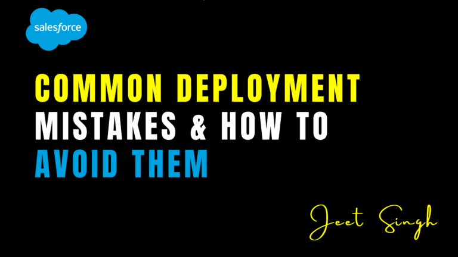

<figure>

<figcaption>

Common Deployment Mistakes & How to Avoid Them

</figcaption>

</figure>

Deploying changes in Salesforce can be a challenging process, especially for teams working with multiple environments, complex metadata, and continuous integration workflows. Even experienced developers and administrators can run into deployment issues that **cause errors, data loss, or production downtime**.

Understanding the most common deployment mistakes and how to avoid them is crucial for maintaining **smooth, error-free releases**. In this guide, we’ll explore the **biggest deployment pitfalls** in Salesforce and provide practical solutions to help you deploy with confidence.

## 1\. Not Using Version Control Properly

### **The Mistake**

Many teams still rely on **manual deployments** instead of using a **Git-based version control system**. Without version control, tracking changes, resolving conflicts, and rolling back mistakes becomes extremely difficult.

### **How to Avoid It**

✅ Use **Git (GitHub, Bitbucket, GitLab)** to track all code and metadata changes.  
✅ Implement **branching strategies** like feature branching, release branches, and hotfixes.  
✅ Automate deployments using **CI/CD pipelines** to keep everything synchronized.

**Solution:** Tools like **Gearset, Copado, or Flosum** integrate with version control to simplify deployments and avoid overwriting critical changes.

## 2\. Deploying Without a Proper Sandbox Strategy

### **The Mistake**

Many teams **deploy directly to production** or use only a single sandbox for testing. This increases the risk of breaking existing functionality, as testing environments are not aligned with production.

### **How to Avoid It**

✅ Use a **sandbox hierarchy** (Developer → Integration → UAT → Staging → Production).  
✅ Always **test deployments in a staging sandbox** before moving to production.  
✅ Keep **sandbox metadata synced** with production to avoid inconsistencies.

**Solution:** Use **Salesforce DX (SFDX)** and DevOps tools to manage sandbox refreshes efficiently.

## 3\. Ignoring Dependencies in Metadata Deployments

### **The Mistake**

Deploying metadata components **out of order** can cause failures due to missing dependencies. For example, deploying a validation rule without the referenced field being present can result in an error.

### **How to Avoid It**

✅ Use **Salesforce Dependency API** or **metadata analyzer tools** to identify dependencies before deploying.  
✅ Deploy in the correct order: **Custom Objects → Fields → Validation Rules → Flows → Apex Classes**.  
✅ Use **change sets or source control tools** that automatically detect dependencies.

**Solution:** Gearset and Copado can scan dependencies and suggest the correct order of deployment.

## 4\. Not Running Pre-Deployment Tests

### **The Mistake**

Skipping test execution before deploying Apex classes and triggers can **cause code failures in production**. Salesforce requires 75% code coverage, and missing tests can block deployments.

### **How to Avoid It**

✅ **Run all unit tests** in a sandbox before deploying.  
✅ Use **test data factories** to create test records dynamically.  
✅ Check code coverage and **fix any failing tests** before deployment.

**Solution:** Use **Salesforce CLI (SFDX)** to automate test execution in CI/CD pipelines.

## 5\. Overwriting Profiles & Permission Sets

### **The Mistake**

Profiles and permission sets are often overwritten during deployments, **removing access controls and causing user issues**.

### **How to Avoid It**

✅ Use **permission set groups** instead of profiles to manage user access.  
✅ Deploy profiles **separately from metadata changes** to prevent overwrites.  
✅ Compare permission differences using **Gearset or Copado** before deployment.

**Solution:** Extract and compare permissions before committing them to version control.

## 6\. Deploying Hardcoded References

### **The Mistake**

Using hardcoded **record IDs, API URLs, or environment-specific settings** in Apex code, workflows, or validation rules makes deployments fail when moving between orgs.

### **How to Avoid It**

✅ Use **Custom Metadata Types** or **Custom Settings** to store configurable values.  
✅ Replace **hardcoded IDs** with **dynamic queries** (e.g., using Name or DeveloperName instead of record IDs).  
✅ Use **Environment Variables in CI/CD** to manage API URLs and credentials dynamically.

**Solution:** Flosum and Copado allow **parameterized deployments** to replace hardcoded values automatically.

## 7\. Deploying Large Data Volumes Without Optimization

### **The Mistake**

Deploying changes that affect large data sets (e.g., field updates, triggers, workflows) **without testing performance impact** can slow down Salesforce or cause governor limit errors.

### **How to Avoid It**

✅ **Batch process large data updates** using **Apex Batch Jobs** or **Data Loader**.  
✅ Use **indexed fields** for SOQL queries to improve query performance.  
✅ Test deployments in a **full-copy sandbox** to check performance before production.

**Solution:** Use Salesforce Optimizer to identify potential performance issues.

## 8\. Not Using CI/CD for Automated Deployments

### **The Mistake**

Manually deploying changes using **change sets or ANT scripts** increases errors, slows down the process, and lacks visibility.

### **How to Avoid It**

✅ Implement **CI/CD pipelines** with Git-based version control.  
✅ Use tools like **Gearset, Copado, or Jenkins** to automate deployments.  
✅ Set up **automated pre-deployment validations** to detect errors before they go live.

**Solution:** Copado provides **fully automated release pipelines** for enterprise teams.

## 9\. Forgetting to Notify Stakeholders Before Deployment

### **The Mistake**

Making changes without informing **end-users, admins, and stakeholders** can lead to confusion, errors, and resistance to adoption.

### **How to Avoid It**

✅ Schedule deployments during **low-impact hours** to minimize disruptions.  
✅ Communicate changes via **release notes, emails, or Chatter announcements**.  
✅ Train users on **new features and updates** before rollout.

**Solution:** Create **deployment checklists** and send automated Slack/email notifications before production releases.

## 10\. Skipping Post-Deployment Testing & Validation

### **The Mistake**

Assuming a deployment was successful **without verifying functionality** can lead to broken workflows, data loss, and unexpected errors.

### **How to Avoid It**

✅ Perform **post-deployment validation** by testing core functionality.  
✅ Run **end-to-end user testing** before marking a deployment as complete.  
✅ Monitor logs and **rollback if critical issues arise**.

**Solution:** Use Salesforce **Change Monitoring Tools** to track post-deployment behavior.

## Conclusion

Avoiding deployment mistakes in Salesforce requires **proper planning, automation, and best practices**. By implementing **version control, sandbox strategies, dependency management, and CI/CD**, teams can significantly reduce deployment failures.

If you’re looking for **expert guidance and hands-on training in Salesforce deployments**, visit **[Jeet Singh’s Salesforce Learning Platform](https://jeet-singh.com/post/)** for **interactive courses, best practices, and real-world DevOps insights**.
