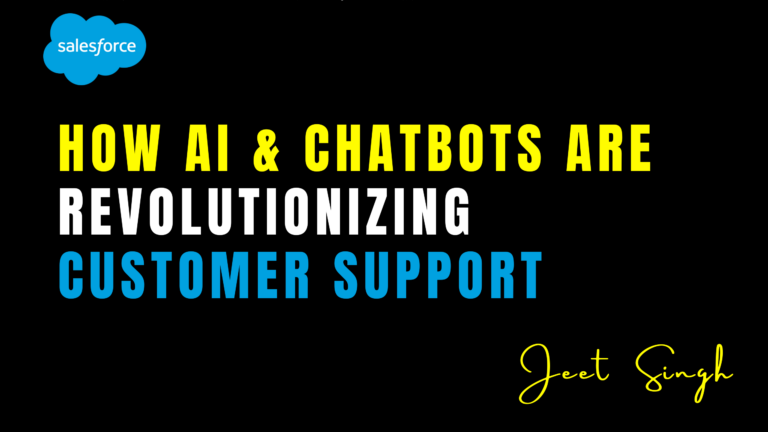

<figure>

<figcaption>

How AI & Chatbots Are Revolutionizing Customer Support

</figcaption>

</figure>

Customer support has evolved significantly in recent years, driven by technological advancements that aim to enhance efficiency, personalization, and responsiveness. Businesses are now leveraging artificial intelligence (AI) and chatbots to transform customer service, reducing response times and improving customer satisfaction. AI-powered chatbots are no longer limited to basic automated responses; they now use natural language processing (NLP), machine learning, and predictive analytics to provide human-like interactions and intelligent problem-solving.

With the growing demand for 24/7 customer support and instant query resolution, AI-driven solutions have become essential for businesses across industries. In this article, we explore how AI and chatbots are revolutionizing customer support, the benefits they offer, and how companies can integrate them into their customer service strategies.

## The Evolution of AI-Powered Chatbots

AI chatbots have come a long way from simple rule-based systems that could only handle basic FAQs. Today’s advanced chatbots utilize machine learning and NLP to understand context, sentiment, and intent, enabling them to engage in more meaningful conversations with customers.

Early chatbots relied on pre-defined decision trees, meaning they could only provide scripted responses. However, modern AI-driven chatbots continuously learn from interactions, improving their responses over time. They can process vast amounts of data, identify patterns, and offer personalized recommendations, making them a crucial component of customer support strategies.

With advancements in conversational AI, businesses can now deploy chatbots that seamlessly interact with customers across multiple channels, including websites, mobile apps, messaging platforms, and voice assistants. This omnichannel capability enhances customer experience by providing consistent support across different touchpoints.

## Key Benefits of AI and Chatbots in Customer Support

### **1\. 24/7 Availability and Instant Responses**

One of the biggest advantages of AI-powered chatbots is their ability to provide round-the-clock customer support. Unlike human agents, chatbots don’t need breaks, which ensures that customers receive immediate assistance at any time of the day. This is especially beneficial for global businesses that serve customers across different time zones.

By handling routine inquiries instantly, chatbots reduce wait times and enhance customer satisfaction. Customers no longer need to navigate lengthy phone menus or wait in long queues to get answers to their questions.

### **2\. Improved Efficiency and Cost Savings**

AI chatbots significantly reduce operational costs by automating repetitive tasks and handling a large volume of customer queries. Businesses can allocate human agents to focus on complex issues, improving overall efficiency and reducing the need for large customer service teams.

By minimizing manual intervention, companies save money on staffing while improving the quality and speed of customer interactions. AI-powered solutions also help prevent burnout among human agents by reducing the workload of handling routine inquiries.

### **3\. Personalization and Context-Aware Conversations**

Modern AI chatbots leverage data analytics and customer history to provide personalized responses. By analyzing past interactions, purchase history, and browsing behavior, chatbots can tailor recommendations and offer relevant solutions to customers.

For instance, an AI-driven chatbot for an e-commerce platform can suggest products based on a user’s previous purchases or browsing history. In the banking sector, chatbots can provide account-specific insights, such as recent transactions or loan eligibility, enhancing the overall customer experience.

### **4\. Omnichannel Support for Seamless Communication**

Customers expect to interact with businesses through multiple channels, including websites, social media, messaging apps, and voice assistants. AI-powered chatbots ensure seamless communication across these platforms, allowing users to switch between channels without losing context.

For example, a customer who starts a conversation on a company’s website can continue the interaction on WhatsApp or Facebook Messenger without having to repeat their query. This level of continuity improves customer experience and builds brand loyalty.

### **5\. Sentiment Analysis for Better Customer Insights**

AI chatbots can analyze customer sentiment in real-time, helping businesses gauge customer emotions and respond accordingly. By identifying frustration, urgency, or satisfaction in a customer’s tone, AI-driven systems can escalate issues to human agents when necessary or adjust their responses to improve engagement.

This ability to detect sentiment allows businesses to proactively address customer concerns, leading to higher retention rates and improved customer satisfaction scores.

### **6\. Automated Ticketing and Issue Resolution**

AI-powered chatbots can integrate with customer relationship management (CRM) systems to automate ticket creation and categorization. When a chatbot is unable to resolve an issue, it can seamlessly escalate the request to a human agent, providing all relevant customer information to ensure a smooth transition.

This eliminates the need for customers to repeatedly explain their issue, improving efficiency and reducing frustration. Additionally, AI chatbots can suggest self-service solutions, such as knowledge base articles or troubleshooting guides, empowering customers to resolve problems on their own.

## Real-World Use Cases of AI and Chatbots in Customer Support

### **1\. E-Commerce and Retail**

AI chatbots help e-commerce businesses provide real-time assistance with product recommendations, order tracking, and returns. Brands like Amazon and Shopify use AI-driven assistants to enhance customer shopping experiences and resolve common queries without human intervention.

### **2\. Banking and Finance**

Financial institutions use AI chatbots to provide account balance inquiries, transaction history details, and fraud alerts. Banks like Wells Fargo and Bank of America have integrated AI assistants to offer seamless banking experiences while ensuring security and compliance.

### **3\. Healthcare and Telemedicine**

AI chatbots assist patients by scheduling appointments, answering health-related questions, and providing medication reminders. Telemedicine platforms use AI to analyze symptoms and direct users to appropriate healthcare professionals.

### **4\. Travel and Hospitality**

Chatbots in the travel industry assist customers with flight bookings, hotel reservations, and itinerary changes. Airlines and travel agencies use AI-driven chatbots to provide instant updates on flight status and handle cancellations efficiently.

### **5\. SaaS and Tech Support**

Software companies use AI-powered chatbots to offer self-service troubleshooting, helping users resolve technical issues without waiting for human support. These chatbots integrate with help desks and ticketing systems to streamline issue resolution.

## Challenges and Considerations for Implementing AI Chatbots

Despite their benefits, AI chatbots are not without challenges. Businesses must ensure that their chatbot solutions provide a human-like experience and do not frustrate users with robotic or unhelpful responses.

### **1\. Ensuring a Human Touch**

While AI chatbots can handle many customer queries, there will always be situations where human intervention is necessary. Businesses should implement a hybrid model where chatbots handle routine issues while human agents take over complex cases.

### **2\. Continuous Training and Improvement**

AI chatbots need regular updates and training to improve accuracy and efficiency. Businesses should analyze chatbot interactions to identify gaps in responses and continuously enhance their AI models.

### **3\. Data Privacy and Security**

Since chatbots handle sensitive customer data, businesses must prioritize security measures to protect user information. Ensuring compliance with data protection regulations, such as GDPR and CCPA, is crucial to maintaining customer trust.

## Conclusion

AI and chatbots are revolutionizing customer support by making it more efficient, responsive, and personalized. From automating routine inquiries to providing real-time insights and sentiment analysis, AI-driven solutions are transforming how businesses engage with customers.

As AI technology continues to advance, businesses that adopt intelligent chatbots will gain a competitive edge by enhancing customer experiences and reducing operational costs. However, successful implementation requires a balance between automation and human interaction to ensure seamless and satisfying customer engagements.

For businesses looking to integrate AI-powered customer support solutions, **[Jeet Singh’s Salesforce Learning Platform](https://jeet-singh.com/post/)** offers training on AI-driven CRM strategies, helping professionals master the latest trends in automation and customer engagement. Investing in AI chatbots today will position businesses for long-term success in an increasingly digital customer service landscape.
