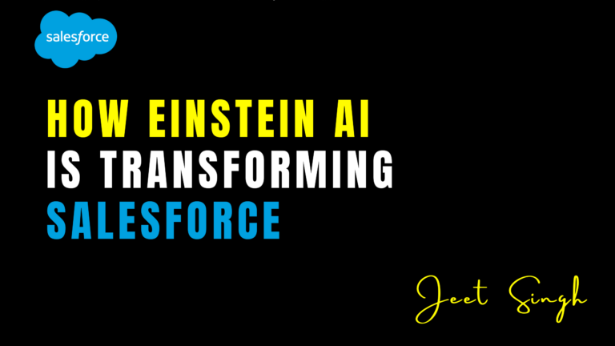

<figure>

<figcaption>

How Einstein AI is Transforming Salesforce

</figcaption>

</figure>

In today’s fast-paced business environment, companies rely on cutting-edge technology to stay ahead of the competition. One of the most powerful tools revolutionizing customer relationship management (CRM) is **Einstein AI**, Salesforce’s artificial intelligence platform. With its advanced machine learning capabilities, Einstein AI is reshaping the way businesses interact with customers, optimize workflows, and make data-driven decisions.

## What is Einstein AI?

Einstein AI is Salesforce’s built-in artificial intelligence system that enhances CRM functionalities by providing predictive analytics, automation, and personalized insights. Unlike traditional AI tools, Einstein AI is deeply integrated into the Salesforce ecosystem, allowing users to access powerful AI-driven insights directly within their CRM workflows.

## Key Features of Einstein AI

1. **Predictive Analytics** – Einstein AI analyzes historical data to predict future outcomes, such as customer behaviors, sales trends, and potential lead conversions.
    
2. **Automated Data Entry** – It eliminates manual data entry by capturing and processing information automatically, increasing efficiency and reducing human errors.
    
3. **Intelligent Insights** – The AI provides actionable recommendations to improve customer engagement, boost sales, and optimize marketing campaigns.
    
4. **AI-Powered Chatbots** – Einstein Bots enhance customer service by handling routine inquiries, providing instant responses, and escalating complex issues to human agents when needed.
    
5. **Sentiment Analysis** – The system analyzes customer interactions to gauge emotions and sentiments, helping businesses tailor responses and improve customer satisfaction.
    

## How Einstein AI is Transforming Salesforce

#### 1\. Enhancing Sales Forecasting

Sales teams can leverage Einstein AI’s predictive capabilities to forecast sales trends more accurately. By analyzing past transactions, customer behaviors, and market conditions, businesses can identify opportunities and mitigate risks, ensuring a more strategic approach to sales planning.

#### 2\. Automating Lead Scoring and Prioritization

Einstein AI ranks leads based on their likelihood to convert, allowing sales representatives to focus on high-value prospects. This automation streamlines the sales pipeline, increasing efficiency and boosting conversion rates.

#### 3\. Improving Customer Service with AI Chatbots

Einstein Bots provide instant support to customers, reducing response times and improving overall satisfaction. These AI-powered chatbots handle common queries, troubleshoot issues, and free up human agents to address more complex concerns.

#### 4\. Optimizing Marketing Campaigns

Marketing teams can use Einstein AI to analyze customer behavior, segment audiences, and create highly targeted campaigns. The AI suggests the best content, channels, and timing to maximize engagement and return on investment (ROI).

#### 5\. Enhancing Productivity and Efficiency

By automating repetitive tasks, Einstein AI allows teams to focus on strategic initiatives rather than administrative work. Automated workflows, smart recommendations, and real-time analytics ensure teams work smarter, not harder.

## Conclusion

Einstein AI is revolutionizing Salesforce by providing businesses with intelligent automation, predictive insights, and enhanced customer engagement. As AI continues to evolve, companies that leverage Einstein AI will gain a significant competitive advantage, driving growth and improving customer relationships.

Are you ready to transform your Salesforce experience with Einstein AI? Now is the time to harness the power of artificial intelligence and take your business to the next level!

                                                                                                                                                                   **\-Jeet Singh**
