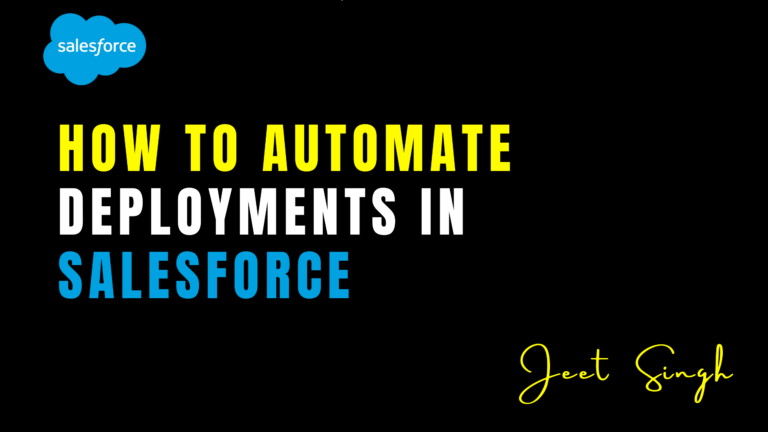

<figure>



<figcaption>

How to Automate Deployments in Salesforce

</figcaption>

</figure>

Automating deployments in Salesforce is crucial for ensuring efficiency, consistency, and reliability in the release management process. Manual deployments can be time-consuming, error-prone, and inefficient, especially for large teams working on multiple environments. By leveraging automation tools and best practices, Salesforce teams can streamline their deployment workflows, reduce human errors, and enhance collaboration.

This guide explores the best ways to automate Salesforce deployments using tools like **Salesforce CLI (SFDX), CI/CD pipelines, Git, and third-party deployment tools**.

### Understanding Salesforce Deployment Automation

Salesforce deployments involve migrating metadata and code from one environment to another. This typically includes **Apex classes, Lightning components, validation rules, workflows, profiles, and other metadata**. Automating this process eliminates the need for repetitive manual steps and ensures smooth transitions between development, staging, and production environments.

### 1\. Using Salesforce CLI (SFDX) for Deployments

Salesforce CLI (SFDX) is a powerful command-line tool that allows developers to interact with Salesforce environments efficiently.

#### Steps to Automate Deployment with SFDX:

1. **Authorize an Org:**
    
    ```
    sfdx auth:web:login -a MyDevOrg
    ```
    
2. **Retrieve Metadata from Source Org:**
    
    ```
    sfdx force:source:retrieve -u MyDevOrg -m ApexClass, LightningComponent
    ```
    
3. **Push Metadata to a Scratch Org:**
    
    ```
    sfdx force:source:push -u MyScratchOrg
    ```
    
4. **Deploy to Production or Sandbox:**
    
    ```
    sfdx force:mdapi:deploy -u ProductionOrg -d deployFolder -w 10
    ```
    

Using SFDX, developers can script deployment workflows, ensuring consistency and repeatability.

### 2\. Implementing CI/CD for Continuous Deployment

**Continuous Integration and Continuous Deployment (CI/CD)** is a best practice that automates the testing and deployment process. Popular CI/CD tools for Salesforce include **GitHub Actions, Bitbucket Pipelines, Jenkins, Azure DevOps, and GitLab CI/CD**.

#### Steps to Set Up CI/CD:

1. **Integrate Salesforce with Git** – Store all metadata in a version-controlled repository like GitHub or Bitbucket.
    
2. **Configure a CI/CD Pipeline** – Use tools like Jenkins or GitHub Actions to trigger automatic deployments.
    
3. **Run Automated Tests** – Execute **Apex tests** and validation rules before deployment.
    
4. **Deploy Automatically to a Target Environment** – Deploy to a sandbox, UAT, or production after successful validation.
    

Example CI/CD Pipeline Configuration (GitHub Actions):

```
name: Deploy to Salesforce
on: [push]
jobs:
  deploy:
    runs-on: ubuntu-latest
    steps:
      - name: Checkout repository
        uses: actions/checkout@v2
      - name: Authenticate with Salesforce
        run: sfdx auth:sfdxurl:store -f ./authFile.txt -a myOrg
      - name: Deploy Metadata
        run: sfdx force:mdapi:deploy -u myOrg -d metadata -w 10
```

This pipeline automates the deployment process whenever new code is pushed to the repository.

### 3\. Using Third-Party Deployment Tools

Several third-party tools offer robust deployment automation for Salesforce, including:

- **Gearset** – Provides easy-to-use deployment automation and version tracking.
    
- **Copado** – A DevOps solution tailored for Salesforce teams.
    
- **Flosum** – A low-code DevOps tool for Salesforce deployment automation.
    
- **Autorabit** – Ensures compliance and security while automating deployments.
    

These tools integrate with Salesforce and provide a user-friendly interface for automating deployments with minimal setup.

### 4\. Automating Testing in Deployments

Automated testing is crucial to ensure successful deployments without breaking existing functionality. Consider integrating:

- **Apex Unit Tests** – Run `sfdx force:apex:test:run` to automate test execution.
    
- **Selenium or Provar** – Automate UI testing for Lightning components.
    
- **Static Code Analysis (PMD, SonarQube)** – Identify code quality issues before deployment.
    

### 5\. Best Practices for Automated Deployments

To ensure smooth deployment automation, follow these best practices:

- **Use Version Control** – Store all metadata in Git repositories.
    
- **Modularize Metadata** – Deploy only the necessary changes.
    
- **Run Automated Tests** – Ensure test coverage before deployment.
    
- **Set Up Rollback Mechanisms** – Have a backup strategy in case of failure.
    
- **Monitor and Log Deployments** – Use logs and dashboards for tracking.
    

## Conclusion

Automating deployments in Salesforce is essential for **improving efficiency, reducing errors, and enhancing collaboration** among development teams. By leveraging **Salesforce CLI, CI/CD pipelines, and third-party tools**, organizations can streamline their deployment processes and ensure smoother releases.

For in-depth Salesforce DevOps training, interactive courses, and hands-on learning experiences, check out [**Jeet Singh**](https://jeet-singh.com/post/), where you can master automation techniques and enhance your Salesforce expertise.

Start automating your Salesforce deployments today and accelerate your development lifecycle!
