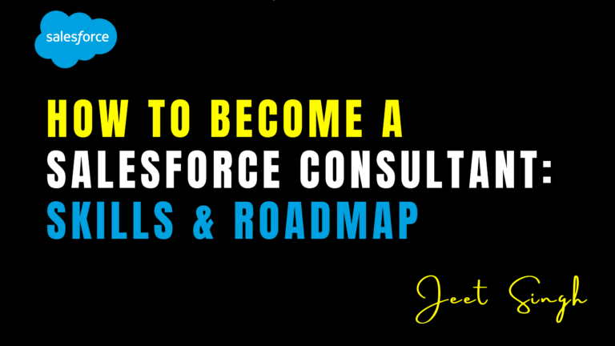

<figure>

<figcaption>

How to Become a Salesforce Consultant: Skills & Roadmap

</figcaption>

</figure>

Salesforce consulting is a rewarding and lucrative career path for professionals who want to help businesses optimize their use of Salesforce. A Salesforce Consultant works with organizations to implement, customize, and improve Salesforce solutions to meet business needs. Whether you’re transitioning from another role or starting fresh, this guide will provide a step-by-step roadmap to becoming a Salesforce Consultant.

As businesses increasingly rely on digital transformation, the need for experienced consultants continues to grow. Companies of all sizes—from startups to Fortune 500 firms—seek skilled Salesforce professionals to help them streamline operations, improve customer experiences, and drive revenue. Becoming a Salesforce Consultant not only offers job stability but also provides a flexible and highly scalable career path.

### Step 1: Understand the Role of a Salesforce Consultant

Salesforce Consultants play a critical role in helping businesses streamline their processes and maximize the value of their Salesforce investment. Their responsibilities include:

- Gathering business requirements and translating them into Salesforce solutions.
    
- Configuring and customizing Salesforce to align with business needs.
    
- Training users and providing ongoing support.
    
- Ensuring data integrity and security.
    
- Integrating Salesforce with other systems.
    
- Staying updated on the latest Salesforce features and best practices.
    
- Conducting performance evaluations and recommending improvements.
    
- Collaborating with developers and stakeholders to create tailored solutions.
    

Consultants may specialize in various areas such as Sales Cloud, Service Cloud, Marketing Cloud, or Nonprofit Cloud, depending on their interests and career goals. Some consultants also focus on niche industries such as healthcare, finance, or education, offering specialized expertise tailored to specific business needs.

### Step 2: Gain Salesforce Knowledge and Certifications

To establish credibility as a Salesforce Consultant, gaining expertise in the platform is essential. Here’s how you can build your knowledge:

#### Learn Salesforce Fundamentals

- Start with **Salesforce Trailhead**, the official free learning platform with interactive modules and hands-on exercises.
    
- Complete beginner trails like **Salesforce Fundamentals** and **CRM Basics**.
    
- Learn about key Salesforce features, including automation tools, reporting, and dashboards.
    
- Understand how different Salesforce clouds operate, such as **Sales Cloud, Service Cloud, and Marketing Cloud**.
    
- Follow Salesforce-related blogs, podcasts, and YouTube channels for industry updates.
    

#### Earn Salesforce Certifications

Certifications demonstrate your expertise and make you more attractive to employers. Key certifications include:

- **Salesforce Certified Administrator** – A foundational certification that covers system management, user setup, and automation.
    
- **Salesforce Certified Advanced Administrator** – Builds on the admin certification and dives deeper into automation and security.
    
- **Salesforce Certified Sales Cloud Consultant** – Ideal for those who want to specialize in sales processes and CRM solutions.
    
- **Salesforce Certified Service Cloud Consultant** – Best for professionals looking to optimize customer service operations.
    
- **Salesforce Certified Marketing Cloud Consultant** – Focuses on marketing automation and customer engagement.
    
- **Salesforce Certified Business Analyst** – Demonstrates an understanding of analyzing business requirements and implementing data-driven solutions.
    

Salesforce certifications not only improve employability but also increase earning potential. Studies show that Salesforce-certified professionals earn higher salaries than their non-certified counterparts.

### Step 3: Gain Hands-On Experience

Practical experience is crucial for becoming a successful Salesforce Consultant. Here’s how to get started:

- **Use a Salesforce Developer Edition account** to practice configurations and automation.
    
- **Volunteer for nonprofits** through programs like Salesforce Talent Alliance or VolunteerMatch to gain real-world experience.
    
- **Take on freelance projects** on platforms like Upwork and Fiverr to work on real business problems.
    
- **Intern with Salesforce partners** to gain insights into implementation projects and consulting work.
    
- **Work on personal projects** by creating a demo Salesforce org and testing various configurations.
    
- **Collaborate with peers** by joining Salesforce study groups and working on mock projects together.
    
- **Attend hackathons and competitions** to solve real-world Salesforce challenges.
    

### Step 4: Develop Consulting and Business Skills

Being a consultant requires more than just technical knowledge. You need strong business and interpersonal skills to succeed. Focus on:

- **Communication Skills** – Explain technical concepts to non-technical clients.
    
- **Problem-Solving Abilities** – Analyze business challenges and develop efficient solutions.
    
- **Project Management** – Learn how to manage timelines, stakeholders, and budgets.
    
- **Sales and Pre-Sales Skills** – Understand how to present Salesforce solutions to clients.
    
- **Negotiation and Client Management** – Learn how to set expectations, manage scope, and build long-term relationships with clients.
    
- **Data Analysis and Reporting** – Understand how to interpret business data and use Salesforce reports to provide insights.
    

### Step 5: Build Your Professional Network

Networking plays a vital role in finding job opportunities and staying updated with industry trends. Here’s how to expand your connections:

- Join **Salesforce Trailblazer Community Groups** to connect with other professionals.
    
- Attend **Salesforce events** such as Dreamforce, TrailblazerDX, and local meetups.
    
- Engage in discussions on LinkedIn and Salesforce Stack Exchange.
    
- Follow Salesforce influencers on social media to stay informed about industry trends.
    
- Join **Salesforce Slack and Discord communities** where professionals share job opportunities and insights.
    
- Seek mentorship from experienced Salesforce Consultants to gain career guidance.
    

### Step 6: Apply for Salesforce Consultant Roles

Once you have the necessary skills and certifications, start applying for jobs. Look for roles such as:

- **Junior Salesforce Consultant**
    
- **Salesforce Business Analyst**
    
- **Salesforce Administrator (Consulting Firm)**
    
- **Freelance Salesforce Consultant**
    
- **Implementation Specialist**
    

Use job boards like LinkedIn, Indeed, and Salesforce's partner network to find open positions. Tailor your resume to highlight your Salesforce expertise, certifications, and project experience.

### Step 7: Keep Learning and Growing

Salesforce is an ever-evolving platform, with frequent updates and new features. Staying up to date is essential for career growth. Here’s how:

- **Regularly revisit Trailhead** to complete new learning modules.
    
- **Stay active in Salesforce communities** and attend webinars.
    
- **Pursue advanced certifications** to specialize in areas like architecture or integrations.
    
- **Experiment with Salesforce AppExchange tools** to learn about third-party integrations.
    

Continuous learning ensures that you stay competitive in the industry and remain a valuable resource for clients and employers.

## Conclusion

Becoming a Salesforce Consultant requires a combination of technical expertise, business acumen, and problem-solving skills. By gaining hands-on experience, earning certifications, and building a strong network, you can successfully transition into a consulting career. As businesses continue to adopt Salesforce, the demand for skilled consultants will only grow, making it an excellent career choice for aspiring professionals.

With dedication and the right approach, you can build a rewarding career in Salesforce consulting, helping businesses maximize their CRM potential while growing your professional opportunities in the Salesforce ecosystem.

                                                                                                                                                            **-Jeet Singh**
