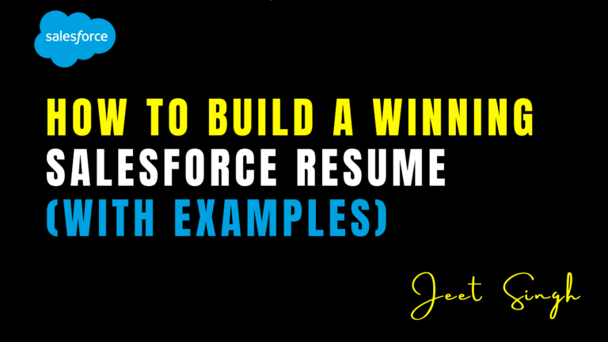

<figure>

<figcaption>

How to Build a Winning Salesforce Resume (With Examples)

</figcaption>

</figure>

A well-crafted resume is essential for standing out in the competitive Salesforce job market. Whether you're aiming for a role as a Salesforce Administrator, Developer, Consultant, or Architect, your resume needs to showcase your technical expertise, certifications, and problem-solving skills. In this guide, we’ll walk you through the key elements of a winning Salesforce resume, provide best practices, and offer examples to help you land your dream job.

### 1\. Choose the Right Resume Format

The first step in crafting a compelling Salesforce resume is selecting the right format. The most common formats are:

- **Reverse-Chronological** – Best for professionals with significant Salesforce experience. This format emphasizes work history and career progression.
    
- **Functional (Skills-Based)** – Ideal for career changers or those with limited Salesforce experience. This format focuses on skills rather than work experience.
    
- **Hybrid (Combination)** – A mix of both, highlighting key skills and work history effectively. This format is great for those who want to showcase both technical expertise and past roles.
    

A reverse-chronological format is usually preferred, as it clearly outlines your work experience and progression in the Salesforce ecosystem, making it easier for recruiters to assess your career growth.

### 2\. Write a Compelling Summary

Your resume summary is the first thing recruiters see, so make it impactful. In 3-4 sentences, highlight your experience, key skills, and certifications. This section should be concise yet powerful, summarizing why you are the perfect candidate for the role.

**Salesforce Administrator Resume Summary Example:** "Certified Salesforce Administrator with 4+ years of experience optimizing CRM functionality for enterprise clients. Skilled in workflow automation, data management, and user training. Adept at customizing Salesforce to enhance business efficiency and improve sales processes. Passionate about leveraging Salesforce to drive business success."

**Salesforce Developer Resume Summary Example:** "Salesforce Certified Platform Developer with expertise in Apex, Visualforce, and Lightning Web Components. Experienced in developing custom applications, integrating third-party solutions, and automating workflows to streamline business operations. Passionate about leveraging Salesforce’s capabilities to enhance user experience and business efficiency."

### 3\. Highlight Your Salesforce Skills

Employers look for both technical and soft skills in a Salesforce professional. Your resume should have a dedicated skills section that emphasizes your most relevant abilities. Some key skills include:

#### **Technical Skills:**

- Salesforce Lightning
    
- Apex programming
    
- Visualforce pages
    
- SOQL & SOSL (Salesforce Object Query Language)
    
- Process Builder and Flow automation
    
- Reports & Dashboards
    
- Salesforce CPQ
    
- REST/SOAP API Integration
    
- Security and user management
    
- DevOps tools like Git, Jenkins, and Copado
    

#### **Soft Skills:**

- Communication and collaboration
    
- Problem-solving and critical thinking
    
- Analytical skills
    
- Client interaction and stakeholder management
    
- Project management and leadership
    
- Adaptability to new technologies
    

### 4\. Showcase Your Work Experience

List your previous roles in reverse chronological order, detailing your achievements using action verbs and quantifiable results. Rather than listing responsibilities, focus on the impact of your work and how it benefited the company.

**Salesforce Developer Work Experience Example:** **Salesforce Developer | ABC Solutions | Jan 2021 – Present**

- Developed and deployed 15+ custom Salesforce applications using Apex, Lightning Web Components, and Visualforce.
    
- Automated lead assignment process, reducing response time by 30% and increasing sales efficiency.
    
- Integrated Salesforce with third-party applications, improving data accuracy by 25% and reducing manual data entry efforts.
    
- Created dashboards and reports that enhanced sales forecasting and tracking, leading to a 20% improvement in sales performance.
    

**Salesforce Administrator Work Experience Example:** **Salesforce Administrator | XYZ Corporation | May 2019 – Dec 2020**

- Managed Salesforce platform for a 500+ user base, ensuring seamless operations and data integrity.
    
- Automated manual processes using Process Builder and Flow, reducing workload by 40%.
    
- Trained end-users and stakeholders, increasing Salesforce adoption rate by 35%.
    
- Conducted regular audits and security checks, maintaining system compliance with industry regulations.
    

### 5\. Emphasize Certifications and Training

Certifications can significantly boost your resume. If you have earned any Salesforce certifications, list them in a separate section. Some of the most valuable certifications include:

- **Salesforce Certified Administrator** – A must-have for admins managing Salesforce instances.
    
- **Salesforce Certified Advanced Administrator** – Demonstrates advanced knowledge in configuration and automation.
    
- **Salesforce Certified Platform Developer I & II** – Ideal for developers looking to showcase their coding skills.
    
- **Salesforce Certified Sales Cloud Consultant** – Focuses on optimizing sales processes within Salesforce.
    
- **Salesforce Certified Marketing Cloud Specialist** – Highlights expertise in Salesforce’s marketing automation.
    

If you’re currently pursuing a certification, mention it as “In Progress” to show your commitment to professional growth.

### 6\. Add Education and Additional Credentials

Your educational background should be listed along with any relevant coursework or degrees. If you have attended Salesforce training sessions, workshops, or bootcamps, include those as well.

**Example:** **Bachelor of Science in Computer Science**  
XYZ University, 2020  
Relevant Coursework: CRM Systems, Database Management, Cloud Computing

### 7\. Include Projects and Achievements

If you have personal, freelance, or open-source Salesforce projects, highlight them in a dedicated section. Projects showcase hands-on experience and initiative.

**Example:**

- Designed a custom Salesforce app for a nonprofit, improving donor tracking by 40%.
    
- Built a workflow automation system for a small business, reducing manual effort by 50%.
    
- Developed a Lightning Web Component that enhanced user experience and increased efficiency.
    

### 8\. Optimize for ATS (Applicant Tracking Systems)

Many companies use ATS software to filter resumes before a human recruiter reviews them. To increase your chances:

- Use relevant Salesforce keywords found in the job description.
    
- Avoid excessive formatting, graphics, or tables.
    
- Keep your file in PDF or Word format for easy scanning.
    
- Use standard job titles and descriptions to ensure ATS compatibility.
    

### 9\. Additional Tips for a Winning Salesforce Resume

- Keep it **concise** (1-2 pages max, unless you have extensive experience).
    
- Use **action-oriented language** (e.g., “Implemented,” “Developed,” “Optimized”).
    
- Customize your resume for **each job application** by aligning your skills with the job description.
    
- Include a **LinkedIn profile** or **Salesforce Trailhead profile** link to showcase additional achievements.
    

## Conclusion

A strong Salesforce resume highlights your technical expertise, certifications, and real-world impact. By following these best practices and structuring your resume effectively, you’ll stand out to recruiters and increase your chances of landing your next Salesforce role. Whether you're just starting or looking to advance your career, investing time in crafting a compelling resume will pay off.

For more useful resources and personalized Salesforce training, visit [Jeet Singh](https://jeet-singh.com/post/). Our interactive platform offers hands-on learning opportunities, expert guidance, and real-world projects to help you master Salesforce and secure your dream job.

**Good luck with your job search!**

                                                                                                                                                              **-Jeet Singh**
