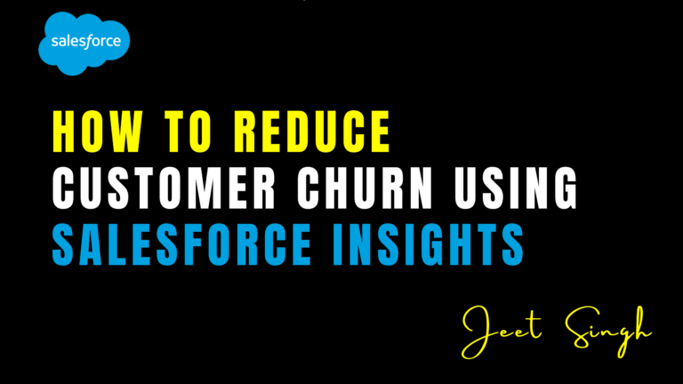

<figure>

<figcaption>

How to Reduce Customer Churn Using Salesforce Insights

</figcaption>

</figure>

Customer churn is a significant challenge for businesses across industries. Losing customers not only impacts revenue but also increases **acquisition costs**, as finding new customers is far more expensive than retaining existing ones. In today’s competitive market, understanding why customers leave and taking proactive steps to retain them is crucial for sustainable growth.

**Salesforce provides powerful insights and tools** that help businesses predict, analyze, and reduce customer churn effectively. By leveraging **AI-driven analytics, automation, and customer engagement strategies**, companies can build stronger relationships and improve customer retention. This article explores how **Salesforce insights** can help businesses identify churn risks and take strategic actions to keep customers engaged.

### 1\. Understanding Customer Churn & Why It Happens

Customer churn refers to the rate at which customers **stop doing business** with a company over a given period. The reasons for churn can vary, but common factors include:

- **Poor customer service:** Delays in response time, unresolved issues, or lack of personalized support.
- **Lack of engagement:** Customers who don’t interact with a brand are more likely to leave.
- **Better competitor offerings:** Customers may switch if they find better pricing, features, or service elsewhere.
- **Product dissatisfaction:** If a product does not meet expectations, customers will likely abandon it.
- **Pricing concerns:** Unexpected price increases or unclear billing policies can drive customers away.

Understanding these causes is the first step in creating **data-driven strategies** to prevent churn. Salesforce provides businesses with **real-time insights** to monitor customer behavior and take proactive measures before it’s too late.

### 2\. Using Salesforce Einstein AI for Churn Prediction

One of the most powerful tools within Salesforce for **churn prevention** is **Einstein AI**. **Einstein Prediction Builder** uses historical data to analyze patterns and **predict which customers are most likely to churn**.

### **How it Works:**

- Einstein AI examines **customer engagement, purchase history, support tickets, and sentiment analysis** to detect churn signals.
- Businesses can use **predictive scores** to categorize customers into high-risk, moderate-risk, and low-risk segments.
- Based on these predictions, teams can implement **targeted retention strategies** before the customer leaves.

For example, if a high-value customer **reduces their usage or stops engaging**, Einstein can alert account managers, allowing them to take **proactive action**—such as offering personalized discounts, exclusive offers, or direct outreach—to prevent churn.

### 3\. Automating Customer Retention with Salesforce Workflows

Automation is a game-changer when it comes to **reducing churn**. Salesforce allows businesses to set up workflows that **automatically trigger retention actions** when certain conditions are met.

### **Examples of Automated Retention Workflows:**

- **Re-engagement Emails:** If a customer hasn’t logged in for 30 days, an automated email can remind them about features they haven’t explored.
- **Loyalty Offers:** If a customer’s contract is about to expire, Salesforce can trigger an **automated discount offer** or a loyalty incentive.
- **Customer Service Follow-Ups:** If a support ticket is unresolved, an automated escalation can ensure that a manager reaches out for resolution.
- **Onboarding & Education:** Customers who struggle to use a product often churn. Salesforce can trigger an **automated onboarding sequence**, sending educational content to help them succeed.

With **Salesforce Flow and Process Builder**, businesses can **reduce manual work** and ensure timely interventions that keep customers engaged.

### 4\. Enhancing Customer Support with Salesforce Service Cloud

Poor customer service is one of the top reasons customers leave a business. **Salesforce Service Cloud** helps businesses **deliver faster, personalized, and proactive support**—a critical factor in improving customer satisfaction and retention.

### **How Service Cloud Reduces Churn:**

- **Omnichannel Support:** Customers can reach out via **phone, email, live chat, or social media**, ensuring convenience.
- **AI-Powered Chatbots:** Salesforce **Einstein Bots** can **handle basic customer queries instantly**, reducing wait times and improving service speed.
- **Case Prioritization:** High-value customers can receive **priority support**, ensuring their issues are resolved faster.
- **Self-Service Portals:** A well-structured knowledge base helps customers find solutions quickly without contacting support.

By leveraging **AI-driven case routing and real-time support insights**, businesses can **improve response times and boost customer satisfaction**, reducing the chances of churn.

### 5\. Personalizing Customer Engagement with Salesforce Marketing Cloud

Engagement is key to **customer retention**. Customers who feel valued and connected to a brand are far less likely to churn. **Salesforce Marketing Cloud** helps businesses create personalized, data-driven customer interactions that **strengthen relationships**.

### **Strategies to Enhance Engagement:**

- **Behavior-Based Messaging:** Salesforce tracks customer interactions and **sends personalized messages** based on activity. For example, if a customer abandons a purchase, they receive an automated follow-up email with a discount.
- **Loyalty & Rewards Programs:** Businesses can automate **loyalty campaigns** for repeat customers, offering them exclusive perks to keep them engaged.
- **Social Listening & Engagement:** Salesforce integrates with social media platforms, allowing businesses to monitor customer feedback and engage in real-time.
- **AI-Powered Recommendations:** Based on past behavior, **Einstein AI** suggests the **next best offer or product**, increasing customer satisfaction and retention.

By keeping customers **actively engaged**, businesses can **reduce churn and build long-term loyalty**.

## 6\. Monitoring Churn Metrics with Salesforce Reports & Dashboards

Data-driven decision-making is essential for **preventing churn**. **Salesforce Reports & Dashboards** provide businesses with **real-time insights into customer behavior**, helping them take proactive measures.

### **Key Metrics to Track:**

- **Churn Rate:** Percentage of customers lost over a period.
- **Customer Lifetime Value (CLV):** How much revenue a customer generates before churning.
- **Product Usage Reports:** Tracks customer engagement levels.
- **Support Ticket Trends:** High support cases may indicate dissatisfaction.
- **Net Promoter Score (NPS):** Measures customer satisfaction and likelihood of recommending the brand.

By continuously monitoring these **key metrics**, businesses can **identify churn risks early and take corrective action**.

## Conclusion

Customer churn can significantly impact a business’s bottom line, but with **Salesforce insights**, companies can **predict, prevent, and reduce churn effectively**. By leveraging **AI-driven predictions, automation, enhanced customer support, personalized engagement, and real-time analytics**, businesses can ensure **higher retention and customer satisfaction**.

If you’re looking to **master Salesforce tools and strategies** to improve customer retention, check out **[Jeet Singh’s Salesforce Learning Platform](https://jeet-singh.com/post/)** for expert training and hands-on guidance.

Start leveraging **Salesforce insights today** to build lasting customer relationships and **reduce churn for sustainable business growth!**
