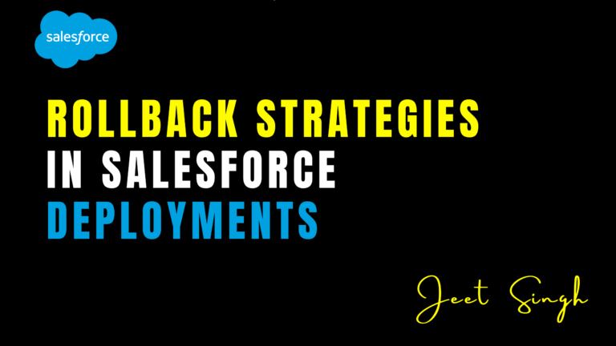

<figure>

<figcaption>

Rollback Strategies in Salesforce Deployments

</figcaption>

</figure>

Deploying changes in Salesforce can sometimes lead to unexpected issues, such as **broken functionality, data corruption, or performance slowdowns**. Whether due to human error, dependencies, or unforeseen bugs, it’s crucial to have a **rollback strategy** in place to **quickly restore the previous stable state** and minimize business disruption.

A well-defined **rollback plan** ensures that organizations can recover from failed deployments efficiently, maintaining **system stability and user trust**. In this article, we will explore different rollback strategies in Salesforce and best practices to implement them.

## 1\. Why Rollback is Critical in Salesforce

Unlike traditional development environments, Salesforce operates in a **multi-tenant cloud environment**, meaning that once a deployment is pushed to production, it cannot simply be "undone" with a single command. Unlike software applications where you can revert to a previous version easily, **Salesforce metadata and data require structured rollback approaches**.

### **Key reasons why rollback is important:**

- **Prevents Business Disruptions:** If a deployment causes issues, rolling back quickly minimizes downtime.
- **Protects Data Integrity:** Deployments that modify data models, fields, or workflows can impact existing records.
- **Ensures Compliance & Security:** Unsuccessful deployments could unintentionally expose sensitive information.
- **Reduces Development Time & Effort:** Fixing failed deployments manually is time-consuming and error-prone.

## 2\. Common Rollback Strategies in Salesforce

### **A. Manual Rollback using Backups**

This is the most basic rollback approach, where teams take **metadata and data backups** before deploying and manually restore them if something goes wrong.

**Steps to follow:**

1. **Backup metadata**: Export all metadata components using **Salesforce CLI, ANT Migration Tool, or third-party tools like Gearset**.
2. **Backup data**: Export Salesforce records using **Data Loader, Workbench, or a full sandbox copy**.
3. If a deployment fails, **manually redeploy the previous version** of the metadata and restore the data.

**Pros:**  
✅ Simple and effective for small deployments.  
✅ No additional tools required beyond Salesforce-provided utilities.

**Cons:**  
❌ Time-consuming and requires manual intervention.  
❌ Difficult to manage in large-scale deployments with multiple changes.

### **B. Version Control Rollback (Git-based Revert)**

A more efficient rollback strategy involves using **Git-based version control systems (GitHub, Bitbucket, GitLab)** to track metadata changes and revert to a stable version.

**Steps to follow:**

1. **Store all metadata in a Git repository** (e.g., using Salesforce DX).
2. Before deploying, **tag or create a backup branch** of the stable version.
3. If deployment issues occur, use `git revert` or `git reset` to restore the previous version.
4. Redeploy the stable version to Salesforce using **Salesforce CLI or CI/CD tools**.

**Pros:**  
✅ Provides an **automated and structured rollback** process.  
✅ Allows for **quick reversion** to a stable state.  
✅ Works well with **CI/CD pipelines**.

**Cons:**  
❌ Requires proper **Git versioning setup** and knowledge.  
❌ Metadata dependencies can still cause issues during rollback.

### **C. Using CI/CD Rollback Pipelines**

Modern **DevOps tools like Copado, Gearset, Flosum, or Jenkins** provide built-in rollback mechanisms for Salesforce deployments.

**Steps to follow:**

1. **Configure a CI/CD pipeline** that tracks every deployment version.
2. Store **metadata snapshots** before each deployment.
3. If a failure occurs, trigger an **automated rollback deployment** from the previous successful version.

**Pros:**  
✅ Fast, automated, and minimizes downtime.  
✅ Works well for **large teams and enterprise deployments**.  
✅ Ensures **consistent and error-free rollbacks**.

**Cons:**  
❌ Requires setup of **DevOps tools** and CI/CD pipelines.  
❌ Some tools have **licensing costs**.

### **D. Partial Rollback via Change Sets**

Salesforce Change Sets allow teams to **deploy specific metadata components** between environments, but they **do not provide a built-in rollback option**. However, a workaround is to use a **"Rollback Change Set"**, which contains the previous versions of modified components.

**Steps to follow:**

1. Before deployment, create a **backup Change Set** containing the original versions of modified components.
2. If the new deployment fails, deploy the **rollback Change Set** to revert the changes.

**Pros:**  
✅ No additional tools required (native Salesforce functionality).  
✅ Useful for **small metadata rollbacks**.

**Cons:**  
❌ Change Sets are **manual and time-consuming**.  
❌ **No version control integration**.

### **E. Data Rollback with Salesforce Backup Tools**

If a deployment affects Salesforce data (e.g., mass updates, deletions, or field modifications), data rollback becomes necessary.

**Steps to follow:**

1. **Before deployment, back up data** using **Salesforce Weekly Export, Data Loader, or third-party tools (OwnBackup, Spanning Backup, etc.)**.
2. If data is corrupted, restore it from the backup files.
3. Ensure that related objects and dependencies are also restored.

**Pros:**  
✅ Ensures data integrity and protects against accidental deletions.  
✅ Works for both **metadata and data recovery**.

**Cons:**  
❌ Data rollback can be **complex and time-consuming** for large datasets.  
❌ Requires **regular backups** to be effective.

## **3\. Best Practices for Effective Rollback Management**

✔️ **Always Test in a Sandbox First:** Deploy changes in a **Full Sandbox or UAT environment** before pushing to production.

✔️ **Implement CI/CD for Faster Recovery:** Automate backups and deployments using **DevOps tools like Copado, Gearset, or Flosum**.

✔️ **Use Version Control for Metadata Tracking:** Store all metadata in **Git repositories** and tag stable versions.

✔️ **Automate Backups for Data and Metadata:** Schedule **regular exports** using **Salesforce Backup & Restore solutions**.

✔️ **Document Rollback Plans:** Have a **clear rollback strategy** documented for all major deployments.

✔️ **Monitor Post-Deployment Performance:** Track errors, system logs, and user feedback after deployment.

## Conclusion

Rollback strategies are essential to ensure that Salesforce deployments remain **stable, efficient, and error-free**. Whether you use **manual backups, Git version control, CI/CD automation, or Salesforce Change Sets**, having a structured rollback plan helps minimize risks and **keeps your system running smoothly**.

For a **step-by-step guide on Salesforce deployments, DevOps best practices, and interactive learning**, visit **[Jeet Singh’s Salesforce Learning Platform](https://jeet-singh.com/post/)**. 🚀 Happy deploying!
