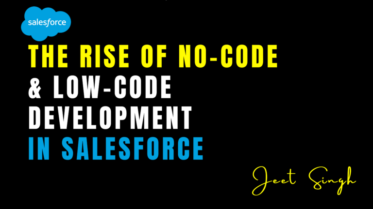

<figure>

<figcaption>

The Rise of No-Code & Low-Code Development in Salesforce

</figcaption>

</figure>

The world of software development is undergoing a massive shift, and Salesforce is at the forefront of this transformation. With the increasing demand for faster application development, businesses are looking for ways to build and deploy solutions without the need for extensive coding expertise. No-code and low-code development platforms are emerging as game-changers, empowering both technical and non-technical users to create powerful applications with minimal effort.

Salesforce, as one of the leading cloud-based CRM platforms, has embraced this trend by offering a suite of tools that enable users to automate processes, design applications, and enhance business operations without deep coding knowledge. This shift democratizes application development, allowing business users, administrators, and citizen developers to contribute to digital transformation without relying solely on professional developers.

In this article, we explore the rise of no-code and low-code development in Salesforce, its benefits, key tools, and how businesses can leverage these technologies to streamline their operations.

## Understanding No-Code & Low-Code Development

#### What is No-Code Development?

No-code development refers to the creation of applications without writing a single line of code. It uses visual development environments, drag-and-drop interfaces, and pre-configured templates to allow users to build applications quickly. No-code platforms are designed for business users and administrators who may not have programming knowledge but need to automate workflows and enhance processes.

#### What is Low-Code Development?

Low-code development, on the other hand, provides a balance between coding and no-code capabilities. It enables users to build applications using a combination of visual interfaces and minimal coding. Low-code platforms are ideal for professional developers who want to accelerate development while still having the flexibility to write custom logic when needed.

Both no-code and low-code approaches help reduce development complexity and speed up application delivery, making them essential for modern businesses that need to adapt quickly to changing market demands.

#### Why No-Code & Low-Code Development is Growing in Salesforce

Salesforce has always focused on enabling businesses to build solutions quickly and efficiently. With the rise of no-code and low-code platforms, Salesforce has integrated tools that allow users to automate workflows, create applications, and customize functionalities without requiring deep technical expertise.

Several factors are driving this growth in Salesforce:

- **Increased Demand for Digital Transformation:** Businesses need rapid solutions to stay competitive, and traditional development cycles can be too slow. No-code and low-code tools help accelerate innovation.
- **IT Resource Constraints:** Many organizations face a shortage of skilled developers. No-code and low-code development allow non-technical users to take charge of application development, reducing IT bottlenecks.
- **Faster Time-to-Market:** Companies can build, test, and deploy applications much faster, enabling them to adapt to customer needs and industry trends quickly.
- **Enhanced Customization Without Complexity:** Businesses can tailor their Salesforce environment to their specific needs without requiring extensive coding knowledge.

#### Key No-Code & Low-Code Tools in Salesforce

Salesforce provides a robust set of tools that enable both no-code and low-code development. These tools empower users to create workflows, design user interfaces, and automate business processes with minimal or no coding.

#### 1\. Salesforce Flow (No-Code Automation)

Salesforce Flow is one of the most powerful no-code automation tools available in Salesforce. It allows users to create automated workflows using a visual interface. With Flow, users can:

- Automate repetitive tasks such as approvals, email notifications, and data updates.
- Design interactive screen flows for guided processes.
- Integrate with external systems without writing code.

#### 2\. App Builder (No-Code UI Development)

Salesforce App Builder enables users to create custom applications using a simple drag-and-drop interface. It is used to design pages, dashboards, and mobile applications without writing complex code. App Builder allows users to:

- Customize user experiences with Lightning components.
- Create responsive applications for desktop and mobile.
- Integrate with data sources seamlessly.

#### 3\. Process Builder (No-Code Business Logic Automation)

Process Builder is a no-code tool that allows users to automate business logic by defining rules and actions. Users can create workflows that trigger specific actions based on predefined conditions. Key features include:

- Automating record updates, email notifications, and task assignments.
- Integrating with external applications through API calls.
- Simplifying business process automation without coding.

#### 4\. Apex (Low-Code Custom Development)

For users who require more advanced customization, Salesforce provides Apex, a low-code programming language that enables developers to write backend logic while still leveraging no-code tools. Apex is used for:

- Creating complex business logic and integrations.
- Building custom APIs and advanced automation.
- Extending Salesforce functionalities beyond no-code capabilities.

#### 5\. Lightning Web Components (Low-Code UI Customization)

Lightning Web Components (LWC) allow developers to create custom user interfaces using reusable components. While it requires some coding knowledge, it simplifies UI development by providing pre-built elements that integrate seamlessly with Salesforce.

## Benefits of No-Code & Low-Code Development in Salesforce

#### 1\. Increased Productivity and Agility

By eliminating the need for extensive coding, businesses can develop and deploy applications faster. This increases efficiency and allows organizations to respond quickly to market changes and customer needs.

#### 2\. Cost-Effective Development

Hiring and training developers can be expensive. No-code and low-code tools enable businesses to build applications using existing resources, reducing costs associated with traditional software development.

#### 3\. Empowering Citizen Developers

Non-technical employees, such as business analysts and administrators, can create and modify applications without IT dependency. This reduces the workload on developers and allows teams to take control of their processes.

#### 4\. Seamless Integration and Scalability

Salesforce’s no-code and low-code solutions are designed to integrate with external systems effortlessly. Businesses can scale their applications without worrying about complex development challenges.

#### 5\. Reduced Errors and Maintenance Efforts

No-code platforms provide pre-built templates and visual workflows that reduce human errors. Additionally, updates and maintenance become easier as businesses can modify workflows without breaking code.

## How Businesses Can Leverage No-Code & Low-Code Development

Organizations looking to maximize the potential of no-code and low-code development in Salesforce should consider the following strategies:

- **Train Employees:** Encourage employees to learn and use no-code tools like Flow and Process Builder to automate business processes.
- **Start with Simple Use Cases:** Begin by automating small, repetitive tasks before scaling to more complex workflows.
- **Combine No-Code with Low-Code When Needed:** While no-code tools can handle most tasks, low-code solutions like Apex and LWC can be used for advanced customizations.
- **Adopt a Citizen Development Culture:** Empower business users to create solutions, reducing dependency on IT teams.

## Conclusion

No-code and low-code development in Salesforce is transforming how businesses build applications, automate processes, and drive digital transformation. With tools like Salesforce Flow, App Builder, and Process Builder, companies can accelerate development, reduce costs, and empower employees to create innovative solutions without technical expertise.

As organizations continue to embrace no-code and low-code strategies, they will be better positioned to adapt to changing business needs, enhance customer experiences, and stay ahead in a competitive market. Whether you're a business user looking to streamline workflows or a developer seeking faster application deployment, Salesforce’s no-code and low-code tools provide the flexibility and efficiency needed for modern business success.

For those looking to gain hands-on expertise in Salesforce development, **[Jeet Singh’s Salesforce Learning Platform](https://jeet-singh.com/post/)** offers interactive and in-depth training. Whether you’re a beginner or an experienced professional, this platform provides the best resources to master Salesforce no-code and low-code development. Start your journey today and take your Salesforce skills to the next level.
