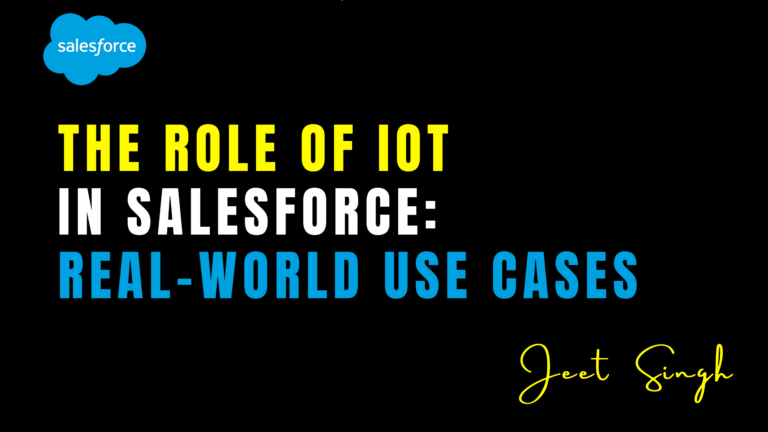

<figure>

<figcaption>

The Role of IoT in Salesforce: Real-World Use Cases

</figcaption>

</figure>

The Internet of Things (IoT) is rapidly transforming the way businesses operate by enabling seamless connectivity between devices, data, and applications. In today’s digital world, businesses are leveraging IoT to collect real-time data, automate processes, and enhance customer experiences.

Salesforce, a leader in Customer Relationship Management (CRM), has embraced IoT to provide businesses with deeper customer insights, proactive service capabilities, and automated workflows. With **Salesforce IoT Cloud**, organizations can harness IoT-generated data to make smarter decisions and deliver highly personalized customer experiences.

In this article, we will explore the role of IoT in Salesforce, its benefits, and real-world use cases that showcase how businesses are using IoT to revolutionize customer engagement and operational efficiency.

## How IoT Enhances Salesforce CRM

IoT connects physical devices, sensors, and software to collect and exchange data in real-time. When integrated with Salesforce, this data becomes a powerful tool for businesses to optimize operations and enhance customer relationships. Here are some key ways IoT enhances Salesforce CRM:

#### 1\. Real-Time Customer Insights

IoT allows businesses to track customer behavior, product usage, and preferences in real-time. This data can be fed into **Salesforce Service Cloud** or **Salesforce Marketing Cloud** to create highly personalized customer interactions. For example, wearable fitness trackers can send real-time health data to Salesforce, allowing healthcare providers to offer tailored advice and services to patients.

#### 2\. Predictive Maintenance & Proactive Customer Support

By leveraging IoT data in **Salesforce IoT Cloud**, companies can predict equipment failures before they happen. This helps businesses shift from reactive to proactive maintenance, reducing downtime and enhancing customer satisfaction. For instance, an elevator company can use IoT sensors to detect performance issues and schedule maintenance automatically within Salesforce before a failure occurs.

#### 3\. Automated Workflows & Smart Triggers

Salesforce IoT Cloud enables businesses to create automated workflows based on IoT data. These workflows can trigger service tickets, alert sales teams about potential upsell opportunities, or send proactive customer notifications. For example, a smart thermostat manufacturer can use IoT data to detect unusual energy consumption and automatically send personalized energy-saving tips to customers through **Salesforce Marketing Cloud**.

#### 4\. Enhanced Field Service Management

Field service teams benefit significantly from IoT integration with **Salesforce Field Service**. Connected devices can provide real-time diagnostics, allowing technicians to arrive prepared with the right tools and parts. This reduces service times and increases first-time fix rates, improving both customer satisfaction and operational efficiency.

#### 5\. Improved Supply Chain & Inventory Management

IoT sensors can track inventory levels, shipping conditions, and warehouse operations in real-time. This data can be integrated into **Salesforce Sales Cloud** and **Einstein Analytics** to optimize supply chain decisions, reduce waste, and ensure timely product availability. Retailers can also use IoT to monitor foot traffic and adjust stock levels accordingly.

## Real-World Use Cases of IoT in Salesforce

#### 1\. Smart Home & Consumer Electronics

Companies in the smart home industry use IoT and Salesforce to provide proactive customer support and predictive maintenance. For example, a smart refrigerator can detect a failing cooling system and automatically create a support ticket in **Salesforce Service Cloud**, notifying both the customer and the service team for timely repairs.

#### 2\. Automotive Industry & Connected Cars

Automakers use IoT and Salesforce to deliver **connected car experiences**. Real-time vehicle diagnostics, fuel efficiency monitoring, and driver behavior analysis help manufacturers provide better services. For example, Tesla’s connected vehicles send performance data to customer service teams, allowing them to proactively reach out for maintenance or software updates.

#### 3\. Healthcare & Remote Patient Monitoring

Healthcare providers use IoT devices such as smartwatches, glucose monitors, and heart rate sensors to track patient health remotely. This data can be stored in Salesforce Health Cloud, enabling doctors to monitor patients in real-time and intervene when necessary. Hospitals can also use IoT sensors to track medical equipment and optimize resource allocation.

#### 4\. Manufacturing & Industrial Equipment

Manufacturers integrate IoT with Salesforce to monitor equipment performance and prevent breakdowns. Industrial machines equipped with sensors can detect anomalies and trigger maintenance requests in Salesforce before costly failures occur. This minimizes downtime and improves productivity.

#### 5\. Retail & Personalized Shopping Experiences

Retailers use IoT and Salesforce to enhance customer engagement. Smart shelves equipped with RFID sensors can track product inventory in real-time and alert store managers via Salesforce when restocking is needed. Beacons in stores can also send personalized offers to customers based on their shopping habits and location.

#### 6\. Logistics & Fleet Management

IoT sensors in delivery trucks provide real-time tracking data, which can be fed into Salesforce to optimize delivery routes and monitor vehicle performance. Logistics companies use this data to ensure on-time deliveries and improve customer satisfaction by providing accurate shipping updates.

## Challenges of Implementing IoT in Salesforce

While IoT offers numerous benefits, integrating it with Salesforce comes with some challenges:

- **Data Overload:** IoT devices generate vast amounts of data, and managing it efficiently within Salesforce requires strong data analytics capabilities.
- **Security Concerns:** IoT devices can be vulnerable to cyber threats. Ensuring secure data transmission and storage within Salesforce is crucial.
- **Integration Complexity:** Businesses must ensure seamless connectivity between IoT devices, Salesforce CRM, and third-party applications.
- **Cost of Implementation:** Deploying IoT infrastructure and integrating it with Salesforce can be costly, requiring careful planning and investment.

## Conclusion

The integration of IoT with Salesforce is transforming customer engagement, predictive maintenance, and operational efficiency across various industries. By leveraging real-time data from connected devices, businesses can enhance customer experiences, automate workflows, and make data-driven decisions.

From **smart homes and connected cars** to **healthcare and industrial automation**, IoT is revolutionizing the way businesses interact with customers. However, successful implementation requires a robust strategy, secure data handling, and seamless integration with Salesforce tools.

For professionals looking to master Salesforce and explore cutting-edge technologies like IoT, **[Jeet Singh’s Salesforce Learning Platform](https://jeet-singh.com/post/)** offers interactive courses, real-world projects, and expert guidance. Stay ahead in your career by learning how to integrate IoT with Salesforce and drive digital transformation in your industry!
