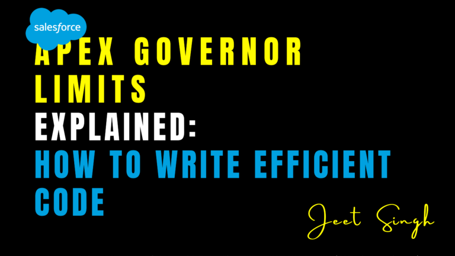

<figure>



<figcaption>

Apex Governor Limits Explained: How to Write Efficient Code

</figcaption>

</figure>

Salesforce is a powerful platform, but its multi-tenant architecture requires strict resource management to ensure fair usage across all organizations. This is where **Apex governor limits** come into play. If you’re a Salesforce developer, understanding these limits and learning how to write efficient code is crucial for building scalable and reliable applications.

In this blog, we’ll explain what Apex governor limits are, why they exist, and how you can write efficient code to stay within these limits.

#### What Are Apex Governor Limits?

Apex governor limits are runtime restrictions enforced by Salesforce to ensure that no single organization monopolizes shared resources like CPU time, memory, and database operations. These limits apply to:

- **Synchronous Transactions**: Code executed in real-time (e.g., triggers, Visualforce controllers).
    
- **Asynchronous Transactions**: Code executed in the background (e.g., batch Apex, scheduled jobs).
    

Exceeding these limits results in runtime exceptions, such as `LimitException`, which can disrupt your application’s functionality.

#### Key Apex Governor Limits Every Developer Should Know

Here are some of the most important governor limits to keep in mind:

| **Limit** | **Synchronous** | **Asynchronous** |
| --- | --- | --- |
| **Total SOQL Queries** | 100 | 200 |
| **Total DML Statements** | 150 | 150 |
| **Total Query Rows** | 50,000 | 50,000 |
| **Heap Size** | 6 MB | 12 MB |
| **CPU Time** | 10,000 ms | 60,000 ms |
| **Callouts (HTTP Requests)** | 100 | 100 |

#### Why Do Governor Limits Exist?

Governor limits serve several purposes:

1. **Resource Fairness**: Prevent one organization from consuming excessive resources in a multi-tenant environment.
    
2. **Performance Optimization**: Encourage developers to write efficient, scalable code.
    
3. **System Stability**: Ensure the Salesforce platform remains stable and responsive for all users.
    

#### How to Write Efficient Code and Avoid Governor Limits

Here are practical strategies to help you write efficient Apex code and stay within governor limits:

##### 1\. Bulkify Your Code

Always write code that can handle multiple records at once. This is especially important for triggers, which can process up to 200 records in a single batch.

###### Example:

```
trigger AccountTrigger on Account (before insert) {
for (Account acc : Trigger.new) {
acc.Name = acc.Name + ' - Processed';
}
}
```

#### 2\. Avoid SOQL Queries and DML Statements Inside Loops

###### Bad Example:

Placing SOQL queries or DML statements inside loops is a common mistake that can quickly exhaust your limits.

```
for (Account acc : Trigger.new) {
Contact con = [SELECT Id FROM Contact WHERE AccountId = :acc.Id LIMIT 1]; // SOQL inside loop
con.LastName = 'Updated';
update con; // DML inside loop
}
```

###### Good Example:

```
Set accountIds = new Set();
for (Account acc : Trigger.new) {
accountIds.add(acc.Id);
}
List contactsToUpdate = [SELECT Id FROM Contact WHERE AccountId IN :accountIds];
for (Contact con : contactsToUpdate) {
con.LastName = 'Updated';
}
update contactsToUpdate; // Single DML outside loop
```

#### 3\. Use Collections and Maps

Collections like `List`, `Set`, and `Map` allow you to process records efficiently and avoid redundant operations.

###### Example:

```
Map accountMap = new Map([SELECT Id, Name FROM Account]);
for (Opportunity opp : [SELECT Id, AccountId FROM Opportunity]) {
Account acc = accountMap.get(opp.AccountId);
// Process records
}
```

#### 4\. Leverage Batch Apex for Large Data Volumes

For operations involving large datasets, use **Batch Apex** to process records in smaller, manageable chunks.

###### Example:

```
global class UpdateAccountsBatch implements Database.Batchable {
global Database.QueryLocator start(Database.BatchableContext bc) {
return Database.getQueryLocator('SELECT Id, Name FROM Account');
}
global void execute(Database.BatchableContext bc, List scope) {
for (Account acc : scope) {
acc.Name = acc.Name + ' - Updated';
}
update scope;
}
global void finish(Database.BatchableContext bc) {
// Post-processing logic
}
}
```

#### 5\. Optimize SOQL Queries

- Use indexed fields in WHERE clauses.
    
- Retrieve only the fields you need.
    
- Use relationship queries to avoid multiple queries.
    

###### Example

```
List accounts = [SELECT Id, Name, (SELECT Id, LastName FROM Contacts) FROM Account WHERE Industry = 'Technology'];
```

#### 6\. Monitor and Debug Limits

Use the `Limits` class to monitor resource usage and debug potential issues.

###### Example:

```
System.debug('SOQL Queries Used: ' + Limits.getQueries() + '/' + Limits.getLimitQueries());
System.debug('CPU Time Used: ' + Limits.getCpuTime() + '/' + Limits.getLimitCpuTime());
```

#### Common Pitfalls to Avoid

1. **Hardcoding IDs or Limits**: Avoid assumptions about data volume or specific record IDs.
    
2. **Ignoring Testing**: Always test your code with large datasets to ensure it performs well under real-world conditions.
    
3. **Overfetching Data**: Retrieve only the fields and rows you need to minimize resource usage.
    

## Conclusion

Apex governor limits are a fundamental aspect of Salesforce development, designed to ensure fair resource usage and system stability. By understanding these limits and following best practices—such as bulkifying your code, optimizing SOQL queries, and leveraging Batch Apex—you can write efficient, scalable code that stays within governor limits.

Remember: **Efficient code is not just about functionality—it’s about scalability and performance.** Take the time to review and refine your code, and always test with real-world scenarios to ensure it meets the demands of your organization.                                                                                           

                                                                                                                                                                   **-Jeet Singh**
