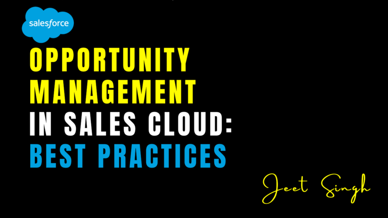

<figure>

<figcaption>

Opportunity Management in Sales Cloud: Best Practices

</figcaption>

</figure>

In Salesforce Sales Cloud, **opportunities** represent potential sales deals that your team is working to close. Effective opportunity management is crucial for driving revenue growth, improving sales performance, and building strong customer relationships. By leveraging the tools and features in Sales Cloud, you can streamline your opportunity management process and increase your chances of closing deals. In this blog, we’ll explore best practices for managing opportunities in Sales Cloud, helping you maximize your sales potential.

### What Is Opportunity Management in Sales Cloud?

Opportunity management is the process of tracking and managing potential sales deals from initial contact to closing. In Salesforce Sales Cloud, opportunities are records that store information about a potential deal, such as the deal amount, stage in the sales pipeline, and expected close date. Sales Cloud provides tools for creating, updating, and tracking opportunities, as well as analyzing sales performance.

For example, if a lead expresses interest in your product, you can create an opportunity record and track its progress through the sales pipeline. You can also assign the opportunity to a sales rep, set deadlines, and monitor performance using customizable reports and dashboards.

## Key Features of Opportunity Management in Sales Cloud

Sales Cloud offers several features to help you manage opportunities effectively. Here are some of the most important ones:

#### 1\. Sales Pipeline Management

The sales pipeline is a visual representation of the stages a deal goes through before it’s closed. Sales Cloud allows you to customize your sales pipeline to match your business process. You can track opportunities as they move through each stage, from initial contact to closing.

For example, you can create stages like “Prospecting,” “Qualification,” “Proposal,” and “Closed Won.” This helps you monitor the progress of each opportunity and identify bottlenecks in your sales process.

#### 2\. Opportunity Tracking

Sales Cloud provides tools for tracking all aspects of an opportunity, including the deal amount, expected close date, and probability of closing. You can also track interactions with the customer, such as emails, calls, and meetings, to build a complete picture of the deal.

For example, you can use Sales Cloud to log a call with a customer and update the opportunity record with notes from the conversation. This ensures that all relevant information is stored in one place.

#### 3\. Sales Forecasting

Sales forecasting is the process of predicting future sales revenue based on current opportunities. Sales Cloud provides tools for creating sales forecasts, which help you set realistic goals and make data-driven decisions.

For example, you can use Sales Cloud’s forecasting tools to predict how much revenue your team will generate in the next quarter. This helps you allocate resources effectively and plan for growth.

#### 4\. Collaboration Tools

Sales Cloud includes collaboration tools that allow your sales team to work together on opportunities. You can share notes, assign tasks, and communicate with team members directly within the platform.

For example, if a sales rep needs input from a colleague on a complex deal, they can use Sales Cloud’s collaboration tools to share information and coordinate their efforts.

## Best Practices for Opportunity Management in Sales Cloud

Here are some best practices to help you manage opportunities effectively in Sales Cloud:

#### 1\. Define Your Sales Process

Clearly define the stages of your sales pipeline and the criteria for moving opportunities through each stage. This ensures that your team follows a consistent process and can track progress effectively.

#### 2\. Keep Opportunity Records Up-to-Date

Ensure that opportunity records are updated regularly with accurate information. This includes the deal amount, expected close date, and any notes from customer interactions. Accurate data is essential for making informed decisions and forecasting revenue.

#### 3\. Use Sales Forecasting Tools

Leverage Sales Cloud’s sales forecasting tools to predict future revenue and set realistic goals. Regularly review your forecasts and adjust them based on changes in your pipeline.

#### 4\. Collaborate Effectively

Use Sales Cloud’s collaboration tools to share information and coordinate efforts with your team. This ensures that everyone is on the same page and can work together to close deals.

#### 5\. Analyze Sales Performance

Use Sales Cloud’s reporting and analytics tools to track sales performance and identify areas for improvement. For example, you can analyze win rates, average deal size, and sales cycle length to optimize your sales process.

#### 6\. Automate Repetitive Tasks

Use automation tools in Sales Cloud to streamline repetitive tasks, such as updating opportunity records or sending follow-up emails. This saves time and ensures that nothing falls through the cracks.

## Real-World Example: Managing a Complex Deal

Imagine you’re working on a complex deal with multiple stakeholders and a long sales cycle. By using Sales Cloud’s opportunity management tools, you can track the deal’s progress through each stage of the pipeline, log interactions with the customer, and collaborate with your team to address challenges. You can also use sales forecasting tools to predict the deal’s impact on your revenue and adjust your strategy as needed.

## Conclusion

Opportunity management is a critical part of the sales process, and Salesforce Sales Cloud provides the tools you need to manage opportunities effectively. By following best practices like defining your sales process, keeping records up-to-date, and using sales forecasting tools, you can maximize your sales potential and close more deals. Whether you’re a sales rep, manager, or business owner, Sales Cloud can help you streamline your opportunity management process and achieve your goals.

Remember: **Effective opportunity management isn’t just about closing deals—it’s about building relationships and delivering value.** Start using Salesforce Sales Cloud today and take your sales process to the next level!

                                                                                                                                                                     **\-Jeet Singh**
