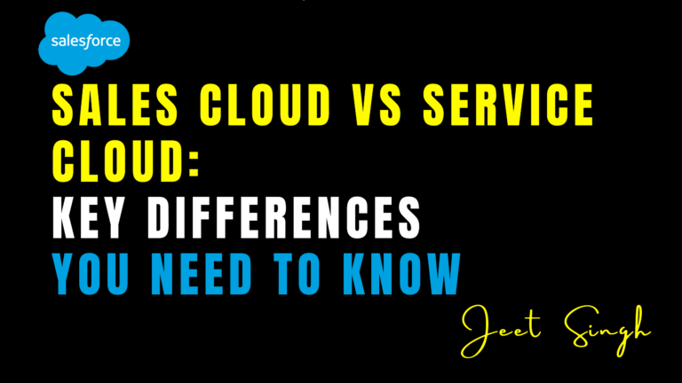

<figure>

<figcaption>

Sales Cloud vs Service Cloud: Key Differences You Need to Know

</figcaption>

</figure>

Salesforce offers a suite of cloud-based solutions designed to help businesses manage different aspects of their operations. Two of the most popular offerings are **Sales Cloud** and **Service Cloud**, which cater to sales and customer service teams, respectively. While both platforms are built on the same Salesforce CRM foundation, they serve distinct purposes and come with unique features. In this blog, we’ll explore the key differences between Sales Cloud and Service Cloud, helping you understand which solution is right for your business needs.

### What Is Salesforce Sales Cloud?

Salesforce Sales Cloud is a sales-focused CRM platform designed to help businesses manage their sales processes, track customer interactions, and close deals faster. It provides tools for lead management, opportunity tracking, sales forecasting, and more. Sales Cloud is ideal for sales teams looking to streamline their workflows, improve collaboration, and drive revenue growth.

For example, Sales Cloud allows sales reps to track leads from initial contact to closing the deal, automate follow-up tasks, and analyze sales performance using customizable reports and dashboards. It’s a powerful tool for businesses that want to optimize their sales processes and build stronger customer relationships.

### What Is Salesforce Service Cloud?

Salesforce Service Cloud, on the other hand, is a customer service-focused CRM platform designed to help businesses deliver exceptional customer support. It provides tools for case management, knowledge base creation, omnichannel support, and more. Service Cloud is ideal for customer service teams looking to resolve issues quickly, improve customer satisfaction, and scale their support operations.

For example, Service Cloud allows support agents to manage customer cases, access a centralized knowledge base, and provide support across multiple channels, such as email, phone, chat, and social media. It’s a powerful tool for businesses that want to deliver personalized and efficient customer service.

## Key Differences Between Sales Cloud and Service Cloud

While Sales Cloud and Service Cloud share some similarities, they are designed for different purposes and come with unique features. Here are the key differences between the two platforms:

#### 1\. Primary Focus

The primary focus of Sales Cloud is on **sales processes**, such as lead management, opportunity tracking, and sales forecasting. It’s designed to help sales teams close deals faster and drive revenue growth.

Service Cloud, on the other hand, focuses on **customer service**, such as case management, knowledge base creation, and omnichannel support. It’s designed to help support teams resolve issues quickly and improve customer satisfaction.

#### 2\. Core Features

Sales Cloud includes features like **lead management**, **opportunity tracking**, **sales automation**, and **sales analytics**. These tools help sales teams manage their pipelines, automate repetitive tasks, and analyze sales performance.

Service Cloud includes features like **case management**, **knowledge base**, **omnichannel support**, and **service analytics**. These tools help support teams manage customer cases, provide self-service options, and deliver support across multiple channels.

#### 3\. User Roles

Sales Cloud is primarily used by **sales professionals**, such as sales reps, account executives, and sales managers. These users rely on Sales Cloud to track leads, manage opportunities, and close deals.

Service Cloud is primarily used by **customer service professionals**, such as support agents, service managers, and customer success teams. These users rely on Service Cloud to manage cases, resolve issues, and deliver exceptional customer support.

#### 4\. Integration with Other Tools

Both Sales Cloud and Service Cloud integrate with other Salesforce products, such as Marketing Cloud and Commerce Cloud, to provide a complete CRM solution. However, Sales Cloud is more tightly integrated with sales-focused tools, while Service Cloud is more tightly integrated with service-focused tools.

For example, Sales Cloud integrates with tools like Salesforce CPQ (Configure, Price, Quote) for managing quotes and contracts, while Service Cloud integrates with tools like Field Service Lightning for managing on-site service appointments.

#### 5\. Customization and Scalability

Both platforms are highly customizable and scalable, but they are tailored to different use cases. Sales Cloud is designed to scale with your sales team, allowing you to add more users, customize your sales process, and integrate with other sales tools.

Service Cloud is designed to scale with your support team, allowing you to add more channels, customize your support workflows, and integrate with other service tools.

### When to Use Sales Cloud vs Service Cloud

The choice between Sales Cloud and Service Cloud depends on your business needs. Use **Sales Cloud** if your primary goal is to manage sales processes, track leads and opportunities, and drive revenue growth. It’s ideal for sales teams that want to streamline their workflows and close deals faster.

Use **Service Cloud** if your primary goal is to deliver exceptional customer support, manage cases, and improve customer satisfaction. It’s ideal for customer service teams that want to resolve issues quickly and scale their support operations.

In many cases, businesses use both platforms together to create a complete CRM solution that covers both sales and service. For example, a company might use Sales Cloud to manage its sales pipeline and Service Cloud to provide post-sale support.

### Real-World Example: A Business Using Both Platforms

Imagine you’re running an e-commerce business. You can use **Sales Cloud** to manage your sales pipeline, track leads, and close deals. Once a customer makes a purchase, you can use **Service Cloud** to provide support, manage returns, and resolve issues. By using both platforms together, you can create a seamless experience for your customers, from initial contact to post-sale support.

### Conclusion

Salesforce Sales Cloud and Service Cloud are powerful tools designed to meet different business needs. While Sales Cloud focuses on sales processes and revenue growth, Service Cloud focuses on customer service and satisfaction. By understanding the key differences between the two platforms, you can choose the right solution for your business or use both together to create a complete CRM solution.

Remember: **The right platform depends on your business goals.** Whether you’re focused on sales, service, or both, Salesforce has the tools you need to succeed.  

                                                                                                                                                               **-Jeet Singh**
