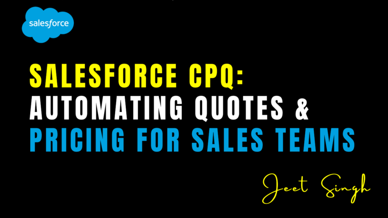

<figure>

<figcaption>

Salesforce CPQ: Automating Quotes & Pricing for Sales Teams

</figcaption>

</figure>

Sales forecasting is a critical part of managing your sales pipeline and making informed business decisions. By predicting future revenue based on current opportunities, you can set realistic goals, allocate resources effectively, and plan for growth. Salesforce provides powerful tools for setting up and managing sales forecasts, making it easier than ever to stay on top of your sales performance. In this blog, we’ll walk you through the steps to set up sales forecasting in Salesforce and share best practices to help you get the most out of this feature.

### What Is Sales Forecasting in Salesforce?

Sales forecasting in Salesforce is the process of predicting future sales revenue based on the opportunities in your pipeline. It allows you to estimate how much revenue your team will generate in a given period, such as a quarter or a year. Salesforce provides tools for creating customizable forecasts, tracking progress, and analyzing performance.

For example, if you have several opportunities in your pipeline with different deal amounts and probabilities of closing, Salesforce can aggregate this data to create a forecast. This helps you set realistic targets, identify potential gaps, and make data-driven decisions.

## Steps to Set Up Sales Forecasting in Salesforce

Here’s how you can set up sales forecasting in Salesforce:

### 1. **Enable Forecasting in Salesforce**

Before you can start using sales forecasting, you need to enable the feature in Salesforce. Go to **Setup** → **Forecasts** and enable forecasting for your organization. You can choose between **Collaborative Forecasts** (for team-based forecasting) or **Customizable Forecasts** (for more advanced customization).

* * *

### 2. **Define Your Forecast Periods**

Forecast periods define the timeframes for your forecasts, such as quarters or months. Go to **Setup** → **Forecasts** → **Forecast Periods** and create the periods you want to use. For example, you might create quarterly forecast periods to align with your business goals.

* * *

### 3. **Set Up Forecast Categories**

Forecast categories represent the stages in your sales pipeline, such as “Pipeline,” “Best Case,” “Commit,” and “Closed.” Go to **Setup** → **Forecasts** → **Forecast Categories** and define the categories that match your sales process. You can also map these categories to the stages in your opportunity records.

* * *

### 4. **Customize Your Forecast Settings**

Salesforce allows you to customize your forecast settings to suit your business needs. Go to **Setup** → **Forecasts** → **Forecast Settings** and configure options like forecast hierarchy (for team-based forecasting), quota settings, and currency settings (if you’re using multiple currencies).

* * *

### 5. **Assign Forecasts to Users**

If you’re using Collaborative Forecasts, you’ll need to assign forecasts to users or teams. Go to **Setup** → **Forecasts** → **Forecast Assignments** and assign forecasts to the appropriate users. This ensures that everyone has access to the forecasts they need to manage their sales pipeline.

* * *

### 6. **Create and Manage Forecasts**

Once your forecast settings are configured, you can start creating and managing forecasts. Go to the **Forecasts** tab in Salesforce and create a new forecast. You can view your forecast by period, category, or user, and track progress using customizable charts and reports.

## Best Practices for Sales Forecasting in Salesforce

Here are some best practices to help you get the most out of sales forecasting in Salesforce:

### 1. **Align Forecasts with Your Sales Process**

Ensure that your forecast categories and periods align with your sales process and business goals. This makes it easier to track progress and identify gaps in your pipeline.

* * *

### 2. **Keep Opportunity Records Up-to-Date**

Accurate forecasts depend on accurate data. Ensure that opportunity records are updated regularly with the correct deal amounts, close dates, and probabilities. This ensures that your forecasts are reliable and actionable.

* * *

### 3. **Use Collaborative Forecasts for Team-Based Planning**

If you’re working with a sales team, use Collaborative Forecasts to share forecasts and coordinate efforts. This ensures that everyone is on the same page and can work together to achieve their targets.

* * *

### 4. **Regularly Review and Adjust Forecasts**

Sales forecasts are not set in stone. Regularly review your forecasts and adjust them based on changes in your pipeline, such as new opportunities or changes in deal amounts. This helps you stay on track and make informed decisions.

* * *

### 5. **Leverage Reports and Dashboards**

Use Salesforce’s reporting and dashboard tools to analyze your forecasts and track performance. For example, you can create a dashboard that shows your forecasted revenue, actual revenue, and variance. This helps you identify trends and make data-driven decisions.

* * *

## Real-World Example: Setting Up Quarterly Forecasts

Imagine you’re a sales manager responsible for a team of 10 sales reps. You want to set up quarterly sales forecasts to track your team’s performance and plan for the next quarter. By enabling forecasting in Salesforce, defining quarterly forecast periods, and setting up forecast categories, you can create a forecast that aligns with your sales process. You can then assign forecasts to each rep, track progress using customizable reports, and adjust your strategy as needed.

* * *

## Conclusion

Sales forecasting is a powerful tool for managing your sales pipeline and making informed business decisions. By setting up sales forecasting in Salesforce and following best practices, you can predict future revenue, set realistic goals, and plan for growth. Whether you’re a sales rep, manager, or business owner, Salesforce’s forecasting tools can help you stay on top of your sales performance and achieve your goals.

Remember: **Accurate forecasts are the foundation of a successful sales strategy.** Start using Salesforce’s forecasting tools today and take your sales process to the next level!  
                                                                                                                                                                   **\-Jeet Singh**
