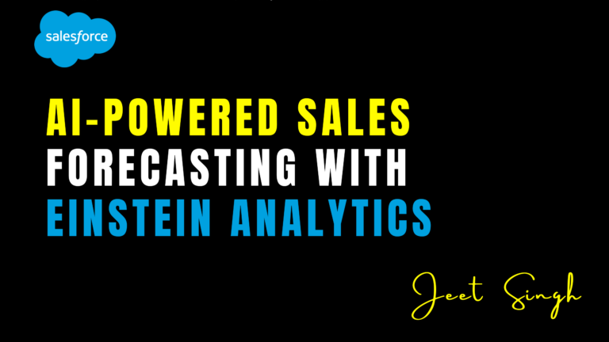

<figure>

<figcaption>

AI-Powered Sales Forecasting with Einstein Analytics

</figcaption>

</figure>

Sales forecasting is a crucial aspect of business strategy, enabling organizations to predict future revenue, allocate resources effectively, and optimize sales efforts. Traditional forecasting methods often rely on historical data and human intuition, which can be prone to errors. However, with the power of Artificial Intelligence (AI), businesses can now achieve more accurate and data-driven forecasts. Salesforce's **Einstein Analytics** offers AI-powered sales forecasting that enhances decision-making and improves overall sales performance. Here’s how it works and why it matters:

## 1\. Understanding AI-Powered Sales Forecasting

AI-powered sales forecasting uses machine learning algorithms to analyze historical data, identify patterns, and predict future sales outcomes. Unlike traditional methods, AI considers multiple variables, such as market trends, customer behavior, and real-time sales data, to generate highly accurate forecasts.

Einstein Analytics, a part of Salesforce’s AI-powered suite, leverages predictive analytics to provide real-time sales insights, helping sales teams make informed decisions and improve forecasting accuracy.

## 2\. Key Features of Einstein Analytics in Sales Forecasting

#### a) **Automated Data Analysis**

Einstein Analytics automatically processes vast amounts of structured and unstructured data, identifying trends and correlations that might be overlooked by manual forecasting methods.

#### b) **Predictive Forecasting Models**

The AI models in Einstein Analytics continuously learn from sales data, refining their predictions over time. This ensures that sales forecasts become more precise and aligned with market conditions.

#### c) **Opportunity Insights and Lead Scoring**

By analyzing historical deal patterns and customer interactions, Einstein Analytics assigns scores to opportunities and leads, predicting their likelihood of conversion. This helps sales teams prioritize high-value opportunities.

#### d) **Anomaly Detection and Risk Alerts**

Einstein Analytics identifies potential risks, such as deals that may be at risk of slipping, and provides real-time alerts to sales reps. This proactive approach allows teams to take corrective actions before it’s too late.

#### e) **Customizable Dashboards and Reports**

Sales teams can create customized dashboards with real-time forecasting metrics, visualizing key performance indicators (KPIs), pipeline health, and revenue projections in an easy-to-understand format.

## 3\. Benefits of Using Einstein Analytics for Sales Forecasting

#### **a) Improved Forecast Accuracy**

AI-powered insights reduce human bias and errors, providing highly accurate sales forecasts that help businesses plan better.

#### **b) Enhanced Sales Productivity**

With automated forecasting and predictive analytics, sales teams can focus more on closing deals rather than spending time on manual data analysis.

#### **c) Proactive Decision-Making**

Real-time risk alerts and anomaly detection enable sales leaders to address challenges before they impact revenue.

#### **d) Optimized Resource Allocation**

Accurate forecasts allow businesses to allocate budgets, staffing, and inventory efficiently, ensuring that resources are directed where they are most needed.

#### **e) Greater Competitive Advantage**

By leveraging AI-driven forecasting, companies gain a strategic advantage, making more informed business decisions based on data-driven insights.

## 4\. How to Implement Einstein Analytics for Sales Forecasting

1. **Integrate Data Sources** – Connect Einstein Analytics with Salesforce CRM and other data sources to ensure comprehensive data collection.
    
2. **Set Up Predictive Models** – Configure AI-driven models to analyze sales trends and predict future revenue streams.
    
3. **Customize Dashboards** – Build visual reports that offer real-time insights into sales performance and forecasting metrics.
    
4. **Monitor and Adjust** – Continuously review AI-generated forecasts and fine-tune models based on changing market conditions.
    
5. **Train Sales Teams** – Ensure that sales teams understand how to interpret AI-generated insights and use them for strategic decision-making.
    

## Conclusion

AI-powered sales forecasting with Einstein Analytics is revolutionizing the way businesses predict revenue and optimize sales strategies. By leveraging machine learning and predictive analytics, companies can improve forecast accuracy, enhance sales productivity, and gain a competitive edge. Implementing Einstein Analytics ensures that sales teams have the insights they need to make proactive, data-driven decisions, ultimately leading to higher conversions and business growth.

                                                                                                                                                                      **-Jeet Singh**
